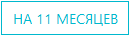

# Карточка договора

Карточка договора содержит всю основную рабочую информацию о данном договоре.

<!-- @import "[TOC]" {cmd="toc" depthFrom=1 depthTo=6 orderedList=false} -->

<!-- code_chunk_output -->

- [Карточка договора](#карточка-договора)
  - [Как перейти в карточку договора](#как-перейти-в-карточку-договора)
  - [Функции карточки договора](#функции-карточки-договора)
  - [Структура карточки договора](#структура-карточки-договора)
    - [Иконка возврата в журнал договоров](#иконка-возврата-в-журнал-договоров)
    - [Блок «Основная информация»](#блок-основная-информация)
      - [Тип договора](#тип-договора)
      - [Иконки действий](#иконки-действий)
    - [Блок «Информация о заказчике»](#блок-информация-о-заказчике)
    - [Блок «Оплаты по договору»](#блок-оплаты-по-договору)
    - [Блок «Зяавки по договору»](#блок-зяавки-по-договору)

<!-- /code_chunk_output -->

## Как перейти в карточку договора

1. Перейдите в [Журнал договоров](/LIMS_Manual_Stand/Lists/Contracts_list/Contracts_list.html) по ссылке в левом меню Битрикс 24.
2. Перейдите по соответствующей ссылке в столбце «№».

## Функции карточки договора

1. Учет и хранение рабочей информации по договору
2. Управление типом договора
3. Формирование файла договора
4. Хранение подписанных скан-копий договора и приложения (ТЗ)
5. Переформирование файла договора с учетом внесенных изменений
6. Учет оплат по абонентскому договору
7. Учет заявок, созданных в рамках данного договора
8. Обеспечение возможности прямого перехода в карточки заявок, созданных в рамках данного договора
9. Обеспечение возможности прямого перехода в карточки ТЗ, относящиеся к заявкам, созданным в рамках данного договора

## Структура карточки договора

Карточка договора состоит из следующих блоков:

1. Иконка возврата в журнал договоров
2. Блок «Основная информация»
3. Блок «Информация о заказчике»
4. Блок «Заявки по договору»

### Иконка возврата в журнал договоров

 – нажмите на данную иконку чтобы осуществить возврат в журнал договоров.

### Блок «Основная информация»

Данный блок содержит следующие поля (слева направо): 
* **Наименование договора**
* **№ договора** 
* **Дата договора (от)**

Данные поля заполняются автоматически на основании информации, введенной при создании карточки заявки в [Интерфейсе создания заявки на испытания](/LIMS_Manual_Stand/Create_application_card!!!/Create_appl_card.html). Возможность их редактирования открывается в случае установки типа «Договор клиента» (см. ниже).

#### Тип договора 
Всего существует три типа договора, которые устанавливаются нажатием соответствующей кнопки:

 – установите данный тип, если договор предполагает предоплату с последующим распределением по отдельным заявкам или оплату несколькими траншами. В этом случае появится еще один блок – [«Оплаты по договору»](#блок-«оплаты-по-договору»).

 – установите данный тип, если вам необходимо отредактировать название, номер и дату договора.

 – установите данный тип, если договорзаключается до конца года и не требует автопролонгации. 

#### Иконки действий

 – нажмите на данную иконку для загрузки скан-копии подписанного договора (откроется окно выбора файла на локальном компьютере). После закгузки икнока изменится на 

 – нажмите на данную иконку чтобы скачать подписанную версию договора в формате pdf.

 – нажмите на данную иконку чтобы скачать форму договора в формате docx.

 – нажмите на данную иконку чтобы переформировать договор (например, в случае внесения изменений в реквизиты заказчика в карточке заявки).

### Блок «Информация о заказчике»

Данный блок содержит ФИО и контактные данные заказчика, указанные в реквизитах последнего, и выбранные при создании заявки.

### Блок «Оплаты по договору»

Данный блок содержит следующие элементы:

* Поле **Сумма договора** – введите вручную или установите при помощи стрелок в правой части поля полную сумму оплаты по договору.  
* Иконка  – нажмите на нее для вызова вспомогательного интерфейса добавления оплаты.

* Поля **Оплачено** и **Остаток по оплате** заполняются автоматически после добавления оплаты.

Все добавленные оплаты будут отображены в таблице в правой части интерфейса в формате **"Номер - сумма - дата оплаты"**.

### Блок «Зяавки по договору»

Данный блок содержит следующие элементы:

* **Строка фильтрации по оплате** – установите курсор в данное поле и в выпадающем списке выберите один из двух статусов: «Оплачено» или «Не оплачено»

* **Таблица заявок** – данная таблица содержит:
    * Порядковый номер записи  
    * Номер-ссылку на заявку, перефдя по которой, вы попадете в карточку соответствующей заявки.
    * Дату создания заявки
    * Сумму оплаты по данной заявке
    * Номер счета на оплату услуг по данной заявке
    * Номер-ссылку на ТЗ (приложение к договору), перейдя по которой, вы попадете в карточку соответствующего ТЗ.
    * Иконку  для загрузки скан-копии подписанного приложения к договору (ТЗ).
    * Сумму и процент скидки
    * Размер проведенной оплаты по данной заявке (в случае частичной оплаты)

    ### Сохранение

    После заполнения всех блоков карточки договора нажмите кнопку  для сохранения результата.