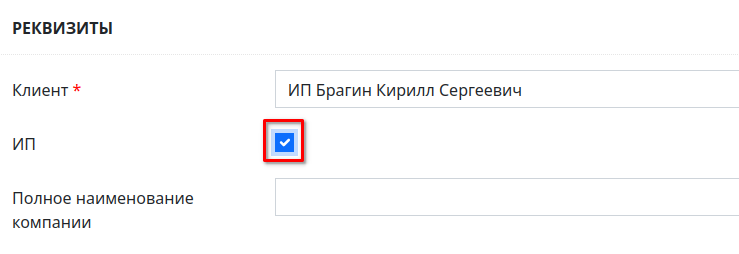
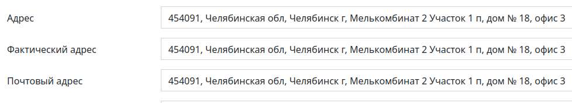

# Интерфейс создания заявки на испытания

<!-- @import "[TOC]" {cmd="toc" depthFrom=1 depthTo=6 orderedList=false} -->

<!-- code_chunk_output -->

- [Интерфейс создания заявки на испытания](#интерфейс-создания-заявки-на-испытания)
    - [Функции интерфейса](#функции-интерфейса)
    - [Как перейти в интерфейс](#как-перейти-в-интерфейс)
    - [Структура интерфейса](#структура-интерфейса)
    - [Блок «Реквизиты»](#блок-реквизиты)
        - [Поле «Клиент»](#поле-клиент)
        - [Флажок ИП](#флажок-ип)
        - [Поле «Полное наименование компании»](#поле-полное-наименование-компании)
        - [Поле «ИНН»](#поле-инн)
        - [Поле «КПП»](#поле-кпп)
        - [Поля «ОГРН» и «ОГРНИП»](#поля-огрн-и-огрнип)
        - [Поля «Адрес», «Фактический адрес» и «Почтовый адрес»](#поля-адрес-фактический-адрес-и-почтовый-адрес)
        - [Поля «E-mail» и «E-mail для договора»](#поля-e-mail-и-e-mail-для-договора)
        - [Поле «Телефон»](#поле-телефон)
        - [Поле «Контактное лицо»](#поле-контактное-лицо)
        - [Поле «Должность руководителя»](#поле-должность-руководителя)
        - [Поле «Должность руководителя в родительном падеже»](#поле-должность-руководителя-в-родительном-падеже)
        - [Поле «ФИО руководителя»](#поле-фио-руководителя)
        - [Поле «Действует на основании»](#поле-действует-на-основании)
        - [Поле «Расчетный счет»](#поле-расчетный-счет)
        - [Поле «Кор. Счет»](#поле-кор-счет)
        - [Поле «Лицевой счет»](#поле-лицевой-счет)
        - [Поле «БИК»](#поле-бик)
        - [Поле «Наименование банка»](#поле-наименование-банка)
    - [Блок «Данные заявки»](#блок-данные-заявки)
        - [Поле «Основание для проведения испытаний»](#поле-основание-для-проведения-испытаний)
        - [Поле «Тип заявки»](#поле-тип-заявки)
        - [Поле «Материал для исследования»](#поле-материал-для-исследования)
        - [Поле «Главный ответственный»](#поле-главный-ответственный)
    - [Сохранение заявки](#сохранение-заявки)

<!-- /code_chunk_output -->

### Функции интерфейса

Данный форма служит для создания заявки на испытания.

### Как перейти в интерфейс

Вход в данный интерфейс осуществляется по ссылке «Новая заявка» в левом меню Битрикс&#160;24.

### Структура интерфейса

Интерфейс состоит из следующих блоков:
1. Реквизиты
2. Блок выбора объекта и схемы испытаний
3. Данные заявки

### Блок «Реквизиты»
 
Данный блок должен содержать информацию о юридическом лице заказчика или данные ИП. Если компания зарегистрирована в системе, данный раздел заполняется автоматически при введении названия компании заказчика. 

Рисунок 1. Общий неполный вид блока «Реквизиты»
 

Блок «Реквизиты» содержит следующие поля:

##### Поле «Клиент»

В данном поле необходимо ввести наименование организации заказчика (см. рисунок 2). Если организация зарегистрирована в системе, то ее название появится в выпадающем списке, и при его выборе все поля, для которых имеется информация, заполняются автоматически. Если организация в системе не зарегистрирована, то система автоматически зарегистрирует ее после заполнения формы заявки. 

Рисунок 2. Поле ввода «Клиент»
 

##### Флажок ИП

Если заказчик обращается впервые и является индивидуальным предпринимателем, то в поле «ИП» необходимо установить флажок (см. рисунок 3). 

Рисунок 3. Флажок ИП
 

##### Поле «Полное наименование компании»

В данном поле необходимо ввести полное наименование компании заказчика или полные ФИО ИП (см. рисунок 4). 

Рисунок 4. Поле «ИНН»
 

##### Поле «ИНН»

В данном поле необходимо ввести ИНН заказчика (см. рисунок 5).  

Рисунок 5. Поле «ИНН»
 

Заполнение раздела «Реквизиты» должно начинаться с заполнения ИНН. Если компания заказчика зарегистрирована в системе, то система найдет ее по ИНН и предложит применить данные (см. рисунок 6).  

Рисунок 6. Заказчик найден по ИНН в программе
 

Если компания в системе не зарегистрирована, то система по умолчанию должна осуществлять по указанному ИНН поиск юридического лица или ИП в интернете и в случае успеха предлагать применить данные (см. рисунок 7). 

Рисунок 7. Заказчик найден по ИНН в интернете
 

##### Поле «КПП»

В данном поле необходимо ввести ИНН/КПП заказчика (см. Рисунок 8). 

Рисунок 8. Поле «ИНН/КПП»
 

##### Поля «ОГРН» и «ОГРНИП»

Если заказчик ИП, и вами установлен флажок ИП, то в поле «ОГРНИП» необходимо ввести номер ОГРНИП заказчика (см. рисунок 9).  

Рисунок 9. Поле «ОГРНИП»
 

Если заказчик – юридическое лицо, и флажок «ИП» не установлен, то поле «ОГРНИП» будет закрыто. Необходимо ввести лишь ОГРН заказчика в поле «ОГРН» (см. рисунок 10). 

Рисунок 10. Поле «ОГРН»
 

##### Поля «Адрес», «Фактический адрес» и «Почтовый адрес»

В поле «Адрес» необходимо ввести юридический адрес заказчика. В поле «Фактический адрес» необходимо ввести адрес фактического местонахождения заказчика (см. рисунок 11). В поле «Почтовый адрес» необходимо ввести адрес для доставки заказчику бумажной корреспонденции. 

Рисунок 11. Поля «Адрес», «Фактический адрес» и «Почтовый адрес»
 

##### Поля «E-mail» и «E-mail для договора»

В данном поле необходимо ввести адрес электронной почты заказчика для отправки рабочей корреспонденции (см. рисунок 12). В поле «E-mail для договора» необходимо ввести адрес электронной почты заказчика, который должен быть отображен в договоре. Если данное поле останется пустым, то в договоре в адрес электронной почты не будет прописан. Если у заказчика данные адреса электронной почты совпадают, то необходимо заполнить оба поля одинаково. 

Рисунок 12. Поля «E-mail» и «E-mail для договора»
 

Если у заказчика несколько адресов электронной почты, то необходимо добавить их в систему, нажав на кнопку «+» и заполнив соответствующие поля.

##### Поле «Телефон»

В данном поле в любом удобном формате необходимо ввести телефон (или несколько телефонов через запятую) для связи с заказчиком (см. рисунок 13).  

Рисунок 13. Поле «Телефон»
 

##### Поле «Контактное лицо»

В данном поле необходимо ввести данные контактного лица: ФИО, телефон и т.п. (см.&#160;рисунок 14).  

Рисунок 14. Поле «Контактное лицо»
 

##### Поле «Должность руководителя»

В данном поле должно быть необходимо ввести должность руководителя предприятия заказчика (см. рисунок 15).

##### Поле «Должность руководителя в родительном падеже»

В данном поле должно быть необходимо ввести должность руководителя предприятия заказчика в родительном падеже (см. рисунок 15).

##### Поле «ФИО руководителя»

В данное поле должно быть необходимо ввести полные фамилию, имя и отчество руководителя предприятия заказчика (см. рисунок 15).

##### Поле «Действует на основании»

В данное поле должно быть необходимо ввести наименование документа, на основании которого действует руководитель (см. рисунок 15). 

 

Рисунок 15. Поля информации о руководителе
 

##### Поле «Расчетный счет»

В данном поле необходимо ввести номер расчетного счета предприятия заказчика (см. рисунок 16).

##### Поле «Кор. Счет»

В данном поле необходимо ввести номер корреспондентского счета предприятия заказчика (см. рисунок 16).

##### Поле «Лицевой счет»

В данном поле необходимо ввести номер лицевого счета заказчика (см. рисунок 16), если он у него имеется.

##### Поле «БИК»

В данном поле необходимо ввести БИК банка заказчика (см. рисунок 16).

##### Поле «Наименование банка»

В данном поле необходимо ввести наименование банка заказчика (см. рисунок 16).

Рисунок 16. Банковские реквизиты
 

### Блок «Данные заявки»

Рисунок 20. Общий вид формы блока «Данные заявки»

##### Поле «Основание для проведения испытаний»

Данное поле представляет собой выпадающий список, в котором при установке в него курсора необходимо выбрать документ-основание для проведения испытаний.

##### Поле «Тип заявки»

Установите курсор в данное поле и в выпадающем списке выберите тип заявки:
* ИЦ – испытательный центр
* ОСК – отдел строительного контроля
* ВЛК – внутрилабораторный контроль
* МСИ – межлабораторные сличительные испытания
* АП –
* НК –
* Н –
* ПР –

##### Поле «Материал для исследования»

Установите курсор в данное поле и начните ввод наименования материала для исследования. В результате поле раскроется в список, в котором вы сможете выбрать нужный материал. Если вы не нашли нужный материал, то необходимо ввести его наименование вручную.

В поле «Количество» вручную или при помощи стрелок в его правой части установите количество проб материала.

Если вам необходимо добавить материал, нажмите 

##### Поле «Главный ответственный»

В данном поле ФИО главного ответственного за проведения испытаний в рамках выбранной методики устанавливается системой автоматически в соответствии с матрицей компетенций. Если автоматического определения не произошло, то при установке курсора в данное поле появится выпадающий список, в котором необходимо установить ответственного вручную. Также после установки курсора возможно ввести ФИО вручную или выбрать в выпадающем списке после начала ввода.

Если вам необходимо добавить ответственного, нажмите 

### Сохранение заявки

По нажатии кнопки «Сохранить» произойдет сохранение введенной информации. После сохранения система осуществит возврат в начало карточки и выведет сообщение об успешном создании заявки (см. рисунок 21), а в журнале заявок появится соответствующая запись, содержащая основную информацию о созданной заявке и ссылку на ее карточку.

Рисунок 21. Заявка успешно создана

