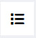
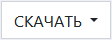
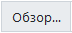

# Карточка оборудования

В карточке оборудования содержится полная рабочая информация о данной единице оборудования. Также в карточке вы можете сформировать различную рабочую документацию, такую как акты ввода в эксплуатацию, списания и т.п.

<!-- @import "[TOC]" {cmd="toc" depthFrom=1 depthTo=6 orderedList=false} -->

<!-- code_chunk_output -->

- [Карточка оборудования](#карточка-оборудования)
  - [Как перейти в карточку оборудования](#как-перейти-в-карточку-оборудования)
  - [Функции карточки оборудования](#функции-карточки-оборудования)
  - [Структура карточки оборудования](#структура-карточки-оборудования)
    - [Иконки действий](#иконки-действий)
    - [Блок «Основные характеристики»](#блок-основные-характеристики)
    - [Блок «Условия эксплуатации»](#блок-условия-эксплуатации)
    - [Блок «Условия хранения»](#блок-условия-хранения)
    - [Блок «Технические данные»](#блок-технические-данные)
    - [Блок «Метрологический контроль»](#блок-метрологический-контроль)
    - [Блок «местонахождение и собственность»](#блок-местонахождение-и-собственность)
    - [Блок «Ввод в эксплуатацию»](#блок-ввод-в-эксплуатацию)
    - [Блок «Ответственные лица»](#блок-ответственные-лица)
    - [Блок «Программное обеспечение»](#блок-программное-обеспечение)
    - [Блок «Дополнительная информация»](#блок-дополнительная-информация)
  - [Сохранение](#сохранение)

<!-- /code_chunk_output -->

## Как перейти в карточку оборудования

1. Перейдите в журнал оборудования
2. В столбце «Наименование» перейдите по нужной вам ссылке

## Функции карточки оборудования

1. Учет всей рабочей информации по данной единице оборудования
2. Хранение скан-копий документации, относящейся к оборудованию
3. Управление статусами оборудования (в области аккредитации, поверено, в наличии)
4. Управление закреплением оборудования за ответственными сотрудниками
5. Хранение метрологической информации и управление ею

## Структура карточки оборудования

Карточка оборудования состоит из следующих блоков:

1. Иконки действий
2. Блок «Основные характеристики»
3. Блок «Условия эксплуатации»
4. Блок «Условия хранения»
5. Блок«Технические данные»
6. Блок «Метрологический контроль»
7. Блок «Местонахождение и собственность»
8. Блок «Ввод в эксплуатацию и списание»
9. Блок «Ответственные лица»
10. Блок «Программное обеспечение»
11. Блок «Дополнительная информация»

### Иконки действий

 – нажмите на данную иконку чтобы вернуться в журнал заявок.

 – нажмите на данную кнопку чтобы сформировать следующие документы:
* карточку оборудования;
* актвоода в эксплуатацию;
* акт списания;
* акт о постановке на длительное хранение;
* акт о верификации оборудования;
* этикетку оборудования.

### Блок «Основные характеристики»

В данном блоке содержится основная рабочая информация о данной единице оборудования, а также скан-копии документации к ней и ее фотографии.

Блок содержит следующие поля:
* **Измеряемая характеристика** – введите сюда наименование характеристики / показателя, измеряемых при помощи данного оборудования.
* **Наименование (обязательное поле)** – введите сюда полное наименование оборудования.
* **Тип оборудования** – идентификатор типа и модификации оборудования. указанный в документации к нему.
* **№ по гос. реестру РФ** – номер оборудования в государственном реестре.
* **Идентификация оборудования** – к какой катеогрии отностится оборудование. Всего их пять:
    * СИ – средства измерения
    * ИО – испытательное оборудование
    * ВО – вспомогательное оборудование
    * СО – стандартные образцы
    * Оборудование для подготовки и отбора проб
* **Группа испытываемых объектов** – группа объектов / материалов, которые подвергаются исследованию посредством данного оборудования.
* **Страна, производитель**
* **Инвентарный номер** – инвентарный номер оборудования, присвоенный предприятием-эксплуататором
* **Заводской номер** – номер оборудования, присвоенный ему заводом-изготовителем
* **Год выпуска**
* **Дата ввода в эксплуатацию (обязательное поле)** – установите курсор в данное поле и в выпадающем списке выберите дату ввода оборудования в эксплуатацию
* **Описание типа оборудования** – актуально только для СИ. Загрузите* сюда документ, содержащий описание СИ, утвержденное ВНИИМС. 
* **Фотография оборудования** – загрузите* сюда фотографию оборудования. 
* **Скан-копия документа о праве собственности на оборудование** – загрузите* сюда скан документа о праве собственности. 
* **Состояние при покупке** – установите курсор в данное поле и в выпадающем списке выберите состояние оборудования при покупке (новое или б/у).
* **Паспорт / руководство по эксплуатации** – загрузите* сюда скан документа о праве собственности. 
    >**\*** Для загрузки файла в левой части строки нажмите кнопку , в результате чего откроется окно выбора файла на локальном компьютере. После загрузки в белой части строки отобразтися имя загружаемого файла, а после [сохранения результатов ввода](#сохранение), когда файл попадет в ЛИМС, его название будет отображено в правой, серой, части поля.
 – нажмите на данную иконку чтобы скачать файл. Иконка находится в правой части поля. Она становится активной после загрузки файла.
 – нажмите на данную иконку чтобы удалить загруженный файл. Иконка находится в правой части поля. Она становится активной после загрузки файла.

* Флажок **«В области аккредитации»** – установите данный флажок, если оборудование находится в области аккредитации. 
* Флажок **«В наличии»** – установите данный флажок, если данное оборудование находится в доступе на предприятии.
* Флажок **«Проверено»** – установите данный флажок, если оборудование проверено.

### Блок «Условия эксплуатации»

В данном блоке содержится информация об условиях, в которых данное оборудование должно эксплуатироваться. 

* **Относителная влажность, Температура и Атмосферное давление** – в поля «От» и «До» внесите граничные значения диапазонов данных параметров. Если параметры не нормируются, установите флажок **«Не нормируется»**.
* **Напряжение питающей сети** – введите сюда напряжение, необходимое для работы оборудования.
* **Частота, Гц** – введите сюда частоту переменного тока, необходимую для работы оборудования.

### Блок «Условия хранения»

Введите в поля данного блока значения температуры и влажности воздуха, а также атмосферного давления, при которых оборудование должно храниться.

### Блок «Технические данные»

Введите в поля данного блока техничесие характеристики, диапазон измерения и класс точности оборудования. Информацию можно найти в документации к нему.

### Блок «Метрологический контроль»

В данном блоке находится вся метрологическая информация о данном оборудовании.

* **Дата последней поверки** – установите курсор в данное поле и в выпадающем календаре выберите дату проведения последней поверки оборудования.
* **Дата окончания поверки** – установите курсор в данное поле и в выпадающем календаре выберите дату окончания срока последней поверки оборудования.
* Радиокнопки **Актуальный сертификат** – установите ее в том подблоке*, в котором содержится актуальный сертификат.
* **Дата начала поверки** – установите курсор в данное поле и в выпадающем календаре выберите дату начала поверки оборудования согласно приложенного свидетельства о поверке.
* **Дата окончания поверки** – установите курсор в данное поле и в выпадающем календаре выберите дату окончания поверки оборудования согласно приложенного свидетельства о поверке.
* **Свидетельство о поверке** – загрузите сюда файл свидетельства о поверке. Для загрузки файла в левой части строки нажмите кнопку , в результате чего откроется окно выбора файла на локальном компьютере. После загрузки в белой части строки отобразтися имя загружаемого файла, а после [сохранения результатов ввода](#сохранение), когда файл попадет в ЛИМС, его название будет отображено в правой, серой, части поля.
 – нажмите на данную иконку чтобы скачать файл. Иконка находится в правой части поля. Она становится активной после загрузки файла.
 – нажмите на данную иконку чтобы удалить загруженный файл. Иконка находится в правой части поля. Она становится активной после загрузки файла.

* **Межкалибровочный интервал** – введите в данное поле периодичность калибровки оборудования.
* **Первичный метрологический контроль** – установите курсор в данное поле и в выпадающем календаре выберите тип контроля.
* **Место поверки** – впишите сюда наименование места, где проводилась поверка оборудовнаия.
* Флажок «Не подлежит поверке» – установите его в том случае, если данное оборудование не подлежит поверке.

### Блок «местонахождение и собственность»

Данный блок отвечает на вопрос о том, кому принадлежит оборудование и в каком отделе / помещении оно установлено / находится в данный момент.

* **Право собственности** – внесите сюда наименование предприятия-собственника оборудовнаия.
* **Метсо установки или хранения** – установите курсор в данное поле и в выпадающем списке выберите отдел, в котором оборудование установлено / находится в данный момент.
* **Помещение** – установите курсор в данное поле и в выпадающем списке выберите помещение, в котором оборудование установлено / находится в данный момент.

### Блок «Ввод в эксплуатацию»

Данный блок содержит всю информацию о вводе оборудования в эксплуатацию.

* **Ввод в эксплуатацию произвел** – установите курсор в данное поле и в выпадающем списке выберите ФИО сотрудника, ответственного за ввод оборудования в эксплуатацию.
* **Номер приказа о вводе в эксплуатацию**
* **Дата приказа о вводе в эксплуатацию** – установите курсор в данное поле и в выпадающем календаре выберите дату приказа о вводе оборудования в эксплуатацию.
* Флажок **На длительном хранении** – установите его в том случае, если оборудование находится на длительном хранении или консервации.
* **Дата постановки на длительное хранение** – становите курсор в данное поле и в выпадающем календаре выберите дату пеервода оборудования на длительное хранение.

### Блок «Ответственные лица»

Данный блок содержит информацию о сотрудниках. ответственных за данное оборудование.

* **Ответственный сотрудник** – установите курсор в данное поле и в выпадающем списке выберите ФИО сотрудника, ответственного за данное оборудование.

* **Доп. ответственный сотрудник** – установите курсор в данное поле и в выпадающем списке выберите ФИО дополнительного сотрудника, ответственного за данное оборудование.

### Блок «Программное обеспечение»

Введите (при наличии) в поля данного блока наименование и номер версии ПО, обеспечивающего работу оборудования.

### Блок «Дополнительная информация»

Данный блок содержит дополнительную информацию и примечания. Внесите сюда что-нибудь, если вы еще не исписались, заполняя эту карточку, и вам все еще есть, что сказать.

## Сохранение

После того как вы заполнте все поля, нажмите кнопку .
> **Результат:** введенная информация сохранена; карточка заявки создана и зарегистрирована в ЛИМС; в [Журнале оборудования](/LIMS_Manual_Stand/Lists/Equipment_list/equipment_list.html) появилась соответствующая запись. 
