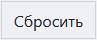

# Модуль ФСА
Данный модуль предназначен для генерации и подписания ЭЦП XML-файлов протоколов испытаний и отправки их в личный кабинет федеральной службы по аккредитации напрямую из карточки заявки ЛИМС.

<!-- @import "[TOC]" {cmd="toc" depthFrom=1 depthTo=6 orderedList=false} -->

<!-- code_chunk_output -->

- [Модуль ФСА](#модуль-фса)
  - [Функции модуля](#функции-модуля)
  - [Компоненты модуля](#компоненты-модуля)
  - [Иконки функциональной панели](#иконки-функциональной-панели)
  - [Интерфейс работы с протоколами](#интерфейс-работы-с-протоколами)
    - [Функционал](#функционал)
      - [Генерация XML-файла из исходного файла договора](#генерация-xml-файла-из-исходного-файла-договора)
      - [Прикрепление файла ЭЦП (в случае, если он генерируется сторонней программой)](#прикрепление-файла-эцп-в-случае-если-он-генерируется-сторонней-программой)
      - [Подписание XML-файла при помощи стороннего файла ЭЦП](#подписание-xml-файла-при-помощи-стороннего-файла-эцп)
      - [Подписание XML-файла при помощи ЛИМС](#подписание-xml-файла-при-помощи-лимс)
      - [Отправка подписанного XML-файла в ЛК ФСА](#отправка-подписанного-xml-файла-в-лк-фса)
  - [Вспомогательный интерфейс ЭЦП](#вспомогательный-интерфейс-эцп)
    - [Функционал](#функционал-1)
      - [Выбор файла сертификата](#выбор-файла-сертификата)
      - [Подписание XML-файла](#подписание-xml-файла)
  - [Журнал учета отправленных XML](#журнал-учета-отправленных-xml)
    - [Функционал](#функционал-2)
      - [Поиск записи](#поиск-записи)
      - [Сортировка по дате](#сортировка-по-дате)
  - [Интерфейс настройки](#интерфейс-настройки)
  - [Как подписать и отправить протокол](#как-подписать-и-отправить-протокол)
    - [Алгоритм](#алгоритм)

<!-- /code_chunk_output -->

## Функции модуля

1. Создание XML-версии протокола испытаний
2. Подписание XML-файла при помощи ЭЦП
3. Оправка подписанного XML-файла напрямую в ЛК Росаккредитации
4. Ведение журнала учета отправленных XML-файлов

## Компоненты модуля

* Интерфейс работы с протоколами
* Вспомогательный интерфейс ЭЦП
* Журнал учета отправленных XML-файлов
* Интерфейс настройки

## Иконки функциональной панели
Функциональная панель находится в левой верхней части страницы каждого компонента модуля и представляет собой набор иконок (см. рисунок 1). Они служат для навигации по структуре модуля и перехода к его отдельным компонентам.

 возврат на главную страницу модуля
 переход в интерфейс настроек (подробнее см соответствующий раздел)
 переход в журнал учета отправленных XML-файлов
 переход в журнал учета отправленных XML-файлов
 переход в журнал учета отправленных XML-файлов

## Интерфейс работы с протоколами

Рисунок 1. Общий вид интерфейса работы с протоколами

Данный интерфейс является основным компонентом модуля. Он состоит из следующих блоков (см. рисунок 1):

**Блок «Протокол»**, который содержит: 
* **поле «Номер протокола»** – служит для выбора файла протокола из БД ЛИМС;

* **кнопку**  – служит для преобразования файла протокола в формат XML.

**Блок «Созданные XML»**, который представляет собой таблицу, содержащую записи о созданных XML-файлах и состоящую из следующих столбцов:
* **Дата** – дата создания XML-файла
* **XML** – наименование XML-файла
* **Файл ЭЦП** – наименование файла ЭЦП
* **Столбец**, содержащий кнопки подписи, отправки и повторной отправки (кнопка видоизмняется в зависимости от стадии процесса).

### Функционал
В интерфейсе работы с протоколами совершаются все основные действия, направленные на доставку подписанного ЭЦП файла протокола испытаний в ЛК ФСА:
#### Генерация XML-файла из исходного файла договора
Для того, чтобы сгенерировать XML-файл:
1. Установите курсор в поле «Номер протокола».
2. В выпадающем списке выберите нужный протокол.
3. Нажмите кнопку 

>**Результат:** в таблице созданных XML появится запись о сгенерированном XML-файле выбранного протокола.
#### Прикрепление файла ЭЦП (в случае, если он генерируется сторонней программой)
Для того чтобы прикрепить сторонний файл ЭЦП: 
1. Нажмите на ссылку «Прикрепить файл» в столбце «Файл ЭЦП» таблицы созданных XML.
2. В открывшемся окне выберите файл на локальном компьютере.

>**Результат:** в столбце «Файл ЭЦП» таблицы созданных XML появится ссылка на прикрепленный файл ЭЦП, содержащая его название. Кликнув по ней, вы можете скачать файл подписи.
#### Подписание XML-файла при помощи стороннего файла ЭЦП
Файл XML подписывается автоматически по факту прикрепления файла ЭЦП (см. предыдущий пункт).
#### Подписание XML-файла при помощи ЛИМС
Для того чтобы подписать XML-файл:
1. Нажмите кнопку  и перейдите во вспомогательный интерфейс ЭЦП (подробнее о данном интерфейсе см. в соответствующем разделе ниже).
2. В поле «Сертификат» выберите актуальный файл сертификата.
3. Нажмите кнопку .

> **Результат:** произойдет возврат в интерфейс работы с протоколами, в верхней части которого появится сообщение о том, что подписание прошло успешно.
    
><strong>NB!</strong> Если при переходе во вспомогательный интерфейс ЭЦП вы столкнулись с сообщением типа "Для работы КриптоПРО ЭЦП Browser plugin на данном сайте необходимо расширениедля браузера", то либо установите расширение, либо обратитесь к системному администратору.

#### Отправка подписанного XML-файла в ЛК ФСА
Для того чтобы отпрвить подписанный файл в ЛК ФСА:
1. Подпишите XML-файл ЭЦП (см.предыдущие пункты).
2. В соответствующей строке таблицы созданных XML нажмите кнопку  (при успешном подписании файла XML эта кнопка заменит собой кнопку ).

>**Результат:**  
    > * произойдет отправка подписанного файла в ЛК ФСА;
    > * кнопка  будет заблокирована;
    > * в таблице созданных XML отобразятся все файлы, имеющиеся в БД ЛИМС. 

## Вспомогательный интерфейс ЭЦП

Рисунок 2. Общий вид вспомогательного интерфейса ЭЦП

Данный интерфейс служит для выбора сертификата ЭЦП и подписи файла XML. Он содержит следующую информацию (см. рисунок 2):
* Наименование файла сертификата.
* Информация о сертификате.
* Наименование файла XML на подпись.
* Результат (подписано/не подписано).
* Кнопка , по нажатии которой после выбора сертификата происходит подписание XML-файла ЭЦП.

### Функционал
#### Выбор файла сертификата
В поле «Сертификат» выберите нужный файл сертификата.

> **Результат:** в области «Информация о сетрифиакте» отобразятся все данные, относящиеся к файлу сертификата (см. рисунок 2).

#### Подписание XML-файла
См. [подписание XML-файла при помощи ЛИМС](#подписание-xml-файла-при-помощи-лимс)

## Журнал учета отправленных XML

Рисунок 3. Общий вид журнала учета отправленных XML

Данный журнал служит для учета отправленных в ФСА XML-файлов. Его основные части:

**Строка фильтра по дате**, которая содержит: 
* иконку , по нажатии на которую откроется поле поиска по журналу; 
* поля выбора начальной и конечной дат для сортировки содержимого таблицы по дате отправки;
* Кнопку  для сброса всех примененных фильтров. 

**Таблица отправленных XML**, которая содержит всю информацию об отправленных XML и состоит из следующих столбцов:    
* GUID – уникальный 128-битный идентификатор транзакции;
* Дата – дата отправки XML;
* Метод – какой тип файла передан в ФСА (протокол, сведения о сотрудниках и т.п.);
* XML – ссылка на отправленный XML–файл.

### Функционал
#### Поиск записи
1. Нажмите на иконку .
2. В появившемся поле введите информацию для поиска в таблице.

>**Результат:** в таблице отобразится информация, релевантная введенному запросу.

#### Сортировка по дате
1. Установите курсор в левое поле и в раскрывающемся календаре выберите дату начала диапазона сортировки.
2. Установите курсор в правое поле и в раскрывающемся календаре выберите дату окончания диапазона сорировки.

>**Результат:** в таблице отобразятся записи о файлах, дата отправки которых находится в границах указанного диапазона.
    

**Сброс всех примененных фильтров**
Нажмите кнопку  .

>**Результат:** таблица вернется к первоначальному виду.

**Скачивание XML-файла**
Кликните по ссылке в столбце XML.

>**Результат:** начнется скачивание XML-файла на ваш локальный компьютер.

## Интерфейс настройки

Рисунок 4. Общий вид интерфейса настройки

В данном интерфейсе необходимо установить параметры, обеспечивающие работоспособность и корректное функционирование модуля ФСА.
* **Поле «Ключ API»** – в данное поле необходимо ввести ключ API, сгенерированный на стороне ФСА.
* **Поле «Адрес/IP отправки»** – в данное поле необходимо ввести IP-адрес сервера, на который происходит отправка.
* **Поле «ID аккредитованного пользователя»** – в данное поле необходимо ввести уникальный идентификатор (ID) пользователя на портале ФСА. Его можно найти в личном кабинете ФСА.
* **Поле «Адрес аккредитованной компании»** – в данное поле необходимо ввести фактический адрес местонахождения аккредитованной компании, от имени которой отправляются документы.
* **Поле «ID адреса аккредитованной компании»** – в данное поле необходимо ввести ID аккредитованной компании, от имени которой отправляются документы. Его можно найти в личном кабинете ФСА.
* **Поле «Ид пользователя, утвердившего и подписавшего протокол»** в данное поле необходимо ввести ID пользователя, который уполномочен подписывать и отправлять документы, и на кого оформлен личный кабинет на портале ФСА. ID можно найти в личном кабинете ФСА.
* **Поле «ФИО пользователя, утвердившего и подписавшего протокол»** – в данное поле необходимо ввести ФИО данного сотрудника.

> После того, как все данные введены, нажмите кнопку 

## Как подписать и отправить протокол

### Алгоритм
1. Находясь в карточке заявки, в рамках которой уже выдан протокол испытаний, в строке «Протокол» нажмите на иконку . Вы перейдете в интерфейс работы с протоколами модуля ФСА.
2. Сгенерируйте XML-файл [(см. здесь)](#генерация-xml-файла-из-исходного-файла-договора). 
3. Если вы используете сторонний файл подписи, то загрузите его [(см. здесь)](#прикрепление-файла-эцп-в-случае-если-он-генерируется-сторонней-программой) и переходите к п. 5 (при отправке XML-файл будет подписан автоматически).
4. Если вы подписываете XML при помощи ЛИМС, то в последнем столбце таблицы созданных XML нажмите кнопку . Вы перейдете во вспомогательный интерфейс ЭЦП.
5. Подпишите XML [(см. здесь)](#подписание-xml-файла-при-помощи-лимс).
6. Отправьте подписанный XML-файл протокола в ФСА [(см. здесь)](#отправка-подписанного-xml-файла-в-лк-фса).