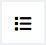
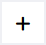
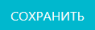
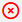
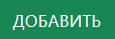
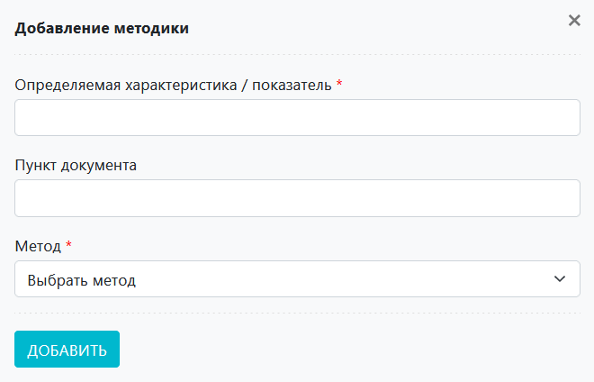
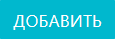

# Карточка ГОСТа

В карточке ГОСТа отражена информация о данном ГОСТе, а также в отдельной таблице приведен список методик, по которым в рамках данного ГОСТа лаборатория проводит испытания.

<!-- @import "[TOC]" {cmd="toc" depthFrom=1 depthTo=6 orderedList=false} -->

<!-- code_chunk_output -->

- [Карточка ГОСТа](#карточка-госта)
  - [Как перейти в карточку ГОСТа](#как-перейти-в-карточку-госта)
  - [Функции карточки ГОСТа](#функции-карточки-госта)
  - [Структура карточки ГОСТа](#структура-карточки-госта)
    - [Иконки действий](#иконки-действий)
    - [Блок «Информация о ГОСТе»](#блок-информация-о-госте)
    - [Блок «Таблица методик»](#блок-таблица-методик)
      - [Вспомогательный интерфейс добавления методики](#вспомогательный-интерфейс-добавления-методики)

<!-- /code_chunk_output -->

## Как перейти в карточку ГОСТа

1. Перейдите в журнал области аккредитации.
2. В столбце «Номер документа» перейдите по ссылке в соответствующей строке. 

## Функции карточки ГОСТа

1. Учет информации по данному ГОСТу
2. Формирование списка используемых методик в рамках данного ГОСТа
3. Управление актуальностью методик в рамках данного ГОСТа
4. Обеспечение доступа к карточкам методик в рамках данного ГОСТа

## Структура карточки ГОСТа

Карточка ГОСТа состоит из следующих блоков:
1. Иконки действий
2. Информация о ГОСТе
3. Таблица методик

### Иконки действий

 – нажмите на данную иконку чтобы вернуться в журнал области аккредитации.

 – нажмите на данную иконку чтобы добавить новый ГОСТ (откроется интерфейс создания карточки ГОСТа, аналогичный готовой карточке ГОСТа).

 – нажмите на данную иконку чтобы скопировать текущую карточку ГОСТа.

### Блок «Информация о ГОСТе»
Данный блок содержит следующие поля:
* **Номер документа** – номер ГОСТа
* **Год** – год публикации ГОСТа
* **Наименование документа** – полное наименование ГОСТа
* **Наименование объекта** – наименование объекта ГОСТа (что стандартизирует)
* **Код ТН ВЭД ЕАЭС**
* **Код ОКПД 2**

Также данный блок содержит следующие кнопки действий:

 – нажмите данную кнопку чтобы сохранить введенную или измененную информацию в данном блоке.

 – нажмите данную кнопку чтобы отметить все выбранные в таблице методик методики как неактуальные.

### Блок «Таблица методик»

В данной таблице содержится первичная информация о методиках по которым проводятся испытания в рамках данного ГОСТа.

Таблица сдержит следующие столбцы:
* **Отметка о подтверждении методики** – значок  обозначает, что методика подтверждена. Подробнее см. [Блок «Контроль»](/LIMS_Manual_Stand/Method_card/Method_card.html#control) инструкции к карточке методики.
* **Определяемая характеристика / показатель** – то, что определяем в ходе испытаний
* **Пункт документа** – пункт ГОСТ, регламентирующий указанный метод
* **Метод**
* **Единица измерения**
* **В ОА** – находится ли методика в области аккредитации
* **В РОА** – Находится ли методика на расширении области аккредитации
* Иконка  – нажмите на нее чтобы перейти к редактированию карточки методики
* Иконка  – нажмите на нее чтобы скопировать карточку методики (в таблице методик появится соответстующая строка со статусом  «Не подтверждено»)

 – находится в левой верхней части блока. По нажатии данной кнопки откроется вспомогательный интерфейс добавления записи в таблицу методик.

#### Вспомогательный интерфейс добавления методики

Интерфейс содержит следующие поля:

* **Определяемая характеристика / показатель** – обязательное плое. Введите сюда требуемое наименование определяемой характеристики / показателя.
* **Пункт документа** – введите сюда номер пункта ГОСТа, который регламентирует испытания по данному методу.
* **Метод** – установите курсор в данное поле и выберите нужный метод.

После того как вы заполнили все поля, нажмите кнопку .
> **Результат:** в таблице методик появится новая строка, содержащая введенные вами данные, а также будет создана новая карточка методики.

