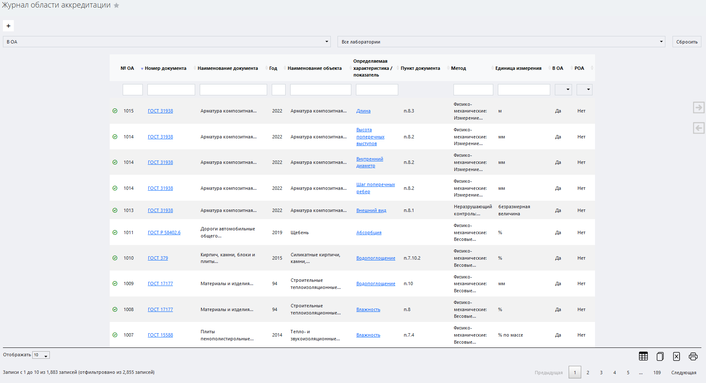
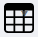

# Журнал области аккредитации

Данный журнал служит для регистрации и учета отношения методик к области аккредитации. 

<!-- @import "[TOC]" {cmd="toc" depthFrom=1 depthTo=6 orderedList=false} -->

<!-- code_chunk_output -->

- [Журнал области аккредитации](#журнал-области-аккредитации)
  - [Как перейти в журнал области аккредитации](#как-перейти-в-журнал-области-аккредитации)
  - [Функции журнала](#функции-журнала)
  - [Структура журнала](#структура-журнала)
    - [Кнопка вызова интерфейса регистрации нового ГОСТа](#кнопка-вызова-интерфейса-регистрации-нового-госта)
      - [Интерфейс регистрации нового ГОСТа](#интерфейс-регистрации-нового-госта)
    - [Область фильтров](#область-фильтров)
    - [Таблица методик](#таблица-методик)
      - [Структура таблицы](#структура-таблицы)
    - [Выбор количества отображаемых строк в таблице](#выбор-количества-отображаемых-строк-в-таблице)
    - [Иконки сервисных функций](#иконки-сервисных-функций)
    - [Легенда](#легенда)

<!-- /code_chunk_output -->

## Как перейти в журнал области аккредитации

Перейти в журнал области аккредитации вы можете по ссылке в левом меню Битрикс 24.

## Функции журнала

1. Ведение учета используемых методик и ГОСТов
2. Мониторинг отношения методик к области аккредитации лаборатории / ИЦ
3. Мониторинг актуальности методики
4. Обеспечение доступа к интерфейсу регистрации нового ГОСТа
5. Обеспечение доступа к карточке ГОСТа, к которому имеет отношение данная методика
6. Обеспечение доступа к карточке методики
7. Отображение записей в таблице по заданным параметрам (фильтрация)

## Структура журнала

Журнал области аккредитации состоит из следующих элементов:
1. Иконка вызова интерфейса регистрации нового ГОСТа	
2. Область фильтров
3. Таблица методик
4. Выбор количества отображаемых строк в таблице
5. Иконки сервисных функций

### Кнопка вызова интерфейса регистрации нового ГОСТа

 Нажмите на данную кнопку чтобы вызвать интерфейс регистрации нового ГОСТа.

#### Интерфейс регистрации нового ГОСТа

Подробнее о данном интерфейсе см. [Карточка ГОСТ](\LIMS_Manual_Stand\GOST_card\GOST_card.html)

Для того, чтобы зарегистрировать новый ГОСТ:

1. Заполните все поля блока «ГОСТ»
4. Нажмите кнопку 

> **Результат:** ГОСТ зарегистрирован, соответствующая запись появилась в таблице журнала области аккредитации.
:warning: Выбор методик в блоке «Методики» возможен только после того, как вы зарегистрируете ГОСТ. 

### Область фильтров

 
Данная область содержит в себе поля для задания параметров сортировки информации в таблице (см. соотв. номер ниже).
 
1. **Поле выбора категории методики**
Данное поле предназначено для сортировки методик по одной из следующих категорий:
    * **ОА** – методика в области аккредитации
    * **РОА** – методика на расширении области аккредитации
    * **Вне ОА** – методика вне области аккредитации
    * **Актуальна** – методика актуальна
    * **Не актуальна** – меодика не актуальна

2. **Поле выбора лаборатории**
Установите курсор в данное поле и в выпадающем списке выберите название нужной лаборатории, чтобы увидеть все методики, имеющие к ней отношение.
3. **Кнопка сброса фильтров**
Нажмите на данную кнопку, чтобы сбросить все примененные фильтры. 

### Таблица методик

Данная таблица содержит первичную информацию обо всех методиках, зарегистрированных в БД ЛИМС, и их отношении к области аккредитации.

#### Структура таблицы
Первая строка таблицы представляет собой поля поиска по столбцам. Установите курсор в любое из полей и введите информацию, по которой вы хотите отсортировать содержимое таблицы.

Таблица состоит из следующих столбцов:

* **Отметка о статусе** – здесь содержится иконка, которая сообщает, подтверждена методика или нет.
* **Номер документа** номер НТД, содержащей данную методику. Если вы перейдете по какой-либо ссылке в данном столбце, вы попадете в карточку ГОСТа, содержащего данную методику.
* **Наименование документа** – наименование НТД, содержащей данную методику
* **Год** – год выпуска НТД
* **Наименование объекта** – наименование объекта испытаний
* **Определяемая характеристика / показатель** – если вы перейдете по какой-либо ссылке в данном столбце, вы попадете в карточку методики.
* **Пункт документа** – пункт НТД, регламентирующий применение меода в рамках данной методики
* **Метод** – наименование метода
* **Единица измерения**
* **В ОА** – находится ли методика в области аккредитации
* **РОА** – находится ли методика на расширении области аккредитации

### Выбор количества отображаемых строк в таблице

Наведите курсор на окно выбора количества отображаемых строк в таблице. В выпадающем списке выберите нужное количество (10, 25, 50, 100). После этого в таблице отобразится выбранное количество строк.

### Иконки сервисных функций

 Данная иконка служит для скрытия столбцов в таблице. При нажатии на нее появится меню выбора столбцов. Нажмите на кнопку названия, чтобы скрыть соответствующий столбец. Результат вы увидите сразу, страницу перезагружать не требуется.
 При нажатии на данную иконку произойдет копирование содержимого таблицы, представленной на экране, в буфер обмена. Далее вы можете вставить данные таблицы в любой текстовый или табличный документ.
 При нажатии на данную иконку произойдет скачивание таблицы, представленной на экране, на ваш локальный компьютер в формате xlsx.
 Данная иконка служит для вывода на печать представленной на экране таблицы. При нажатии на нее откроется окно выбора параметров печати и предварительного просмотра.

### Легенда

В первом столбце таблицы присутствуют иконки, обозначающие статус соответствия / несоответствия записи об условиях применяемой методике.
 Соответствует
 Не соответствует