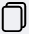

# Журнал регенерации активированного угля
Данный журнал предназначен для контроля процесса регенерации активированного угля.

<p align=center>

</p>

<!-- @import "[TOC]" {cmd="toc" depthFrom=1 depthTo=6 orderedList=false} -->

<!-- code_chunk_output -->

- [Журнал регенерации активированного угля](#журнал-регенерации-активированного-угля)
  - [Как перейти в журнал](#как-перейти-в-журнал)
  - [Функции журнала:](#функции-журнала)
  - [Структура журнала](#структура-журнала)
    - [Кнопка «Добавить запись»](#кнопка-добавить-запись)
    - [Кнопка «Добавить измерения с пустым БДБ-13»](#кнопка-добавить-измерения-с-пустым-бдб-13)
      - [Вспомогательный интерфейс добавления в журнал результатов измерений с незагруженным блоком детектирования БДБ-13](#вспомогательный-интерфейс-добавления-в-журнал-результатов-измерений-с-незагруженным-блоком-детектирования-бдб-13)
    - [Кнопка «Добавить измерения с загруженным БДБ-13»](#кнопка-добавить-измерения-с-загруженным-бдб-13)
      - [Вспомогательный интерфейс добавления в журнал измерений с загруженным блоком детектирования БДБ-13](#вспомогательный-интерфейс-добавления-в-журнал-измерений-с-загруженным-блоком-детектирования-бдб-13)
    - [Таблица журнала](#таблица-журнала)
    - [Иконки сервисных функций](#иконки-сервисных-функций)
    - [Выбор количества отображаемых строк в таблице](#выбор-количества-отображаемых-строк-в-таблице)
  - [Как внести запись в журнал](#как-внести-запись-в-журнал)

<!-- /code_chunk_output -->

## Как перейти в журнал

Вы можете перейти в журнал по соответствующей ссылке в левом меню Битрикс 24.

## Функции журнала:
1. Учет качества регенерации активированного угля 
2. Отображение записей в таблице по заданным параметрам (фильтрация)
3. Обеспечение доступа к интерфейсу регистрации проведенных работ
4. Обеспечение доступа к интерфейсам внесения результатов измерений
4. Контроль соответствия результатов измерений референсным значениям и сигнализация в случае несоответствия 
5. Вывод таблицы журнала на печать

## Структура журнала
<p align=center>

</p>

Журнал состоит из следующих элементов:
1. Кнопка «Добавить запись»
2. Кнопка «Добавить измерения с пустым БДБ-13»
3. Кнопка «Добавить измерения с загруженным БДБ-13»
4. Таблица журнала
5. Иконки сервисных функций
6. Выбор количества отображаемых строк в таблице

### Кнопка «Добавить запись»

Нажмите на нее чтобы вызвать вспомогательный интерфейс добавления в журнал записи о контроле регенерации.

<p align=center>

</p>

В данном интерфейсе установите курсор в поле «Дата и время окончания регенерации активированного угля» и в выпадающем календаре установите нужную дату.

>**Результат:** в таблице журнала отобразится запись о проведенном контроле регенерации активированного угля в виде новой строки с установленной датой. Результаты испытаний в ней содержаться не будут.

### Кнопка «Добавить измерения с пустым БДБ-13»

Нажмите на нее, чтобы вызвать вспомогательный интерфейс добавления измерений с незагруженным блоком детектирования БДБ-13.

#### Вспомогательный интерфейс добавления в журнал результатов измерений с незагруженным блоком детектирования БДБ-13

<p align=center>

</p>

Данный интерфейс содержит следующие поля:
* **Дата и время окончания регенерации** – установите курсор в данное поле и в выпадающем списке выберите дату и время, установленые вами в интерфейсе добавления в журнал записи о контроле регенерации.
* **Дата и время измерения** – установите курсор в данное поле и в выпадающем календаре установите дату и время измерения.
* **Выберите тип БДБ-13** – установите курсор в данное поле и в выпадающем списке выберите тип блока детектирования БДБ-13.

* Блок **Измерение количества импульсов** – вручную или при помощи стрелок в правой части установите в данных полях значения количества импульсов на каждом этапе измерений.
* Блок **Измерение t, изм, с** – вручную или при помощи стрелок в правой части установите время измерений в секундах каждом этапе измерений.
* Блок **Измерение скорости счета импульсов, cˉ¹** – вручную или при помощи стрелок в правой части установите скорость счета импульсов в секундах каждом этапе измерений.
* **Среднее значение скорости счета импульсов** – вручную или при помощи стрелок в правой части установите среднее значение счета импульсов.

После того как вы введете все необходимые значения, нажмите кнопку «Отправить».
>**Результат:** в блоке «С пустым БДБ-13» таблицы отобразятся введенные значения измерений.

### Кнопка «Добавить измерения с загруженным БДБ-13»

Нажмите на нее, чтобы вызвать вспомогательный интерфейс добавления измерений с загруженным блоком детектирования БДБ-13.

#### Вспомогательный интерфейс добавления в журнал измерений с загруженным блоком детектирования БДБ-13

<p align=center>

</p>

Данный интерфейс содержит следующие поля:
* **Дата и время окончания регенерации** – установите курсор в данное поле и в выпадающем списке выберите дату и время, установленые вами в интерфейсе добавления в журнал записи о контроле регенерации.
* **Дата и время измерения** – установите курсор в данное поле и в выпадающем календаре установите дату и время измерения.
* Блок **Измерение количества импульсов** – вручную или при помощи стрелок в правой части установите в данных полях значения количества импульсов на каждом этапе измерений.
* Блок **Измерение t, изм, с** – вручную или при помощи стрелок в правой части установите время измерений в секундах каждом этапе измерений.
* Блок **Измерение скорости счета импульсов, cˉ¹** – вручную или при помощи стрелок в правой части установите скорость счета импульсов в секундах каждом этапе измерений.
* **Среднее значение скорости счета импульсов** – вручную или при помощи стрелок в правой части установите среднее значение счета импульсов.
* **A_bф, Бк** – вручную или при помощи стрелок в правой части установите значение A_bф в беккерелях.

После того как вы введете все необходимые значения, нажмите кнопку «Отправить».
>**Результат:** в блоке «С загруженным БДБ-13» таблицы отобразятся введенные значения измерений.

### Таблица журнала
Таблица состоит из следующих столбцов:

<Table style="border: 0px">
<tr>
  <td style="border: 0px">

* **Столбец индикации о соответствии / несоответствии результатов измерений референсным значениям** – заполняется автоматически на основании введенных результатов измерений.
* **Дата и время окончания регенерации** – дата и время окончания регенерации активированного угля 
* **№ БДБ-13** – номер блока детектирования БДБ-13
  </td>
  <td style="border: 0px">  
  </td>
</tr>

<tr>
  <td style="border: 0px">

**Блок «С пустым БДБ-13»** – столбцы данного блока дублируют поля вспомогательного интерфейса добавления в журнал измерений с незагруженным блоком детектирования БДБ-13
* **Дата и время измерения** – дата и время проведения измерений с незагруженным блоком детектирования БДБ-13
* **Кол-во импульсов** – количество импульсов
* **t, измб с** – время измерения в секундах
* **Скорость счета импульсов, cˉ¹** – скорость счета импульсов (обратная величина)
* **Среднее значение скорости счета импульсов** – среднее значение скорости подсчета импульсов на основе трех этапов измерений.
  </td>
  <td style="border: 0px"> 
  </td>
</tr>

<tr>
  <td style="border: 0px">

**Блок «С загруженным БДБ-13»** – столбцы данного блока дублируют поля вспомогательного интерфейса добавления в журнал измерений с загруженным блоком детектирования БДБ-13

* **Дата и время измерения** – дата и время проведения измерений с незагруженным блоком детектирования БДБ-13
* **Кол-во импульсов** – количество импульсов
* **t, измб с** – время измерения в секундах
* **Скорость счета импульсов, cˉ¹** – скорость счета импульсов (обратная величина)
* **Среднее значение скорости счета импульсов** – среднее значение скорости подсчета импульсов на основе трех этапов измерений.
* **A_bф, Бк** – значение A_bф в беккерелях.

 </td>
  <td style="border: 0px"> 
  </td>
</tr>

<tr>
<td style="border: 0px">

* **Соответствует / не соответствует** – заключение о соответствии / несоответствии результатов измерений референсным значениям (выставляется автоматически на основании введенных результатов измерений)
* **Подпись ответственного лица** – ФИО ответственного за проведение контрольного мероприятия
</td>
<td style="border: 0px">
</td>
</tr>
</Table>

### Иконки сервисных функций

 Данная иконка служит для скрытия столбцов в таблице. При нажатии на нее появится меню выбора столбцов. Нажмите на кнопку названия, чтобы скрыть соответствующий столбец. Результат вы увидите сразу, страницу перезагружать не требуется.
 При нажатии на данную иконку произойдет копирование содержимого таблицы, представленной на экране, в буфер обмена. Далее вы можете вставить данные таблицы в любой текстовый или табличный документ.
 При нажатии на данную иконку произойдет скачивание таблицы, представленной на экране, на ваш локальный компьютер в формате xlsx.
 Данная иконка служит для вывода на печать представленной на экране таблицы. При нажатии на нее откроется окно выбора параметров печати и предварительного просмотра.


### Выбор количества отображаемых строк в таблице

Наведите курсор на окно выбора количества отображаемых строк в таблице. В выпадающем списке выберите нужное количество (10, 25, 50, 100). После этого в таблице отобразится выбранное количество строк.

## Как внести запись в журнал

```mermaid align="center"
flowchart TD
  1((Перейти в журнал <br> по ссылке <br> в левом меню <br> Битрикс 24))
  2("Нажать кнопку <br> «Добавить запись»")
  3(Установить дату <br> окончания регенерации <br> активированного угля)
  4(Провести <br> измерения <br> с пустым БДБ-13)
  5("Нажать кнопку <br> «Добавить измерения <br> с пустым БДБ-13»")
  6(Внести результаты <br> измерений <br> с пустым БДБ-13)
  7(Провести <br> измерения <br> с загруженным БДБ-13)
  8("Нажать кнопку <br> «Добавить измерения <br> с загруженным БДБ-13»")
  9(Внести результаты <br> измерений <br> с загруженными БДБ-13)
  10((Проконтролировать <br> появление <br> записи в журнале))
  
  1-->2
  2-->3
  3-->4
  4-->5
  5-->6
  6-->7
  7-->8
  8-->9
  9-->10

  style 1 fill: pink, stroke:#333,stroke-width:2px
  style 10 fill: lightgreen, stroke:#333,stroke-width:2px
