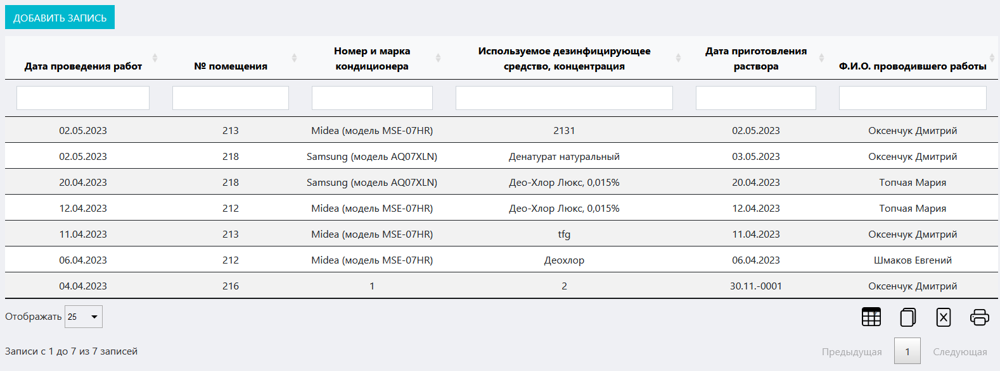
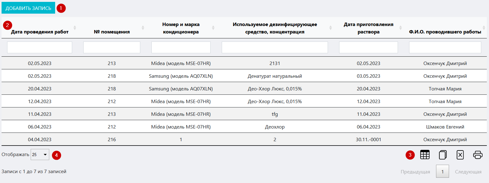
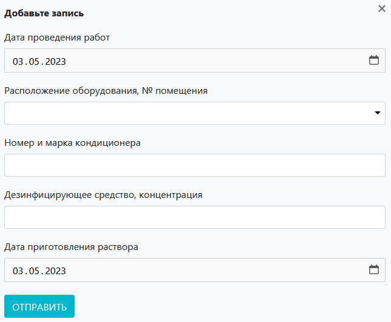

# Журнал дезинфекции кондиционеров
Данный журнал предназначен для учета работ по очистке и дезинфекции кондиционеров в лаборатории / ИЦ.

<!-- @import "[TOC]" {cmd="toc" depthFrom=1 depthTo=6 orderedList=false} -->

<!-- code_chunk_output -->

- [Журнал дезинфекции кондиционеров](#журнал-дезинфекции-кондиционеров)
  - [Как перейти в журнал](#как-перейти-в-журнал)
  - [Функции журнала:](#функции-журнала)
  - [Структура журнала](#структура-журнала)
    - [Кнопка «Добавить оборудовнаие»](#кнопка-добавить-оборудовнаие)
    - [Иконки сервисных функций](#иконки-сервисных-функций)
    - [Таблица журнала](#таблица-журнала)
    - [Выбор количества отображаемых строк в таблице](#выбор-количества-отображаемых-строк-в-таблице)

<!-- /code_chunk_output -->

## Как перейти в журнал

Вы можете перейти в журнал по соответствующей ссылке в левом меню Битрикс 24.

## Функции журнала:
1. Учет полного спектра работ по очистке и дезинфекции кондиционеров 
2. Отображение записей в таблице по заданным параметрам (фильтрация)
3. Обеспечение доступа к интерфейсу регистрации проведенных работ
4. Вывод таблицы журнала на печать

##  Структура журнала

Журнал состоит из следующих блоков:
1. Кнопка «Добавить запись»
2. Таблица журнала
3. Иконки сервисных функций
4. Выбор количества отображаемых строк в таблице

### Кнопка «Добавить оборудовнаие»

Нажмите на нее чтобы вызвать вспомогательный интерфейс добавления в журнал записи о проведенных работах по дезинфекции.

Данный интерфейс содержит следующие поля:
* **Дата проведения работ** – установите курсор в данное поле и в выпадающем календаре установите дату проведения работ по дезинфекции.
* **Расположение оборудования, № помещения** – установите курсор в данное поле и в выпадающем списке выберите тип холодильника.
* **Номер и марка кондиционера** – введите сюда сведения о заводском номере и марке кондиционера.
* **Дезинфицирующее средство, концентрация** – введите сюда намиенование и концентрацию используемого дезинфицирующего средства.
* **Дата приготовления раствора** –  установите курсор в данное поле и в выпадающем календаре установите дату приготовления раствора.

После того как вы заполните все поля, нажмите кнопку «Отправить»

>**Результат:** в таблице журнала появится запись о проведенных работах.

### Иконки сервисных функций

 Данная иконка служит для скрытия столбцов в таблице. При нажатии на нее появится меню выбора столбцов. Нажмите на кнопку названия, чтобы скрыть соответствующий столбец. Результат вы увидите сразу, страницу перезагружать не требуется.
 При нажатии на данную иконку произойдет копирование содержимого таблицы, представленной на экране, в буфер обмена. Далее вы можете вставить данные таблицы в любой текстовый или табличный документ.
 При нажатии на данную иконку произойдет скачивание таблицы, представленной на экране, на ваш локальный компьютер в формате xlsx.
 Данная иконка служит для вывода на печать представленной на экране таблицы. При нажатии на нее откроется окно выбора параметров печати и предварительного просмотра.

### Таблица журнала

Таблица состоит из следующих столбцов:

* **Дата проведения работ** – когда проводились работы
* **№ помещения** – где именно расположен кондиционер
* **Номер и марка кондиционера** – какой кондиционер подвергался дезинфекции
* **Используемое дезинфицирующее средство, концентрация** – какое дезсредство и в какой концентрации применялось 
* **Дата приготовления раствора** – когда был приготовлен раствор
* **ФИО проводившего работы** – ФИО лица, ответственного за дезинфекцию

### Выбор количества отображаемых строк в таблице

Наведите курсор на окно выбора количества отображаемых строк в таблице. В выпадающем списке выберите нужное количество (10, 25, 50, 100). После этого в таблице отобразится выбранное количество строк.