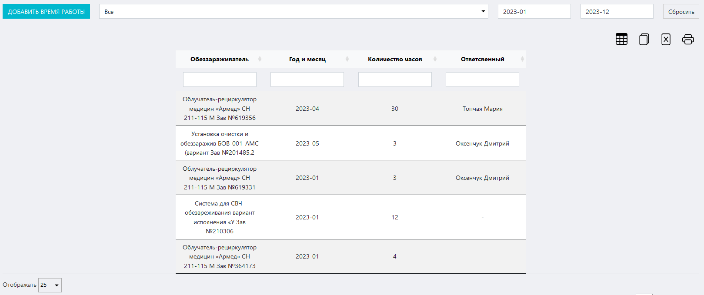
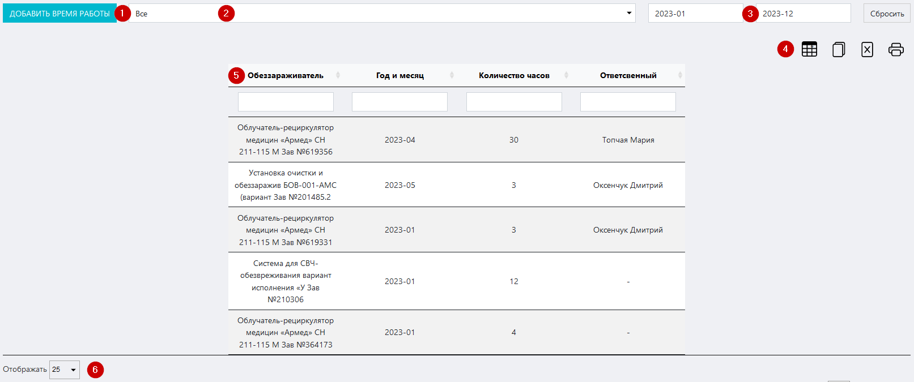
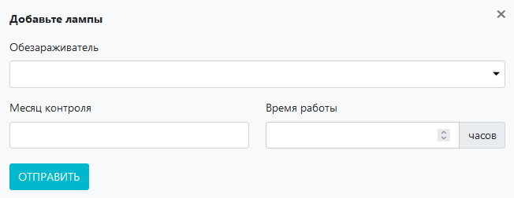

# Журнал контроля времени работы обеззараживателей
Данный журнал предназначен для регистрации и учета времени работы обеззараживателей в лаборатории / ИЦ.

<p align=center>

</p>

<!-- @import "[TOC]" {cmd="toc" depthFrom=1 depthTo=6 orderedList=false} -->

<!-- code_chunk_output -->

- [Журнал контроля времени работы обеззараживателей](#журнал-контроля-времени-работы-обеззараживателей)
  - [Как перейти в журнал](#как-перейти-в-журнал)
  - [Функции журнала:](#функции-журнала)
  - [Структура журнала](#структура-журнала)
    - [Кнопка «Добавить время работы»](#кнопка-добавить-время-работы)
      - [Вспомогательный интерфейс добавления записи о времени работы обеззараживателя](#вспомогательный-интерфейс-добавления-записи-о-времени-работы-обеззараживателя)
    - [Поле выбора обеззараживателя](#поле-выбора-обеззараживателя)
    - [Поля выбора границы диапазона дат записей](#поля-выбора-границы-диапазона-дат-записей)
    - [Иконки сервисных функций](#иконки-сервисных-функций)
    - [Таблица журнала](#таблица-журнала)
    - [Поле выбора количества отображаемых строк в таблице](#поле-выбора-количества-отображаемых-строк-в-таблице)
  - [Как внести запись в журнал](#как-внести-запись-в-журнал)

<!-- /code_chunk_output -->

## Как перейти в журнал

Вы можете перейти в журнал по соответствующей ссылке в левом меню Битрикс 24.

## Функции журнала:
1. Регистрация и учет времени работы обеззараживателей
2. Отображение записей в таблице по заданным параметрам (фильтрация)
3. Обеспечение доступа к интерфейсу внесения результатов измерения
4. Вывод таблицы журнала на печать

##  Структура журнала
<p align=center>

</p>

Журнал состоит из следующих блоков:
1. Кнопка «Добавить время работы»
2. Поле выбора обеззараживателя
3. Поля выбора границы диапазона дат записей
4. Иконки сервисных функций
5. Таблица журнала
6. Поле выбора количества отображаемых строк в таблице

### Кнопка «Добавить время работы»

Нажмите на нее чтобы вызвать вспомогательный интерфейс добавления в журнал записи о времени работы обеззараживателя.

<p align=center>

</p>

#### Вспомогательный интерфейс добавления записи о времени работы обеззараживателя

Данный интерфейс содержит следующие поля:

* Поле **«Обеззараживатель»** – установите курсор в данное поле и в выпадающем списке выберите нужный обеззараживатель.
* Поле **«Месяц контроля»** – введите сюда ндату проведения контроля.
* Поле **«Количество»** – вручную или при помощи стрелок в правой части поля установите в данном поле время работы обеззараживателя в часах.

После того как вы заполните все поля, нажимте кнопку «Отправить».

>**Результат:** в таблице журнала появится запись о времени работы обеззараживателя.

### Поле выбора обеззараживателя

Данное поле предназначено для сортировки записей в таблице по принадлежности к конкретному обеззараживателю.

Установите курсор в данное поле и в выпадающем списке выберите нужный обеззараживатель.

>**Результат:** в таблице журнала отобразятся все записи о времени работы выбранного обеззараживателя. 

### Поля выбора границы диапазона дат записей

Данные поля предназначены для установления диапазона дат, в рамках которых будут отсортированы записи в таблице.

Установите курсор в данные поля и в выпадающем календаре установите нужные даты.

>**Результат:** в таблице в таблице журнала отобразятся все записи о времени работы обеззараживателей в рамках выбранного временного диапазона.

Для сброса дат нажмите кнопку «Сбросить»

### Иконки сервисных функций

 Данная иконка служит для скрытия столбцов в таблице. При нажатии на нее появится меню выбора столбцов. Нажмите на кнопку названия, чтобы скрыть соответствующий столбец. Результат вы увидите сразу, страницу перезагружать не требуется.
 При нажатии на данную иконку произойдет копирование содержимого таблицы, представленной на экране, в буфер обмена. Далее вы можете вставить данные таблицы в любой текстовый или табличный документ.
 При нажатии на данную иконку произойдет скачивание таблицы, представленной на экране, на ваш локальный компьютер в формате xlsx.
 Данная иконка служит для вывода на печать представленной на экране таблицы. При нажатии на нее откроется окно выбора параметров печати и предварительного просмотра.

### Таблица журнала
Здесь отображаются все записи о времени работы всех имеющихся в лаборатории / ИЦ обеззараживателей. Таблица состоит из следующих столбцов:

* **Обеззараживатель** – наименование обеззараживателя
* **Год и месяц** – год и месяц проведения контроля
* **Количество часов** – длительность работы обеззараживателя
* **Ответственный** – ФИО лица, ответственного за данный обеззараживатель

### Поле выбора количества отображаемых строк в таблице

Установите курсор в данное поле и в выпадающем списке выберите нужное количество (10, 25, 50, 100). После этого в таблице отобразится выбранное количество строк.

## Как внести запись в журнал

```mermaid align="center"
flowchart TB
  0((Произвести <br> контроль))
  1(Перейти в журнал <br> по ссылке <br> в левом меню)
  2("Нажать кнопку <br> «Добавить время работы»")
  3(Заполнить все поля <br> в открывшемся интерфейсе)
  4("Нажать кнопку «Отправить»")
  5((Проконтролировать <br> появление <br> записи в журнале))
  
  0-->1
  1-->2
  2-->3
  3-->4
  4-->5

  style 0 fill: pink, stroke:#333,stroke-width:2px
  style 5 fill: lightgreen, stroke:#333,stroke-width:2px