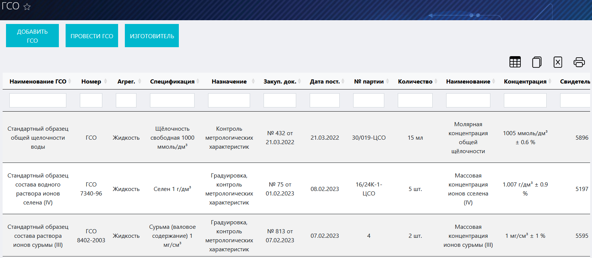
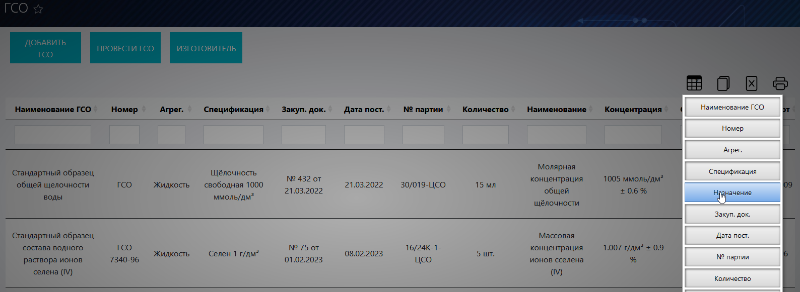
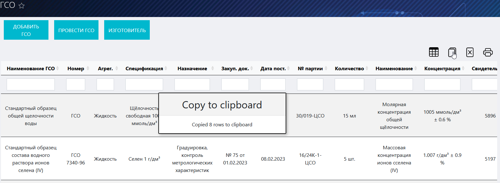
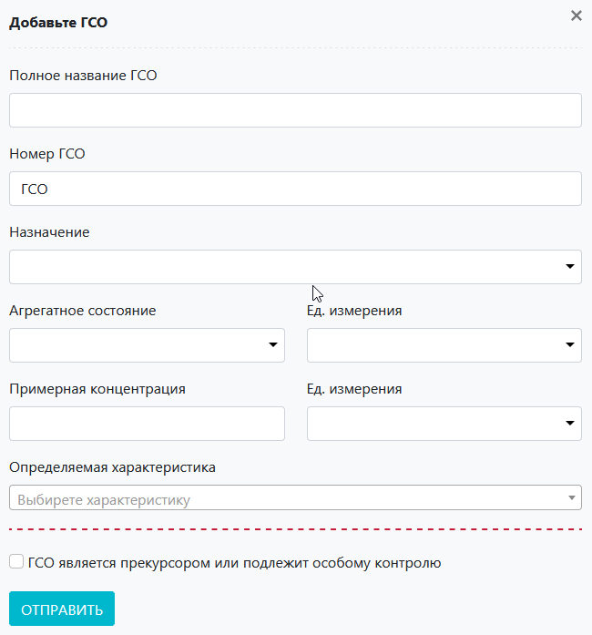
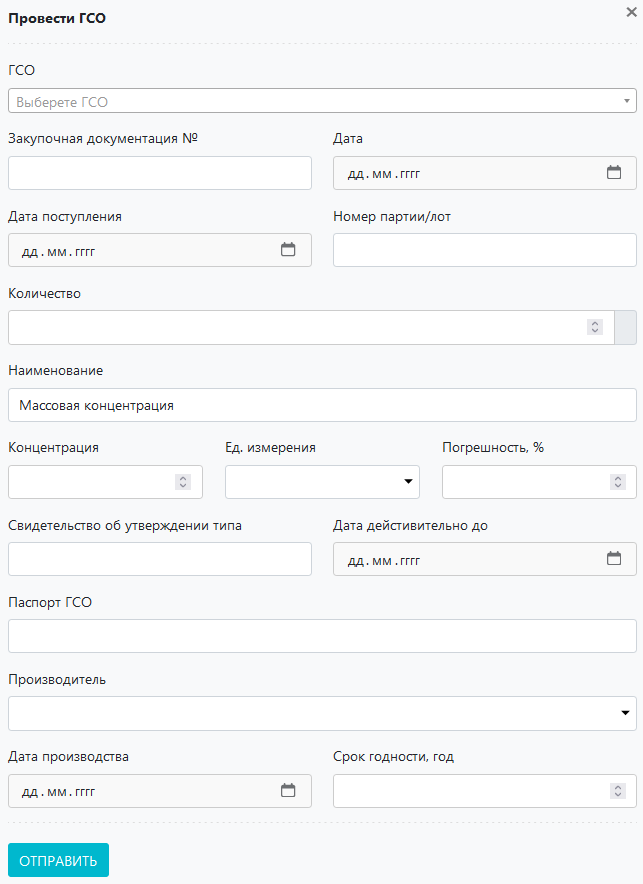
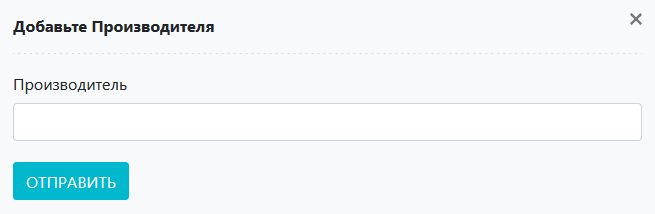

# Журнал ГСО
Данный журнал предназначен для учета ГСО в ЛИМС U-Lab.

<!-- @import "[TOC]" {cmd="toc" depthFrom=1 depthTo=6 orderedList=false} -->

<!-- code_chunk_output -->

- [Журнал ГСО](#-журнал-гсо-)
  - [Как перейти в журнал](#-как-перейти-в-журнал-)
  - [Функции журнала](#-функции-журнала-)
  - [Компоненты журнала](#--компоненты-журнала--)
    - [Таблица ГСО](#-таблица-гсо-)
    - [Функциональная панель](#-функциональная-панель-)
    - [Кнопки вспомогательных интерфейсов](#-кнопки-вспомогательных-интерфейсов-)
    - [Вспомогательные интерфейсы](#-вспомогательные-интерфейсы-)
      - [Интерфейс добавления ГСО](#-интерфейс-добавления-гсо-)
      - [Интерфейс проведения ГСО](#-интерфейс-проведения-гсо-)
      - [Интерфейс добавления нового производителя](#-интерфейс-добавления-нового-производителя-)

<!-- /code_chunk_output -->

## Как перейти в журнал

Вы можете перейти в журнал ГСО по соответствующей ссылке в левом меню Битрикс 24.

## Функции журнала
1. ведение учета всех ГСО, имеющихся в лаборатории;
2. отображение записей в таблице по заданным параметрам (фильтрация);
3. внесение ГСО в БД ЛИМС;
4. проведение ГСО;
5. добавление производителя в БД ЛИМС.

Рисунок 1. Общий вид журнала ГСО

##  Компоненты журнала 
### Таблица ГСО

Первая строка данной таблицы представляет собой набор полей поиска, посредством которых реализуется функция фильтрации содержимого таблицы. Для того чтобы задать параметры поиска, установите курсор в данное поле в том столбце, по содержанию которого хотите произвести отбор, и введите нужное значение. Если необходимо отфильтровать по нескольким параметрам, повторите описанные действия для соответствующих столбцов.
> **Результат:** в таблицу будет выведена отсортированная согласно заданным значениям информация

Таблица состоит из следующих столбцов:
* **Наименование ГСО** – название ГСО
* **Номер** – номер (индекс) ГСО в БД ЛИМС
* **Агрег.** – агрегатное состояние
* **Спецификация** – спецификация ГСО
* **Назначение** – функциональное назначение ГСО
* **Закуп. док.** – номер и дата закупочной документации
* **Дата поставки** – Дата поставки стандарт-титра в лабораторию
* **№ партии** – номер партии стандарт-титра
* **Количество** – количество единиц продукции
* **Наименование** – наименование ключевого показателя
* **Концентрация** – концентрация вещества.
* **Свидетельство** – № свидетельства
* **Паспорт** – № паспорта 
* **Производитель** – наименование производителя.
* **Дата производства** – дата производства ГСО
* **Срок годности** – срок годности ГСО

### Функциональная панель
При помощи данной панели вы можете:
* **Скрыть ненужные колонки в таблице.** Для этого нажмите на иконку  и в появившемся окне нажмите на кнопки с названиями тех столбцов, которые нужно скрыть (см. рисунок 2).
    > **Результат:** ненужные столбцы будут скрыты
    

    
    

    
Рисунок 2. Скрытие ненужных столбцов
 

* **Скопировать содержимое таблицы в буфер обмена.** Для этого нажмите на иконку .
    > **Результат:** На экране появится сообщение о том, что копирование произведено (см. рисунок 3).

    

    
    

    
Рисунок 3. Копирование таблицы в буфер обмена
 

* **Сформировать на основе таблицы файл xlsx.** Для этого нажмите на иконку . 
    > **Результат:** Система сформирует файл и начнет его скачивание на локальный компьютер.

* **Вывести содержимое таблицы на печать.** Для этого нажмите на иконку . 
    > **Результат:** Откроется интерфейс вывода документа на печать.

### Кнопки вспомогательных интерфейсов

 – интерфейс добавления ГСО

 – интерфейс проведения ГСО

 – интерфейс добавления производителя ГСО

### Вспомогательные интерфейсы

#### Интерфейс добавления ГСО
 
 

    
    

    
Рисунок 4. Общий вид интерфейса
 

Данный интерфейс служит для добавления ГСО в БД ЛИМС. Чтобы добавить ГСО: 

1. Нажмите кнопку .
2. Заполните все поля интерфейса: 

    * **Полное название ГСО** – введите в данное поле название стандарт-титра.
    * **Номер ГСО** – введите в данное поле номер ГСО.
    * **Назначение** – установите курсор в данное поле и в выпадающем списке выберите нужное назначение.
    * **Агрегатное состояние** – установите курсор в данное поле и в выпадающем списке выберите агрегатное состояние ГСО.
    * **Ед. измерения** – установите курсор в данное поле и в выпадающем списке выберите нужную единицу измерения количества ГСО.
    * **Примерная концентрация** – введите сюда значение примерной концентрации.
    * **Ед. измерения** – установите курсор в данное поле и в выпадающем списке выберите нужную единицу измерения концентрации вещества.
    * **Определяемая характеристика** – установите курсор в данное поле и в выпадающем списке выберите поределяемую характеристику.
    * **Флажок «Стандарт-титр является прекурсором или подлежит особому контролю»** – установите его, если ГСО является прекурсором.

3. После того как вы ввели все необходимые данные, нажмите кнопку , после чего система внесет информацию о стандарт-титре в БД.

#### Интерфейс проведения ГСО

    
    

    
Рисунок 5. Общий вид интерфейса
 

Данный интерфейс служит для проведения ГСО. Чтобы добавить ГСО:
1. Нажмите кнопку 
2. Заполните следующие поля:
    * **ГСО** – введите в данное поле название стандарт-титра.
    * **Закупочная документация №** – введите в данное поле номер закупочного документа.
    * **Дата** – установите курсор в данное поле и в выпадающем календаре выставьте дату выдачи закупочного документа.
    * **Дата поступления** – установите курсор в данное поле и в выпадающем календаре выставьте дату поступления ГСО.
    * **Номер партии / лот** – введите в данное поле номер партии ГСО.
    * **Количество** – вручную или при помощи стрелок в правой части поля установите количество поступившего ГСО.
    * **Наименование** – введите в данное поле основного параметра.
    * **Концентрация** – вручную или при помощи стрелок в правой части поля установите нужную концентрацию вещества.
    * **Ед. измерения** – установите курсор в данное поле и в выпадающем списке выберите нужную единицу измерения основного параметра.
    * **Погрешность** – вручную или при помощи стрелок в правой части поля установите нужную допустимую погрешность определения основного параметра.
    * **Свидетельство об утверждении типа** – введите в данное поле тип свидетельства об утверждении.
    * **Дата** – установите курсор в данное поле и в выпадающем календаре выставьте дату, до которой действительно свидетельство.
    * **Свидетельство об утверждении типа** – введите в данное поле данные паспорта ГСО.
    * **Производитель** – установите курсор в данное поле и в выпадающем списке выберите производителя ГСО.
    * **Дата производства** – установите курсор в данное поле и в выпадающем календаре установите дату производства ГСО.
    * **Срок годности, год** – вручную или при помощи стрелок в правой части поля установите год окончания срока годности ГСО.
3. После того как вы ввели все необходимые данные, нажмите кнопку , в результате чего система осуществит проведение ГСО.

#### Интерфейс добавления нового производителя
 
 

    
    

    
Рисунок 6. Общий вид интерфейса
 

Данный интерфейс служит для добавления нового производителя в БД ЛИМС. Для того чтобы добавить нового производителя: 
1. Нажмите кнопку  – интерфейс проведения ГСО.
2. Заполните поле «Производитель».
3. Нажмите кнопку .

> Результат: система внесет информацию в БД, и вы сможете осуществить выбор в поле «Производитель» вспомогательного интерфейса добавления стандарт-титра.