# Журнал паразитологии
Данный журнал предназначен для учета контрольных смывов на паразитологию.

<p align=center>
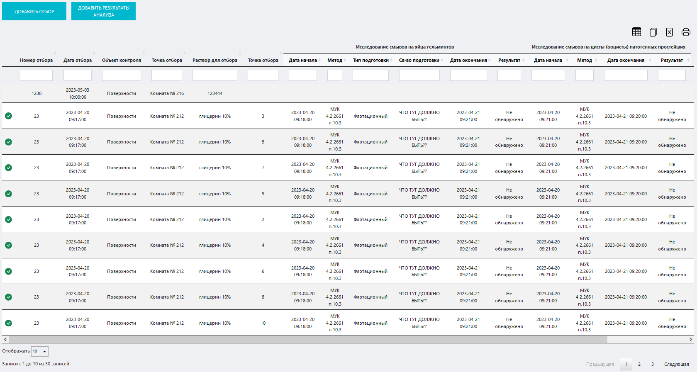
</p>

<!-- @import "[TOC]" {cmd="toc" depthFrom=1 depthTo=6 orderedList=false} -->

<!-- code_chunk_output -->

- [Журнал паразитологии](#журнал-паразитологии)
  - [Как перейти в журнал](#как-перейти-в-журнал)
  - [Функции журнала:](#функции-журнала)
  - [Структура журнала](#структура-журнала)
    - [Кнопка «Добавить отбор»](#кнопка-добавить-отбор)
      - [Вспомогательный интерфейс добавления в журнал записи о произведенном смыве](#вспомогательный-интерфейс-добавления-в-журнал-записи-о-произведенном-смыве)
    - [Кнопка «Добавить результаты анализа»](#кнопка-добавить-результаты-анализа)
      - [Вспомогательный интерфейс добавления результатов анализа к записи о произведенном смыве](#вспомогательный-интерфейс-добавления-результатов-анализа-к-записи-о-произведенном-смыве)
    - [Иконки сервисных функций](#иконки-сервисных-функций)
    - [Таблица журнала](#таблица-журнала)
    - [Выбор количества отображаемых строк в таблице](#выбор-количества-отображаемых-строк-в-таблице)
  - [Как внести запись в журнал](#как-внести-запись-в-журнал)

<!-- /code_chunk_output -->

## Как перейти в журнал

Вы можете перейти в журнал по соответствующей ссылке в левом меню Битрикс 24.

## Функции журнала:
1. Учет смывов на яйца гельминтов и на цисты (ооцисты) патогенных простейших 
2. Отображение записей в таблице по заданным параметрам (фильтрация)
3. Обеспечение доступа к интерфейсу регистрации проведенных работ
4. Контроль соответствия результатов измерений референсным значениям и сигнализация в случае несоответствия 
5. Вывод таблицы журнала на печать

## Структура журнала
<p align=center>
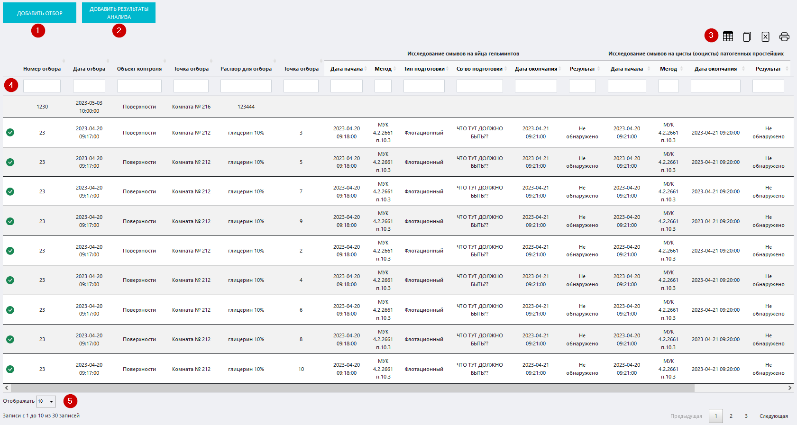
</p>

Журнал состоит из следующих элементов:
1. Кнопка «Добавить отбор»
2. Кнопка «Добавить результаты анализа»
2. Таблица журнала
3. Иконки сервисных функций
4. Выбор количества отображаемых строк в таблице

### Кнопка «Добавить отбор»

Нажмите на нее чтобы вызвать вспомогательный интерфейс добавления в журнал записи о произведенном смыве.

<p align=center>
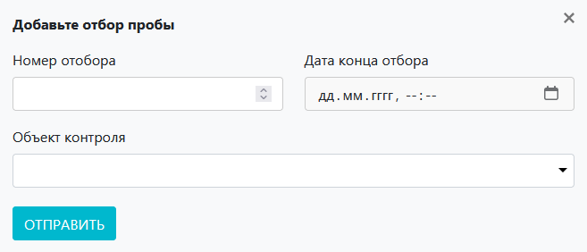
</p>

#### Вспомогательный интерфейс добавления в журнал записи о произведенном смыве

Данный интерфейс содержит следующие поля:
* **Номер отбора** – вручную или при помощи стрелок в правой части поля установите номер отбора.
* **Дата конца отбора** – установите курсор в данное поле и в выпадающем календаре установите дату окончания отбора.
* **Объект контроля** – установите курсор в данное поле и в выпадающем списке выберите объект контроля (поверхность или сотрудник). Существует два варианта выбора:

**1. Объект контроля – поверхность.** В этом случае добавится блок «Поверхности», а интерфейс примет следующий вид:

<p align=center>
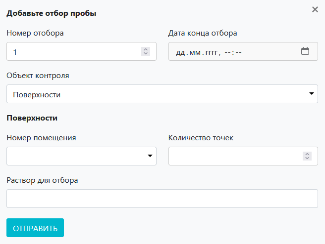
</p>

Блок «Поверхности» содержит следующие поля:

* **Номер помещения** – установите курсор в данное поле и в выпадающем списке выберите помещение, в котором производится смыв.
* **Количество точек** – вручную или при помощи стрелок в правой части поля установите количество точек сбора смывов.
* **Раствор для отбора** – введите сюда информацию о растворе, посредством которого осуществляется смыв.

**2. Объект контроля – человек (сотрудник).** В этом случае добавится блок «Сотрудники», а интерфейс примет следующий вид:

<p align=center>
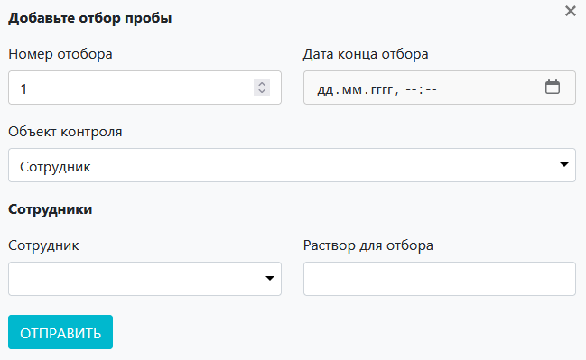
</p>

Блок  «Сотрудники» содержит следующие поля:
* **Сотрудник** – установите курсор в данное поле и в выпадающем списке выберите фамилию сотрудника, который будет подвергаться контролю.
* **Раствор для отбора** – введите сюда информацию о растворе, посредством которого осуществляется смыв.

После того как вы заполните все поля, нажмите кнопку «Отправить»

>**Результат:** в таблице журнала появится запись о проведенном смыве. Результаты анализа будут отсутствовать (они появятся после их внесения).

### Кнопка «Добавить результаты анализа»

Нажмите на нее чтобы вызвать вспомогательный интерфейс добавления результатов анализа к записи о произведенном смыве.

<p align=center>
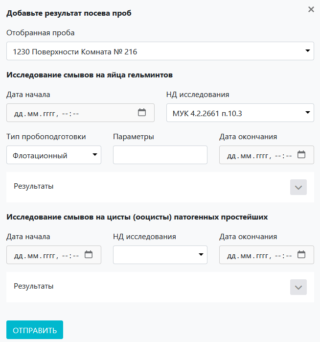
</p>

#### Вспомогательный интерфейс добавления результатов анализа к записи о произведенном смыве

Данный интерфейс содержит следующие элементы:
* Поле **Отобранная проба** – установите курсор в данное поле и в выпадающем списке выберите нужную пробу (например, ту, которую вы зарегистрировали при помощи [интерфейса добавления в журнал записи о произведенном смыве](#кнопка-добавить-отбор)).

**Блок «Исследование смывов на яйца гельминтов»**

* **Дата начала** – установите курсор в данное поле и в выпадающем списке выберите дату начала контроля.
* **НД исследования** – установите курсор в данное поле и в выпадающем списке выберите нормативную документацию, на соновании которой проводится контроль.
* **Тип пробоподготовки** – установите курсор в данное поле и в выпадающем списке выберите тип пробоподготовки.
* **Параметры** – введите сюда параметры пробоподготовки.
* **Дата окончания** – установите курсор в данное поле и в выпадающем списке выберите дату окончания контроля.

<span id=block>После того как вы установили значение в поле «Отобранная проба», у вас появится возможность развернуть **подблок «Результаты»**.</span>

<p align=center>
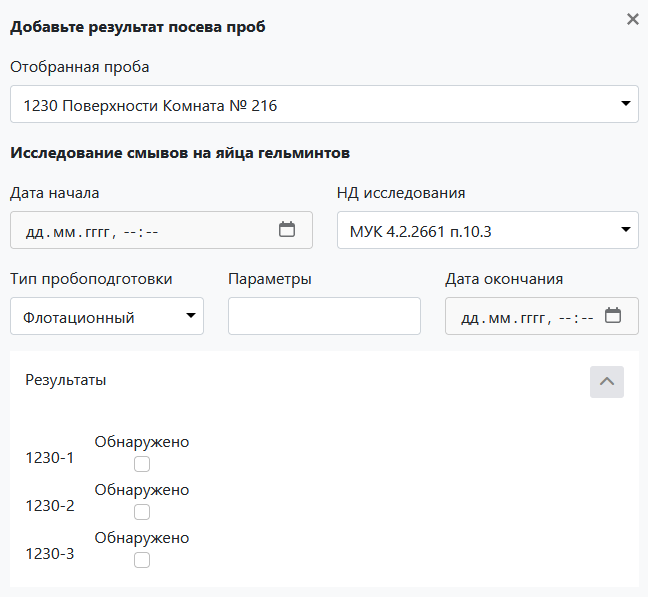
</p>

В данном подблоке будут содержаться флажки «Обнаружено», помеченные индексом, состоящим из номера отбора (смыва), введенного в поле «Номер отбора» [вспомогательного интерфейса добавления в журнал записи о произведенном смыве](#кнопка-добавить-отбор), и порядкового номера флажка в данном списке.

Количество флажков всегда равно количеству точек смыва, установленному в поле «Количество точек» [вспомогательного интерфейса добавления в журнал записи о произведенном смыве](#кнопка-добавить-отбор).

> :warning: В случае, если объектом контроля выбран сотрудник, точек смыва, а, соответственно, и флажков, всегда будет 2 (по количеству рук сотрудника).

**Блок «Исследование смывов на цисты (ооцисты) патогенных простейших»**

* **Дата начала** – установите курсор в данное поле и в выпадающем списке выберите дату начала контроля.
* **НД исследования** – установите курсор в данное поле и в выпадающем списке выберите нормативную документацию, на соновании которой проводится контроль.
* **Дата окончания** – установите курсор в данное поле и в выпадающем списке выберите дату окончания контроля.

После того как вы установили значение в поле «Отобранная проба», у вас появится возможность развернуть **подблок «Результаты»**.

<p align=center>
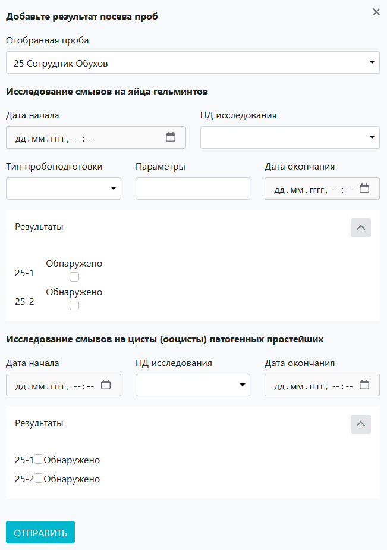
</p>

Данный подблок организован в полном соответствии с [аналогичным подблоком](C:/Users/EugenPro/Desktop/Markdown_docs/LIMS_Manual_Stand/Lists/Chemical_Lab_lists/Parasite_control/Parasite_control.html#block) блока «Исследование смывов на яйца гельминтов».

### Иконки сервисных функций

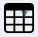 Данная иконка служит для скрытия столбцов в таблице. При нажатии на нее появится меню выбора столбцов. Нажмите на кнопку названия, чтобы скрыть соответствующий столбец. Результат вы увидите сразу, страницу перезагружать не требуется.
 При нажатии на данную иконку произойдет копирование содержимого таблицы, представленной на экране, в буфер обмена. Далее вы можете вставить данные таблицы в любой текстовый или табличный документ.
 При нажатии на данную иконку произойдет скачивание таблицы, представленной на экране, на ваш локальный компьютер в формате xlsx.
 Данная иконка служит для вывода на печать представленной на экране таблицы. При нажатии на нее откроется окно выбора параметров печати и предварительного просмотра.

### Таблица журнала
Таблица состоит из следующих столбцов:

<Table style="border: 0px">
<tr>
  <td style="border: 0px">

* **№ отбора** – порядковый номер контрольного мероприятия
* **Дата отбора** – когда проводилось мероприятие
* **Объект контроля** – что подвергалось контролю (поверхности или сотрудники)
* **Точка отбора** – какое помещение или какой сотрудник подвергались контролю
* **Раствор для отбора** – какой раствор использовался для проведения контроля
* **Количество точек отбора** – сколько было точек смывов
  </td>
  <td style="border: 0px"> 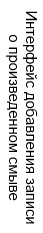 
  </td>
</tr>

<tr>
  <td style="border: 0px">

**Блок «Исследование смывов на яйца гельминтов»**
* **Дата начала** – дата начала контрольного мероприятия
* **Метод** – наименование НД, согласно которой проводился контроль
* **Тип подготовки** – каким образом подготавливалась проба
* **Св-во подготовки** – дополнительные параметры, относящиеся к типу подготовки пробы
* **Дата окончания** – дата окончания контрольного мероприятия
* **Результат** – результат анализа смыва
  </td>
  <td style="border: 0px">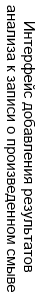 
  </td>
</tr>

<tr>
  <td style="border: 0px">

**Блок «Исследование смывов на цисты (ооцисты) патогенных простейших»**

* **Дата начала** – дата начала контрольного мероприятия
* **Метод** – наименование НД, согласно которой проводился контроль
подготовки пробы
* **Дата окончания** – дата окончания контрольного мероприятия
* **Результат** – результат анализа смыва

 </td>
  <td style="border: 0px"> 
  </td>
</tr>

<tr>
<td style="border: 0px">

* **Вывод** – заключение о соответствии / несоответствии результатов смывов референсным значениям
* **Ответственный** – ФИО ответственного за проведение контрольного мероприятия
</td>
<td style="border: 0px">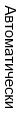
</td>
</tr>
</Table>

### Выбор количества отображаемых строк в таблице

Наведите курсор на окно выбора количества отображаемых строк в таблице. В выпадающем списке выберите нужное количество (10, 25, 50, 100). После этого в таблице отобразится выбранное количество строк.

## Как внести запись в журнал

```mermaid align="center"
flowchart TD
  1((Произвести <br> смывы))
  2(Перейти в журнал <br> по ссылке <br> в левом меню <br> Битрикс 24)
  3("Нажать кнопку <br> «Добавить отбор»")
  4(Заполнить <br> данные отбора)
  5(Провести <br> анализ)
  6("Нажать кнопку <br> «Добавить отбор»")
  7(Внести результаты <br> анализа)
  8((Проконтролировать <br> появление <br> записи в журнале))
  
  1-->2
  2-->3
  3-->4
  4-->5
  5-->6
  6-->7
  7-->8
  
  style 1 fill: pink, stroke:#333,stroke-width:2px
  style 8 fill: lightgreen, stroke:#333,stroke-width:2px
