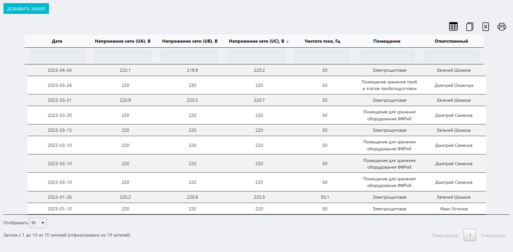
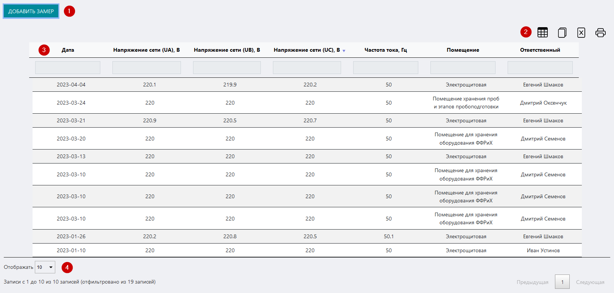
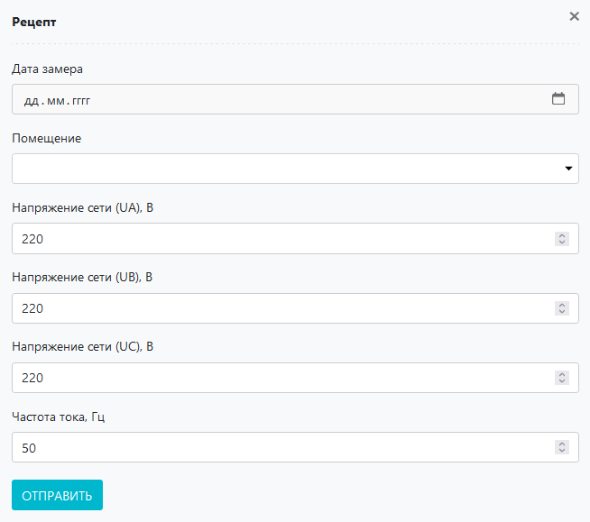

# Журнал контроля электрической сети
Данный журнал предназначен для контроля параметров электрической сети в помещениях лаборатории / ИЦ.

<!-- @import "[TOC]" {cmd="toc" depthFrom=1 depthTo=6 orderedList=false} -->

<!-- code_chunk_output -->

- [Журнал контроля электрической сети](#журнал-контроля-электрической-сети)
  - [Как перейти в журнал](#как-перейти-в-журнал)
  - [Функции журнала:](#функции-журнала)
  - [Структура журнала](#структура-журнала)
    - [Кнопка «Добавить замер»](#кнопка-добавить-замер)
    - [Иконки сервисных функций](#иконки-сервисных-функций)
    - [Таблица журнала](#таблица-журнала)
    - [Выбор количества отображаемых строк в таблице](#выбор-количества-отображаемых-строк-в-таблице)

<!-- /code_chunk_output -->

## Как перейти в журнал

Вы можете перейти в журнал по соответствующей ссылке в левом меню Битрикс 24.

## Функции журнала:
1. Учет ежедневных результатов замеров основных параметров электрической сети в поещениях лаборатории
2. Отображение записей в таблице по заданным параметрам (фильтрация)
3. Обеспечение доступа к интерфейсу внесения результатов измерения
4. Вывод таблицы журнала на печать

##  Структура журнала

Журнал состоит из следующих блоков:
1. Кнопка «Добавить замер»
2. Иконки сервисных функций
3. Таблица журнала
4. Выбор количества отображаемых строк в таблице

### Кнопка «Добавить замер»

Нажмите на нее чтобы вызвать вспомогательный интерфейс добавления в журнал записи о результатах замера параметров электросети.

Структура данного интерфейса дублирует первые пять столбцов таблицы журнала. Просто введите в поля данные замера и нажмите кнопку «Отправить».
>**Результат:** в таблице журнала появится запись о проведенном замере.

### Иконки сервисных функций

 Данная иконка служит для скрытия столбцов в таблице. При нажатии на нее появится меню выбора столбцов. Нажмите на кнопку названия, чтобы скрыть соответствующий столбец. Результат вы увидите сразу, страницу перезагружать не требуется.
 При нажатии на данную иконку произойдет копирование содержимого таблицы, представленной на экране, в буфер обмена. Далее вы можете вставить данные таблицы в любой текстовый или табличный документ.
 При нажатии на данную иконку произойдет скачивание таблицы, представленной на экране, на ваш локальный компьютер в формате xlsx.
 Данная иконка служит для вывода на печать представленной на экране таблицы. При нажатии на нее откроется окно выбора параметров печати и предварительного просмотра.

### Таблица журнала

Таблица состоит из следующих столбцов:

* **Дата** – дата замера
* **Напряжение сети (UA), В** – напряжение на первой фазе
* **Напряжение сети (UB), В** – напряжение на второй фазе
* **Напряжение сети (UC), В** – напряжение на третьей фазе
* **Частота тока, Гц** – частота переменного тока в сети
* **Помещение** – помещение, в котором проводился замер
* **Ответственный** – ФИО лица, проводившего замер

### Выбор количества отображаемых строк в таблице

Наведите курсор на окно выбора количества отображаемых строк в таблице. В выпадающем списке выберите нужное количество (10, 25, 50, 100). После этого в таблице отобразится выбранное количество строк.