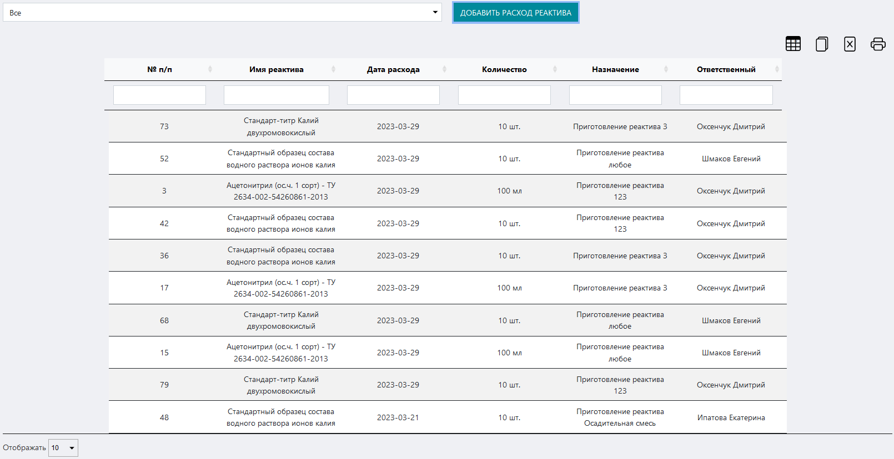
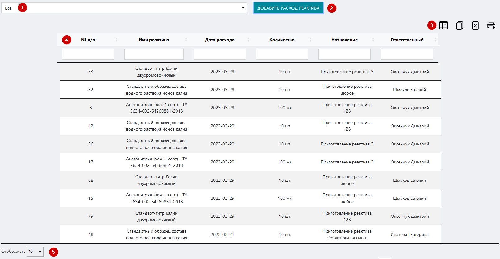
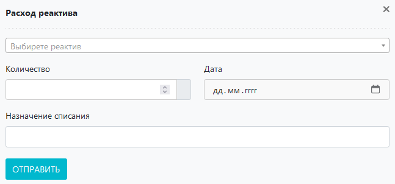

# Журнал расхода реактивов
Данный журнал предназначен для ведения учета расхода реактивов в лаборатории / ИЦ.

<p align=center>

</p>

<!-- @import "[TOC]" {cmd="toc" depthFrom=1 depthTo=6 orderedList=false} -->

<!-- code_chunk_output -->

- [Журнал расхода реактивов](#журнал-расхода-реактивов)
  - [Как перейти в журнал](#как-перейти-в-журнал)
  - [Функции журнала:](#функции-журнала)
  - [Структура журнала](#структура-журнала)
    - [Поле выбора реактива](#поле-выбора-реактива)
    - [Кнопка «Добавить расход реактива»](#кнопка-добавить-расход-реактива)
    - [Иконки сервисных функций](#иконки-сервисных-функций)
    - [Таблица журнала](#таблица-журнала)
    - [Выбор количества отображаемых строк в таблице](#выбор-количества-отображаемых-строк-в-таблице)
  - [Как внести запись в журнал](#как-внести-запись-в-журнал)

<!-- /code_chunk_output -->

## Как перейти в журнал

Вы можете перейти в журнал по соответствующей ссылке в левом меню Битрикс 24.

## Функции журнала:
1. Учет расхода реактивов
2. Отображение записей в таблице по заданным параметрам (фильтрация)
3. Обеспечение доступа к интерфейсу внесения результатов измерения
4. Вывод таблицы журнала на печать

##  Структура журнала
<p align=center>

</p>

Журнал состоит из следующих блоков:
1. Поле выбора реактива
2. Кнопка «Добавить расход реактива»
3. Иконки сервисных функций
4. Таблица журнала
5. Выбор количества отображаемых строк в таблице

### Поле выбора реактива

Данное поле предназначено для сортировки записей в таблице по принадлежности к конкретному реактиву.

Установите курсор в данное поле и в выпадающем списке выберите нужный реактив.

>**Результат:** в таблице журнала отобразятся все записи о расходах, имеющие отношение к выбранному реактиву. Замеры сортируются по дате и по времени в порядке возрастания.

### Кнопка «Добавить расход реактива»

Нажмите на нее чтобы вызвать вспомогательный интерфейс добавления в журнал записи о расходе реактива

<p align=center>

</p>

Данный интерфейс содержит следующие поля:

* **Поле выбора реактива** – установите курсор в данное поле и в выпадающем списке выберите нужный реактив.
* Поле **«Количество»** – вручную или при помощи стрелок в правой части поля установите в данном поле количество потраченного реактива
* Поле **«Дата»** – установите курсор в данное поле и в выпадающем календаре выберите нужную дату.
* Поле **«Назначение списания»** – введите сюда назначение списания: куда / для чего был использован реактив (например, приготовление раствора такого-то).

После того как вы заполните все поля, нажимте кнопку «Отправить».

>**Результат:** в таблице журнала появится запись о расходе.

:warning: При регистрации нового раствора (приготовлении реактива) запись (записи) о расходе реактивов для приготовления раствора автоматически вносится в данный журнал.

### Иконки сервисных функций

 Данная иконка служит для скрытия столбцов в таблице. При нажатии на нее появится меню выбора столбцов. Нажмите на кнопку названия, чтобы скрыть соответствующий столбец. Результат вы увидите сразу, страницу перезагружать не требуется.
 При нажатии на данную иконку произойдет копирование содержимого таблицы, представленной на экране, в буфер обмена. Далее вы можете вставить данные таблицы в любой текстовый или табличный документ.
 При нажатии на данную иконку произойдет скачивание таблицы, представленной на экране, на ваш локальный компьютер в формате xlsx.
 Данная иконка служит для вывода на печать представленной на экране таблицы. При нажатии на нее откроется окно выбора параметров печати и предварительного просмотра.

### Таблица журнала
Здесь отображаются все записи о расходах реактивов. Таблица состоит из следующих столбцов:

* **№ п/п** – номер записи в БД
* **Имя реактива** – наименовени реактива
* **Дата расхода** – когда произведен расход реактива
* **Количество** – сколько реактива израсходовано
* **Назначение** – куда / для чего израсходован реактив
* **Ответственный** – ФИО ответственного за расход реактива

### Выбор количества отображаемых строк в таблице

Наведите курсор на окно выбора количества отображаемых строк в таблице. В выпадающем списке выберите нужное количество (10, 25, 50, 100). После этого в таблице отобразится выбранное количество строк.

## Как внести запись в журнал

```mermaid
flowchart LR
  0((Произвести <br> замер))
  1(Перейти в журнал <br> по ссылке <br> в левом меню)
  2("Нажать кнопку <br> «Добавить расход реактива»")
  3(Заполнить все поля <br> в открывшемся интерфейсе)
  4("Нажать кнопку «Отправить»")
  5((Проконтролировать <br> появление <br> записи в журнале))
  
  0-->1
  1-->2
  2-->3
  3-->4
  4-->5

  style 0 fill: pink, stroke:#333,stroke-width:2px
  style 5 fill: lightgreen, stroke:#333,stroke-width:2px