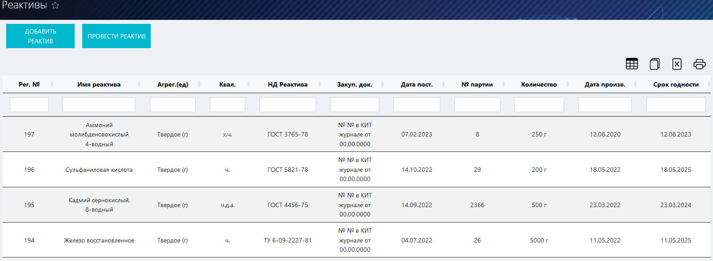
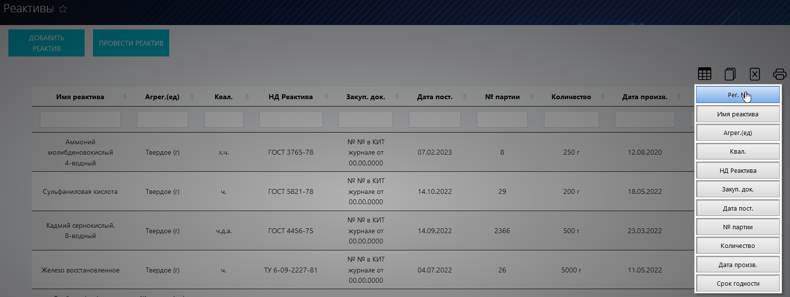
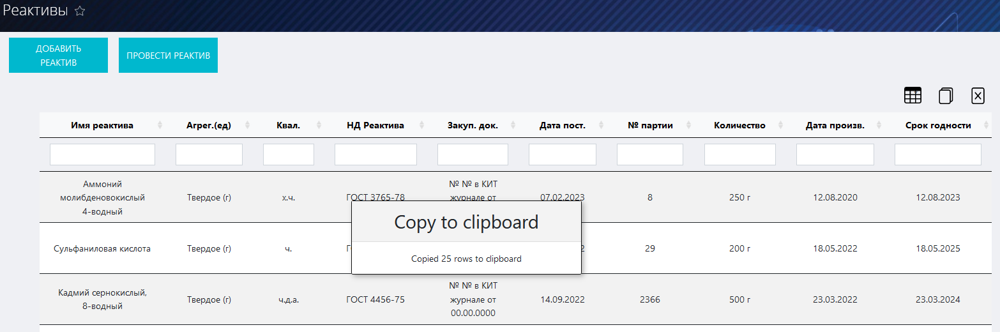
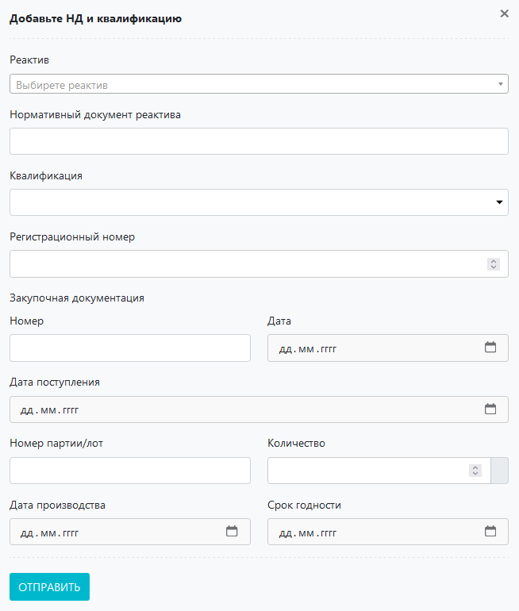

# Журнал реактивов
Данный журнал предназначен для учета реактивов в ЛИМС U-Lab и работы с ними.

<!-- @import "[TOC]" {cmd="toc" depthFrom=1 depthTo=6 orderedList=false} -->

<!-- code_chunk_output -->

- [Журнал реактивов](#журнал-реактивов)
  - [Как перейти в журнал](#как-перейти-в-журнал)
  - [Функции журнала](#функции-журнала)
  - [Компоненты журнала](#компоненты-журнала)
    - [Таблица реактивов](#таблица-реактивов)
    - [Функциональная панель](#функциональная-панель)
    - [Кнопки вспомогательных интерфейсов](#кнопки-вспомогательных-интерфейсов)
      - [Кнопка «Добавить реактив»](#кнопка-добавить-реактив)
      - [Кнопка «Провести реактив»](#кнопка-провести-реактив)
    - [Вспомогательные интерфейсы](#вспомогательные-интерфейсы)
      - [Интерфейс добавления реактива](#интерфейс-добавления-реактива)
      - [Интерфейс проведения реактива](#интерфейс-проведения-реактива)

<!-- /code_chunk_output -->

## Как перейти в журнал

Вы можете перейти в журнал реактивов по соответствующей ссылке в левом меню Битрикс 24.

## Функции журнала
1. Ведение учета всех реактивов, использующихся в лаборатории.
2. Отображение записей в таблице по заданным параметрам (фильтрация).
3. Внесение реактивов в БД ЛИМС.
4. Проведение реактивов.

Рисунок 1. Общий вид журнала реактивов

##  Компоненты журнала 
### Таблица реактивов

Первая строка данной таблицы представляет собой набор полей поиска, посредством которых реализуется функция фильтрации содержимого таблицы. Для того чтобы задать параметры поиска, установите курсор в данное поле в том столбце, по содержанию которого хотите произвести отбор, и введите нужное значение. Если необходимо отфильтровать по нескольким параметрам, повторите описанные действия для соответствующих столбцов.
> **Результат:** в таблицу будет выведена отсортированная согласно заданным значениям информация

Таблица состоит из следующих столбцов:
* **Рег. №** – регистрационный номер реактива в системе.
* **Имя реактива** – наименование реактива.
* **Агрег. (ед.)** – агрегатное состояние и единица измерения.
* **Квал.** – квалификация (для какой сферы деятельности).
* **НД реактива** – регламентирующий нормативный документ на данный реактив.
* **Закуп. док.** – номер и дата закупочной документации.
* **Дата пост.** – дата поставки реактива в лабораторию.
* **№ партии** – номер партии на заводе-изготовителе.
* **Количество** – количество данного реактива.
* **Дата производства**
* **Срок годности**

### Функциональная панель

При помощи данной панели вы можете:

* **Скрыть ненужные колонки в таблице.** Для этого нажмите на иконку  и в появившемся окне нажмите на кнопки с названиями тех столбцов, которые нужно скрыть (см. рисунок 2).
    > **Результат:** ненужные столбцы будут скрыты

    

Рисунок 2. Скрытие ненужных столбцов
 

* **Скопировать содержимое таблицы в буфер обмена.** Для этого нажмите на иконку .
    > **Результат:** На экране появится сообщение о том, что копирование произведено (см. рисунок 3)

    

Рисунок 3. Копирование таблицы в буфер обмена
 

* **Сформировать на основе таблицы файл xlsx.** Для этого нажмите на иконку . 
    > **Результат:** Система сформирует файл и начнет его скачивание на локальный компьютер.

* **Вывести содержимое таблицы на печать.** Для этого нажмите на иконку . 
    > **Результат:** Откроется интерфейс вывода документа на печать.

### Кнопки вспомогательных интерфейсов

#### Кнопка «Добавить реактив» 

 Предназначена для вызова вспомогательного интерфейса добавления реактива в БД ЛИМС. 

#### Кнопка «Провести реактив»

Предназначена для вызова вспомогательного интерфейса проведения реактива в системе. 

### Вспомогательные интерфейсы

#### Интерфейс добавления реактива

Данный интерфейс служит для добавления реактива в БД ЛИМС. Для того чтобы добавить реактив:
1. Нажмите кнопку .
2. В открывшемся интерфейсе заполните все поля:

* **Название реактива** – введите в данное поле название реактива.
* **Агрегатное состояние – ед. изм.** – установите курсор в данное поле и в выпадающем списке выберите нужное агрегатное состояние реактива.
* Флажок **«Реактив является прекурсором»** – установите его в том случае, если реактив является прекурсором или подлежит особому контролю.

3. После того как вы ввели все необходимые данные, нажмите кнопку , после чего система внесет информацию о рецепте в БД.
>**Результат**: реактив будет добавлен в БЛ ЛИМС, и вы смодете выбрать его в поле «Реактив» интерфейса проведения реактива.
#### Интерфейс проведения реактива

Для того, чтобы провести реактив:

1. Нажмите кнопку .
2. В появившемся интерфейсе заполните все поля:
* **Реактив** –  установите курсор в данное поле и в выпадающем списке выберите нужный реактив.
* **Нормативный документ реактива** – впишите сюда тип нормативного документа на данный реактив.
* **Регистрационный номер** – вручную или при помощи стрелок в правой части поля введите нужный регистрационный номер.
* **Закупочная документация Номер** – введите сюда номер закупочного документа.
* **Закупочная документация Дата** – установите курсор в данное поле и в выпадающем календаре выставьте дату выдачи закупочного документа.
* **Дата поступления** – установите курсор в данное поле и в выпадающем календаре выставьте дату поступления реактива.
* **Номер партии / лот** – впишите в данное поле номер партии реактива.
* **Количество** – вручную или при помощи стрелок в правой части поля установите количество реактива.
* **Дата производства** – установите курсор в данное поле и в выпадающем календаре установите дату производства реактива.
* **Срок годности, год** – вручную или при помощи стрелок в правой части поля установите год окончания срока годности реактива.
3. После того как вы ввели все необходимые данные, нажмите кнопку , после чего система внесет информацию о реактиве в БД.