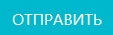

# Журнал рецептов
Данный журнал предназначен для учета рецептов в ЛИМС U-Lab и работы с ними.

<!-- @import "[TOC]" {cmd="toc" depthFrom=1 depthTo=6 orderedList=false} -->

<!-- code_chunk_output -->

- [Журнал рецептов](#журнал-рецептов)
  - [Как перейти в журнал](#как-перейти-в-журнал)
  - [Функции журнала:](#функции-журнала)
  - [Компоненты журнала](#компоненты-журнала)
    - [Таблица рецептов](#таблица-рецептов)
    - [Функциональная панель](#функциональная-панель)
    - [Кнопки вспомогательных интерфейсов](#кнопки-вспомогательных-интерфейсов)
      - [Кнопка «Добавить рецепт»](#кнопка-добавить-рецепт)
      - [Кнопка «Раствор как реактив»](#кнопка-раствор-как-реактив)
    - [Вспомогательные интерфейсы](#вспомогательные-интерфейсы)
      - [Интерфейс добавления рецепта](#интерфейс-добавления-рецепта)
      - [Интерфейс учета раствора в качестве реактива](#интерфейс-учета-раствора-в-качестве-реактива)

<!-- /code_chunk_output -->

## Как перейти в журнал

Вы можете перейти в журнал рецептов по соответствующей ссылке в левом меню Битрикс 24.

## Функции журнала:
1. Ведение учета всех рецептов, использующихся в лаборатории.
2. Отображение записей в таблице по заданным параметрам (фильтрация).
3. Внесение рецептов в БД ЛИМС.
4. Учет растворов в качестве реактивов.

Рисунок 1. Общий вид журнала рецептов

##  Компоненты журнала 
### Таблица рецептов

Первая строка данной таблицы представляет собой набор полей поиска, посредством которых реализуется функция фильтрации содержимого таблицы. Для того чтобы задать параметры поиска, установите курсор в данное поле в том столбце, по содержанию которого хотите произвести отбор, и введите нужное значение. Если необходимо отфильтровать по нескольким параметрам, повторите описанные действия для соответствующих столбцов.
> **Результат:** в таблицу будет выведена отсортированная согласно заданным значениям информация

Таблица состоит из следующих столбцов:
* **Имя** – название рецепта.
* **Концентрация** – процент концентрации раствора.
* **Тип раствора**
* **Нормативный документ** – регламентирующий нормативный документ.
* **Реактивы и их количество** – какие реактивы и в каком объеме входят в состав рецепта.
* **Растворитель** – тип используемого растворителя.
* **К-во раствора**
* **Срок годности**
* **Частота проверки** – как часто необходимо проверять раствор.

### Функциональная панель

При помощи данной панели вы можете:

* **Скрыть ненужные колонки в таблице.** Для этого нажмите на иконку  и в появившемся окне нажмите на кнопки с названиями тех столбцов, которые нужно скрыть (см. рисунок 2).
    > **Результат:** ненужные столбцы будут скрыты

    

Рисунок 2. Скрытие ненужных столбцов
 

* **Скопировать содержимое таблицы в буфер обмена.** Для этого нажмите на иконку .
    > **Результат:** На экране появится сообщение о том, что копирование произведено (см. рисунок 3)

    

Рисунок 3. Копирование таблицы в буфер обмена
 

* **Сформировать на основе таблицы файл xlsx.** Для этого нажмите на иконку . 
    > **Результат:** Система сформирует файл и начнет его скачивание на локальный компьютер.

* **Вывести содержимое таблицы на печать.** Для этого нажмите на иконку . 
    > **Результат:** Откроется интерфейс вывода документа на печать.

### Кнопки вспомогательных интерфейсов

#### Кнопка «Добавить рецепт» 

 Предназначена для вызова вспомогательного интерфейса добавления рецепта в БД ЛИМС. 

#### Кнопка «Раствор как реактив»

Предназначена для вызова вспомогательного интерфейса для учета раствора в качестве реактива в БД ЛИМС. 

### Вспомогательные интерфейсы

#### Интерфейс добавления рецепта

Данный интерфейс служит для добавления рецепта в БД ЛИМС. Для того чтобы добавить рецепт:
1. Нажмите кнопку .
2. В открывшемся интерфейсе заполните все поля:

**Блок «Рецепт»**:
* **Название рецепта** – введите в данное поле название рецепта.
* **Тип раствора** – установите курсор в данное поле и в выпадающем списке выберите нужный тип расвора.
* **Концентрация** – вручную или при помощи стрелок в правой части поля установите концентрацию раствора.
* **Ед. измерения** – установите курсор в данное поле и в выпадающем списке выберите единицу измерения концентрации.
* **Флажок «Точная концентрация»** – установите его, если введенная концентрация раствора является точной.
* **Срок годности, сутки** – вручную или при помощи стрелок в правой части поля установите количество суток до окончания срока годности раствора.
*  **Частота проверки, сутки** – вручную или при помощи стрелок в правой части поля установите необходимую частоту проверки раствора (в сутках).
* **Нормативный документ** – установите курсор в данное поле и в выпадающем списке выберите регламентирующий нормативный докумет.

**Блок «Реактив»**
* **Реактив** – установите курсор в данное поле и в выпадающем списке выберите тип реактива.
* **Количество реактива** – вручную или при помощи стрелок в правой части поля установите необходимое количество реактив адля приготовления раствора.

Если в составе раствора несколько реактивов, то нажмите кнопку .
Если необходимо удалить реактив, нажмите кнопку 

**Блок «Растворитель»** 
* **Растворитель** – установите курсор в данное поле и в выпадающем списке выберите тип растворителя.
* **Количество растворителя** – вручную или при помощи стрелок в правой части поля установите необходимое количество растворителя.
* **Количество раствора** – вручную или при помощи стрелок в правой части поля установите номинальное количество раствора.

3. После того как вы ввели все необходимые данные, нажмите кнопку , после чего система внесет информацию о рецепте в БД.

#### Интерфейс учета раствора в качестве реактива

Необходим для того, чтобы вести учет растворов, которые выступают в качестве реактивов.

1. Нажмите кнопку .
2. В появившемся интерфейсе заполните все поля:
* **Название реактива** – введите в данное поле название реактива.
* **Рецепт** – установите курсор в данное поле и в выпадающем списке выберите рецепт, к которому относится данный раствор.
3. После того как вы ввели все необходимые данные, нажмите кнопку , после чего система внесет информацию о растворе в БД.