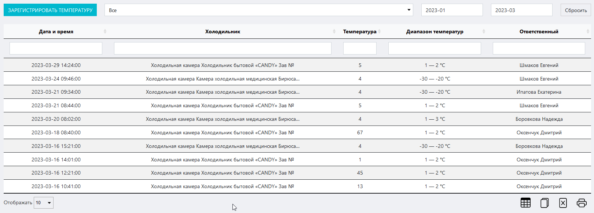
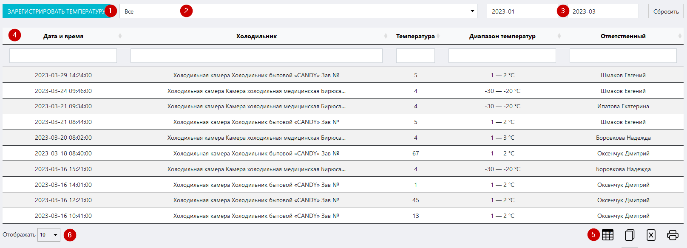
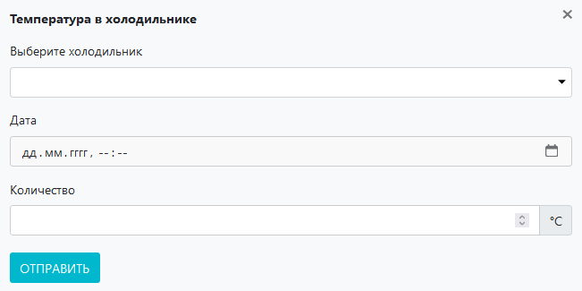
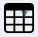

# Журнал температурного контроля холодильников
Данный журнал предназначен для ведения регулярного контроля температурного режима в холодильниках лаборатории / ИЦ.

<p align=center>

</p>

<!-- @import "[TOC]" {cmd="toc" depthFrom=1 depthTo=6 orderedList=false} -->

<!-- code_chunk_output -->

- [Журнал температурного контроля холодильников](#журнал-температурного-контроля-холодильников)
  - [Как перейти в журнал](#как-перейти-в-журнал)
  - [Функции журнала:](#функции-журнала)
  - [Структура журнала](#структура-журнала)
    - [Кнопка «Зарегистрировать температуру»](#кнопка-зарегистрировать-температуру)
    - [Поле выбора холодильника](#поле-выбора-холодильника)
    - [Поле выбора границы диапазона дат записей](#поле-выбора-границы-диапазона-дат-записей)
    - [Таблица журнала](#таблица-журнала)
    - [Иконки сервисных функций](#иконки-сервисных-функций)
    - [Выбор количества отображаемых строк в таблице](#выбор-количества-отображаемых-строк-в-таблице)
  - [Как внести запись в журнал](#как-внести-запись-в-журнал)

<!-- /code_chunk_output -->

## Как перейти в журнал

Вы можете перейти в журнал по соответствующей ссылке в левом меню Битрикс 24.

## Функции журнала:
1. Регистрация ежедневных результатов замеров рабочих температур холодильников
2. Отображение записей в таблице по заданным параметрам (фильтрация)
3. Обеспечение доступа к интерфейсу внесения результатов измерения
4. Вывод таблицы журнала на печать

##  Структура журнала
<p align=center>

</p>

Журнал состоит из следующих блоков:
1. Кнопка «Зарегистрировать температуру»
2. Поле выбора холодильника
3. Поля выбора границы диапазона дат записей
4. Таблица журнала
5. Иконки сервисных функций
6. Выбор количества отображаемых строк в таблице

### Кнопка «Зарегистрировать температуру»

Нажмите на нее чтобы вызвать вспомогательный интерфейс добавления в журнал записи о результатах замера рабочей температуры холодильника.

<p align=center>

</p>

Данный интерфейс содержит следующие поля:

* Поле **«Выберите холодильник»** – установите курсор в данное поле и в выпадающем списке выберите нужный холодильник.
* Поле **«Дата»** – установите курсор в данное поле и в выпадающем календаре выберите нужную дату.
* Поле **«Количество»** – вручную или при помощи стрелок в правой части поля установите в данном поле температуру, полученную в результате замера.

После того как вы заполните все поля, нажимте кнопку «Отправить».

>**Результат:** в таблице журнала появится запись о проведенном замере.

### Поле выбора холодильника

Данное поле предназначено для сортировки записей в таблице по принадлежности к конкретному холодильнику.

Установите курсор в данное поле и в выпадающем списке выберите нужный холодильник.

>**Результат:** в таблице журнала отобразятся все записи о замерах температуры, имеющие отношение к выбранному холодильнику. Замеры сортируются по дате и по времени в порядке возрастания.

### Поле выбора границы диапазона дат записей

Данные поля предназначены для установления диапазона дат, в рамках которых будут отсортированы записи в таблице.

Установите курсор в данные поля и в выпадающем календаре установите нужные даты.

>**Результат:** в таблице в таблице журнала отобразятся все записи о замерах температуры в рамках установленного диапазона дат.

Чтобы сбросить даты, нажмите кнопку «Сбросить»

### Таблица журнала
Здесь отображаются все записи о замерах температуры. Таблица состоит из следующих столбцов:

* **Дата и время** – дата и время замера
* **Холодильник** – наименование и тип холодильника
* **Температура** – результат замера рабочей температуры
* **Диапазон температур** – допустимый диапазон рабочих температур (берется из журнала холодильников)
* **Ответственный** – ФИО лица, ответственного за данный холодильник

### Иконки сервисных функций

 Данная иконка служит для скрытия столбцов в таблице. При нажатии на нее появится меню выбора столбцов. Нажмите на кнопку названия, чтобы скрыть соответствующий столбец. Результат вы увидите сразу, страницу перезагружать не требуется.
 При нажатии на данную иконку произойдет копирование содержимого таблицы, представленной на экране, в буфер обмена. Далее вы можете вставить данные таблицы в любой текстовый или табличный документ.
 При нажатии на данную иконку произойдет скачивание таблицы, представленной на экране, на ваш локальный компьютер в формате xlsx.
 Данная иконка служит для вывода на печать представленной на экране таблицы. При нажатии на нее откроется окно выбора параметров печати и предварительного просмотра.

### Выбор количества отображаемых строк в таблице

Наведите курсор на окно выбора количества отображаемых строк в таблице. В выпадающем списке выберите нужное количество (10, 25, 50, 100). После этого в таблице отобразится выбранное количество строк.

## Как внести запись в журнал

```mermaid
flowchart LR
  0((Произвести <br> замер))
  1(Перейти в журнал <br> по ссылке <br> в левом меню)
  2("Нажать кнопку <br> «Зарегистрировать температуру»")
  3(Заполнить все поля <br> в открывшемся интерфейсе)
  4("Нажать кнопку «Отправить»")
  5((Проконтролировать <br> появление <br> записи в журнале))
  
  0-->1
  1-->2
  2-->3
  3-->4
  4-->5

  style 0 fill: pink, stroke:#333,stroke-width:2px
  style 5 fill: lightgreen, stroke:#333,stroke-width:2px