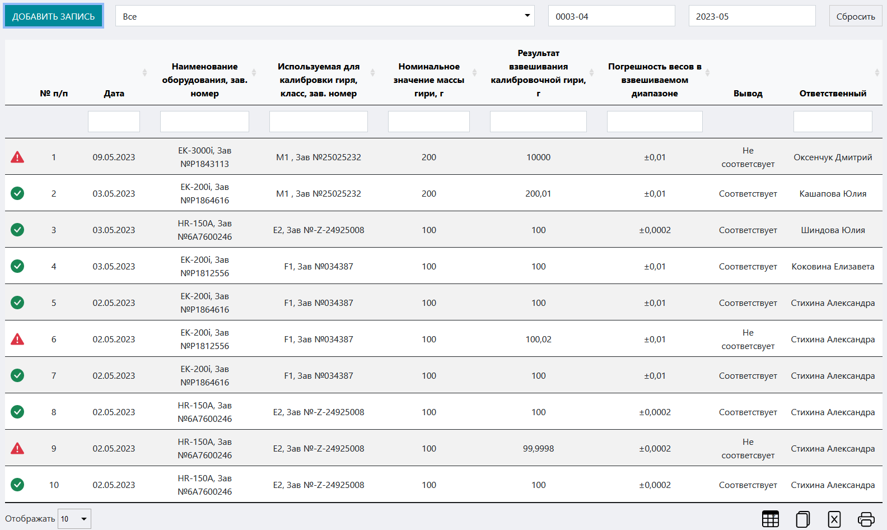
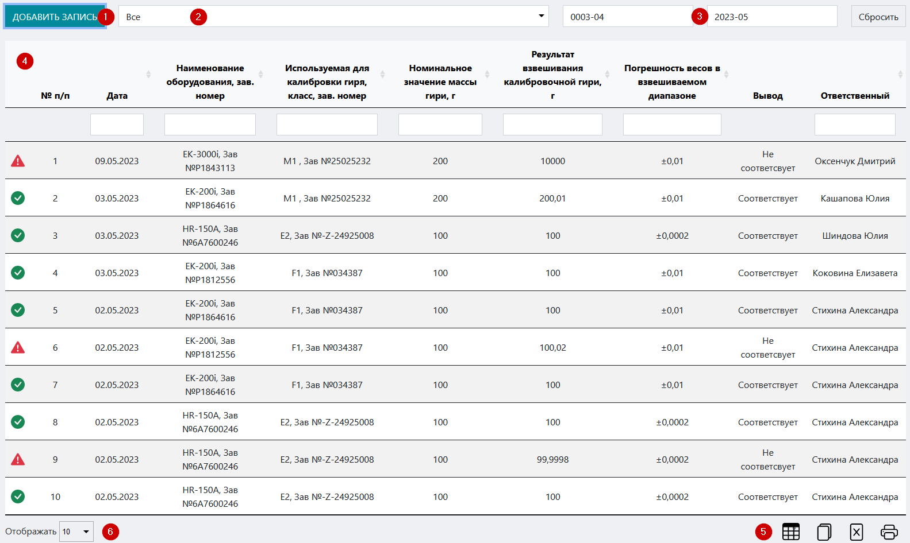
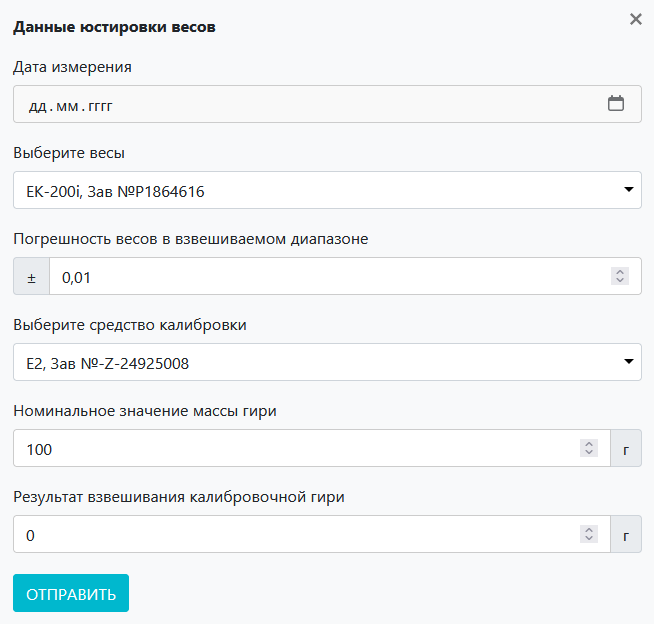

# Журнал юстировки весов
Данный журнал предназначен для учета работ по юстировке / калибровке весов в лаборатории / ИЦ.

<!-- @import "[TOC]" {cmd="toc" depthFrom=1 depthTo=6 orderedList=false} -->

<!-- code_chunk_output -->

- [Журнал юстировки весов](#журнал-юстировки-весов)
  - [Как перейти в журнал](#как-перейти-в-журнал)
  - [Функции журнала:](#функции-журнала)
  - [Структура журнала](#структура-журнала)
    - [Кнопка «Добавить оборудовнаие»](#кнопка-добавить-оборудовнаие)
    - [Поле фильтра по типу оборудования](#поле-фильтра-по-типу-оборудования)
    - [Поля фильтра по дате](#поля-фильтра-по-дате)
    - [Таблица журнала](#таблица-журнала)
    - [Иконки сервисных функций](#иконки-сервисных-функций)
    - [Выбор количества отображаемых строк в таблице](#выбор-количества-отображаемых-строк-в-таблице)

<!-- /code_chunk_output -->

## Как перейти в журнал

Вы можете перейти в журнал по соответствующей ссылке в левом меню Битрикс 24.

## Функции журнала:
1. Учет полного спектра работ по юстировке / калибровке весов 
2. Отображение записей в таблице по заданным параметрам (фильтрация)
3. Обеспечение доступа к интерфейсу регистрации проведенных работ
4. Контроль соответствия результатов измерений референсным значениям и сигнализация в случае несоответствия 
5. Вывод таблицы журнала на печать

##  Структура журнала

Журнал состоит из следующих блоков:
1. Кнопка «Добавить запись»
2. Поле фильтра по типу оборудования
3. Поля фильтра по дате
4. Таблица журнала
5. Иконки сервисных функций
6. Выбор количества отображаемых строк в таблице

### Кнопка «Добавить оборудовнаие»

Нажмите на нее чтобы вызвать вспомогательный интерфейс добавления в журнал записи о проведенных работах по юстировке / калибровке весов.

Данный интерфейс содержит следующие поля:
* **Дата измерения** – установите курсор в данное поле и в выпадающем календаре установите дату проведения юстировки / калибровки.
* **Выберите весы** – установите курсор в данное поле и в выпадающем списке выберите весы, которые подвергались юстировке / калибровке.
* **Погрешность весов во взвешиваемом диапазоне** – поле заполняется автоматически на основании выбора в предыдущем поле. Значение фиксированное.
* **Выберите средство калибровки** – установите курсор в данное поле и в выпадающем списке выберите средство, с помощью которого производилась калибровка.
* **Номинальное значение массы гири** –  поле заполняется автоматически на основании выбора в предыдущем поле. Значение фиксированное.
* **Результат взвешивания калибровочной гири** – введите сюда результат взвешивания.

После того как вы заполните все поля, нажмите кнопку «Отправить»

>**Результат:** в таблице журнала появится запись о проведенной калибровке.

### Поле фильтра по типу оборудования

Установите курсор в данное поле и в выпадающем списке выберите тип оборудования, по которому нужно отсортировать содержимое таблицы.

> **Результат:** в таблице отобразятся все записи, имеющие отношение к выбранному оборудованию.

### Поля фильтра по дате

Установите курсор в данные поля и в выпадающих календарях установите начальную и конечную даты временного диапазона проведения юстировки / калибровки.

> **Результат:** в таблице отобразятся все записи, имеющие отношение установленному временному периоду.

### Таблица журнала

Таблица состоит из следующих столбцов:

Данный интерфейс содержит следующие поля:
* **№ п/п** – номер записи в БД ЛИМС
* **Дата** – когда производилась калтибровка / юстировка
* **Наименование оборудования, заводской номер** – какое оборудование подвергалось юстировке / калибровке
* **Используемая для калибровки гиря, класс, зав. номер** – параметры калибровочной гири
* **Номинальное значение массы гири** –  масса калибровочной гири
* **Результат взвешивания калибровочной гири** – какой результат взвешивания гири показали весы
* **Погрешность весов во взвешиваемом диапазоне** – номинальная допустимая погрешность данных весов
* **Вывод** – соответствуют или не соответствуют полученные показания установленным референсным значениям
* **ФИО проводившего работы** – ФИО лица, ответственного за калибровку

### Иконки сервисных функций

 Данная иконка служит для скрытия столбцов в таблице. При нажатии на нее появится меню выбора столбцов. Нажмите на кнопку названия, чтобы скрыть соответствующий столбец. Результат вы увидите сразу, страницу перезагружать не требуется.
 При нажатии на данную иконку произойдет копирование содержимого таблицы, представленной на экране, в буфер обмена. Далее вы можете вставить данные таблицы в любой текстовый или табличный документ.
 При нажатии на данную иконку произойдет скачивание таблицы, представленной на экране, на ваш локальный компьютер в формате xlsx.
 Данная иконка служит для вывода на печать представленной на экране таблицы. При нажатии на нее откроется окно выбора параметров печати и предварительного просмотра.

### Выбор количества отображаемых строк в таблице

Наведите курсор на окно выбора количества отображаемых строк в таблице. В выпадающем списке выберите нужное количество (10, 25, 50, 100). После этого в таблице отобразится выбранное количество строк.