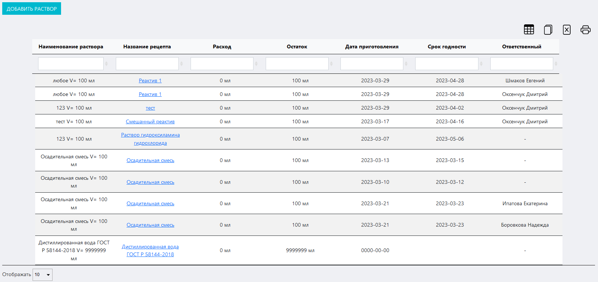
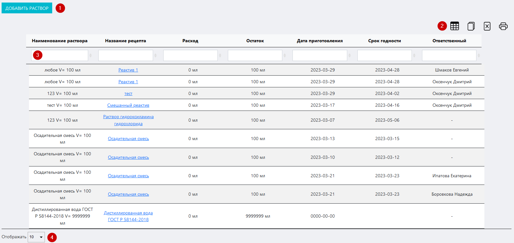
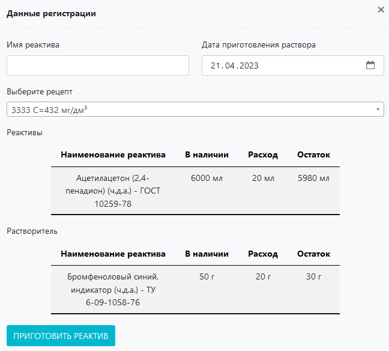
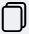

# Журнал регистрации растворов
Данный журнал предназначен для регистрации и учета созданных в ходе работы лаборатории / ИЦ растворов.

<!-- @import "[TOC]" {cmd="toc" depthFrom=1 depthTo=6 orderedList=false} -->

<!-- code_chunk_output -->

- [Журнал регистрации растворов](#журнал-регистрации-растворов)
  - [Как перейти в журнал](#как-перейти-в-журнал)
  - [Функции журнала:](#функции-журнала)
  - [Структура журнала](#структура-журнала)
    - [Кнопка «Добавить раствор»](#кнопка-добавить-раствор)
    - [Иконки сервисных функций](#иконки-сервисных-функций)
    - [Таблица журнала](#таблица-журнала)
    - [Выбор количества отображаемых строк в таблице](#выбор-количества-отображаемых-строк-в-таблице)

<!-- /code_chunk_output -->

## Как перейти в журнал

Вы можете перейти в журнал по соответствующей ссылке в левом меню Битрикс 24.

## Функции журнала:
1. Учет всех созданных вв ходе работы лаборатории / ИЦ растворов
2. Отображение записей в таблице по заданным параметрам (фильтрация)
3. Обеспечение доступа к интерфейсу внесения результатов измерения
4. Вывод таблицы журнала на печать

##  Структура журнала

Журнал состоит из следующих блоков:
1. Кнопка «Добавить раствор»
2. Иконки сервисных функций
3. Таблица журнала
4. Выбор количества отображаемых строк в таблице

### Кнопка «Добавить раствор»

Нажмите на нее чтобы вызвать вспомогательный интерфейс добавления в журнал записи о приготовленном растворе.

Данный интерфейс содержит следующие поля:
* **Имя реактива** – внесите сюда наименование раствора.
* **Оборудование** – установите курсор в данное поле и в выпадающем календаре установите дату приготовления раствора.
**Выберите рецепт** – установите курсор в данное поле и в выпадающем списке выберите нужный рецепт.

В таблицах «Реактивы» и «Растворитель» в нижней части интерфейса отобразятся контрольные параметры по реактиву и растворителю, составляющими основу раствора:

* **Наименование реактива**
* **В наличии** – сколько реактива осталось в наличии в лаборатории.
* **Расход** – показатель расхода реактива в рамках выбранного рецепта.
* **Остаток** – сколько реактива останется в наличии в лаборатории после приготовления раствора.

После того как вы заполните все поля, нажмите кнопку «Приготовить реактив»

>**Результат:** в таблице журнала появится запись о новом растворе / реактиве.

### Иконки сервисных функций

 Данная иконка служит для скрытия столбцов в таблице. При нажатии на нее появится меню выбора столбцов. Нажмите на кнопку названия, чтобы скрыть соответствующий столбец. Результат вы увидите сразу, страницу перезагружать не требуется.
 При нажатии на данную иконку произойдет копирование содержимого таблицы, представленной на экране, в буфер обмена. Далее вы можете вставить данные таблицы в любой текстовый или табличный документ.
 При нажатии на данную иконку произойдет скачивание таблицы, представленной на экране, на ваш локальный компьютер в формате xlsx.
 Данная иконка служит для вывода на печать представленной на экране таблицы. При нажатии на нее откроется окно выбора параметров печати и предварительного просмотра.

### Таблица журнала

Таблица состоит из следующих столбцов:

* **Наименование раствора** 
* **Название рецепта**
* **Расход**
* **Остаток** – остаток раствора в лаборатории 
* **Дата приготовления** – дата приготовленияраствора.
* **Срок годности** – выставляется автоматически на основе данных выбранного рецепта.
* **Ответственный** – ФИО лица, ответственного за приготовление раствора.

### Выбор количества отображаемых строк в таблице

Наведите курсор на окно выбора количества отображаемых строк в таблице. В выпадающем списке выберите нужное количество (10, 25, 50, 100). После этого в таблице отобразится выбранное количество строк.