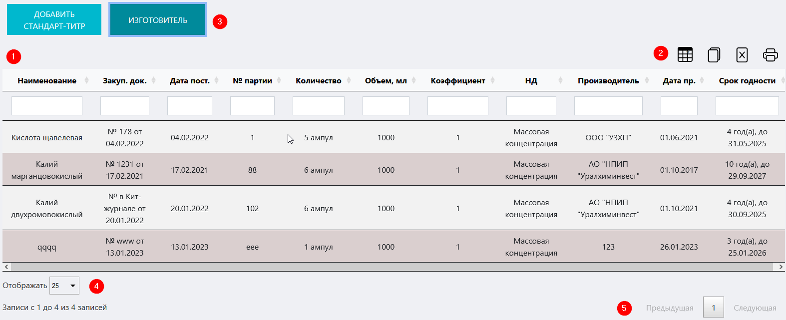
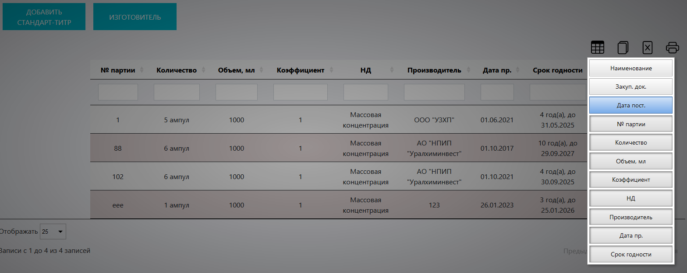
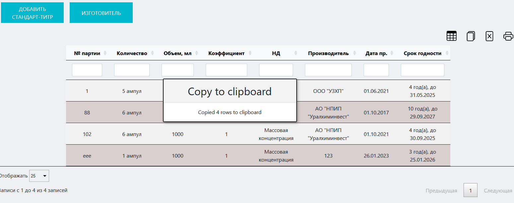
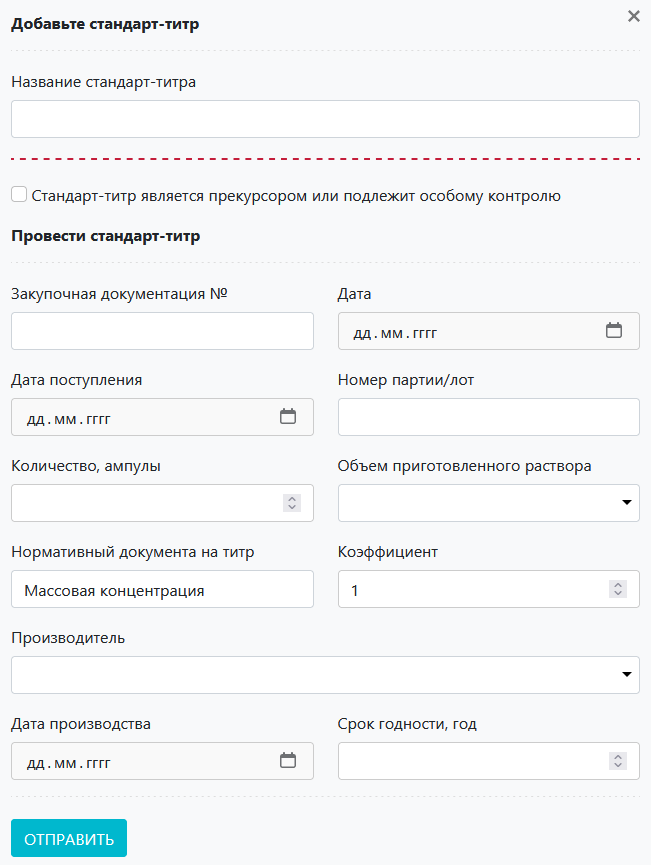
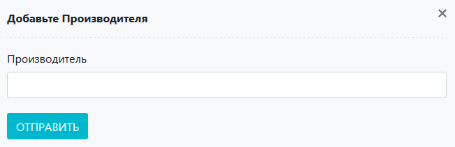

# Журнал сдандарт-титров
Данный журнал предназначен для учета стандарт-титров лаборатории в ЛИМС U-Lab.

<!-- @import "[TOC]" {cmd="toc" depthFrom=1 depthTo=6 orderedList=false} -->

<!-- code_chunk_output -->

- [Журнал сдандарт-титров](#журнал-сдандарт-титров)
  - [Как перейти в журнал](#как-перейти-в-журнал)
  - [Функции журнала:](#функции-журнала)
  - [Компоненты журнала](#компоненты-журнала)
    - [Таблица стандарт-титров](#таблица-стандарт-титров)
    - [Функциональная панель](#функциональная-панель)
    - [Кнопки вспомогательных интерфейсов](#кнопки-вспомогательных-интерфейсов)
      - [Кнопка «Добавить стандарт-титр»](#кнопка-добавить-стандарт-титр)
      - [Кнопка «Изготовитель»](#кнопка-изготовитель)
    - [Вспомогательные интерфейсы](#вспомогательные-интерфейсы)
      - [Интерфейс добавления стандарт-титра](#интерфейс-добавления-стандарт-титра)
      - [Интерфейс добавления нового производителя](#интерфейс-добавления-нового-производителя)

<!-- /code_chunk_output -->

## Как перейти в журнал

Вы можете перейти в журнал стандарт-титров по соответствующей ссылке в левом меню Битрикс 24.

## Функции журнала:
1. Ведение учета всех стандарт-титров лаборатории.
2. Отображение записей в таблице по заданным параметрам (фильтрация).
3. Внесение стандарт-титров в БД ЛИМС.
4. Добавление производителя в БД ЛИМС.

Рисунок 1. Общий вид журнала стандарт-титров

##  Компоненты журнала 
### Таблица стандарт-титров

Первая строка данной таблицы представляет собой набор полей поиска, посредством которых реализуется функция фильтрации содержимого таблицы. Для того чтобы задать параметры поиска, установите курсор в данное поле в том столбце, по содержанию которого хотите произвести отбор, и введите нужное значение. Если необходимо отфильтровать по нескольким параметрам, повторите описанные действия для соответствующих столбцов.
> **Результат:** в таблицу будет выведена отсортированная согласно заданным значениям информация

Таблица состоит из следующих столбцов:
* **Наименование** – название стандарт-титра.
* **Закуп. док.** – номер и дата закупочной документации.
* **Дата поставки** – Дата поставки стандарт-титра в лабораторию.
* **№ партии** – номер партии стандарт-титра.
* **Количество** – количество единиц продукции.
* **Объем, мл** – объем продукции в мл.
* **Коэффициент** – 
* **НД** –
* **Производитель** – наименование производителя.
* **Дата производства**
* **Срок годности**
### Функциональная панель
При помощи данной панели вы можете:
* **Скрыть ненужные колонки в таблице.** Для этого нажмите на иконку  и в появившемся окне нажмите на кнопки с названиями тех столбцов, которые нужно скрыть (см. рисунок 2).
    > **Результат:** ненужные столбцы будут скрыты

    

Рисунок 2. Скрытие ненужных столбцов
 

* **Скопировать содержимое таблицы в буфер обмена.** Для этого нажмите на иконку .
    > **Результат:** На экране появится сообщение о том, что копирование произведено (см. рисунок 3)

    

Рисунок 3. Копирование таблицы в буфер обмена
 

* **Сформировать на основе таблицы файл xlsx.** Для этого нажмите на иконку . 
    > **Результат:** Система сформирует файл и начнет его скачивание на локальный компьютер.

* **Вывести содержимое таблицы на печать.** Для этого нажмите на иконку . 
    > **Результат:** Откроется интерфейс вывода документа на печать.

### Кнопки вспомогательных интерфейсов

#### Кнопка «Добавить стандарт-титр»

Предназначена для вызова вспомогательного интерфейса добавления стандарт-титра в БД ЛИМС. 

#### Кнопка «Изготовитель»

Предназначена для вызова вспомогательного интерфейса добавления нового производителя в БД ЛИМС. 

### Вспомогательные интерфейсы

#### Интерфейс добавления стандарт-титра

Данный интерфейс служит для добавления стандарт-титра в БД ЛИМС и содержит следующие поля:
* **Название стандарт-титра** – введите в данное поле название стандарт-титра.
* **Флажок «Стандарт-титр является прекурсором или подлежит особому контролю»** – установите его, если стандарт-титр являетс прекурсором.
* **Закупочная документация №** – введите сюда номер закупочного документа.
* **Дата** – установите курсор в данное поле и в выпадающем календаре выставьте дату выдачи закупочного документа.
* **Дата поступления** – установите курсор в данное поле и в выпадающем календаре выставьте дату поступления стандарт-титра.
* **Номер партии / лот** – впишите в данное поле номер партии стандарт-титра.
* **Количество, ампулы** – вручную или при помощи стрелок в правой части поля установите количество поступивших ампул стандарт-титра.
* **Объем приготовленного раствора** – установите курсор в данное поле и в выпадающем списке выберите нужный объем расвора, приготовляемого с применением данного стандарт-титра.
* **Нормативный документ на титр** – впишите сюда тип нормативного документа.
* **Коэффициент** – вручную или при помощи стрелок в правой части поля установите нужный коэффициент (напрмер, массовой концентрации).
* **Производитель** – установите курсор в данное поле и в выпадающем списке выберите производителя стандарт-титра.
* **Дата производства** – установите курсор в данное поле и в выпадающем календаре установите дату производства стандарт-титра.
* **Срок годности, год** – вручную или при помощи стрелок в правой части поля установите год окончания срока годности стандарт-титра.

После того как вы ввели все необходимые данные, нажмите кнопку , после чего система внесет информацию о стандарт-титре в БД.

#### Интерфейс добавления нового производителя

Данный интерфейс служит для добавления нового производителя в БД ЛИМС.

Для того чтобы добавить нового производителя, введите в поле «Производитель» наименование, а затем нажмите кнопку , после чего система внесет информацию в БД, и вы сможете осуществить выбор в поле «Производитель» вспомогательного интерфейса добавления стандарт-титра.
