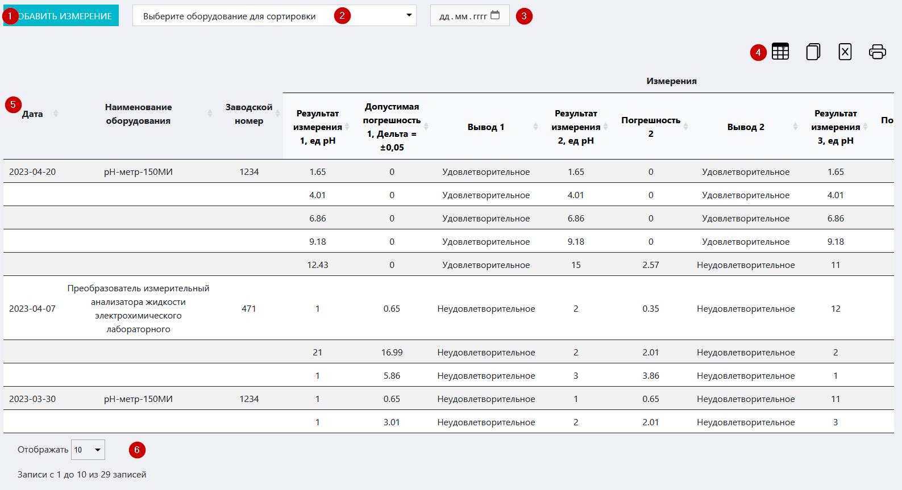

# Журнал контроля контроля градуировки pH-метров
Данный журнал служит для контроля параметров градуировки pH-метров, используемых в лаборатории / ИЦ.

<p align=center>

</p>

<!-- @import "[TOC]" {cmd="toc" depthFrom=1 depthTo=6 orderedList=false} -->

<!-- code_chunk_output -->

- [Журнал контроля контроля градуировки pH-метров](#журнал-контроля-контроля-градуировки-ph-метров)
  - [Как перейти в журнал](#как-перейти-в-журнал)
  - [Функции журнала:](#функции-журнала)
  - [Структура журнала](#структура-журнала)
    - [Кнопка «Добавить измерение»](#кнопка-добавить-измерение)
      - [Вспомогательный интерфейс внесения результатов измерений](#вспомогательный-интерфейс-внесения-результатов-измерений)
        - [Блок «Добавление измерений»](#блок-добавление-измерений)
        - [Блок «Ввод измерений»](#блок-ввод-измерений)
    - [Поле выбора оборудования](#поле-выбора-оборудования)
    - [Поле выбора даты](#поле-выбора-даты)
    - [Иконки сервисных функций](#иконки-сервисных-функций)
    - [Таблица журнала](#таблица-журнала)
    - [Поле выбора количества отображаемых строк в таблице](#поле-выбора-количества-отображаемых-строк-в-таблице)
  - [Как внести запись в журнал](#как-внести-запись-в-журнал)

<!-- /code_chunk_output -->

## Как перейти в журнал

Вы можете перейти в журнал по соответствующей ссылке в левом меню Битрикс 24.

## Функции журнала:
1. Регистрация и учет результатов измерений контрольных параметров дистиллированной воды
2. Отображение записей в таблице по заданным параметрам (фильтрация)
3. Обеспечение доступа к интерфейсу внесения результатов измерений
4. Вывод таблицы журнала на печать
5. Контроль соответствия результатов измерений / контроля референсным значениям и сигнализация в случае несоответствия (окрашивание значения красным цветом и вывод иконки-предупреждения в первом столбце таблицы)

##  Структура журнала
<p align=center>

</p>

Журнал состоит из следующих блоков:
1. Кнопка «Добавить измерение»
2. Поле выбора оборудования
3. Поле выбора даты
4. Иконки сервисных функций
5. Таблица журнала
6. Поле выбора количества отображаемых строк в таблице

### Кнопка «Добавить измерение»

Если вам необходимо внести в журнал результаты контроля параметров градуировки pH-метров, нажмите на данную кнопку.
> **Результат:** откроется модальное окно вспомогательного интерфейса внесения результатов измерений.

<p align=center>

</p>

#### Вспомогательный интерфейс внесения результатов измерений

Интерфейс содержит следующие блоки:

##### Блок «Добавление измерений»

* Флажок **«Расширенные измерения»** – установите его, если вам необходимо внести результаты расширенных измерений (по пяти значениям pH вместо трех основных). После установки флажка интерфейс примет следующий вид:

<p align=center>

</p>

* Поле **«Выбор оборудования»** – установите курсор в данное поле и в выпадающем списке выберите оборудование, которое подверглось контролю.
* Поле **«Дата внесения»** – установите курсор в данное поле и в выпадающем календаре установите дату проведения контроля.

##### Блок «Ввод измерений»

Данный блок содержит поля, в которых вручную или при помощи стрелок в их правой части вам необходимо установить фактические значения контрольных параметров, полученные в результате измерений.

Столбцы **«1», «2», «3»** – это номера серий измерений.

После заполнения всех полей интерфейса нажмите кнопку .
> **Результат:** в таблице журнала появится запись о произведенных замерах.

### Поле выбора оборудования

Данное поле предназначено для сортировки записей в таблице по принадлежности к конкретному оборудованию.

Установите курсор в данное поле и в выпадающем списке выберите нужныое оборудование.

> **Результат:** в таблице журнала отобразятся записи, имеющие отношение к выбранному оборудованию.

### Поле выбора даты

Данные поля предназначены для установления диапазона дат, в рамках которых будут отсортированы записи в таблице.

Установите курсор в данные поля и в выпадающем календаре установите нужные даты.

>**Результат:** в таблице в таблице журнала отобразятся все записи о контроле в рамках выбранной даты.

Для сброса даты нажмите кнопку «Сбросить»

### Иконки сервисных функций

 Данная иконка служит для скрытия столбцов в таблице. При нажатии на нее появится меню выбора столбцов. Нажмите на кнопку названия, чтобы скрыть соответствующий столбец. Результат вы увидите сразу, страницу перезагружать не требуется.
 При нажатии на данную иконку произойдет копирование содержимого таблицы, представленной на экране, в буфер обмена. Далее вы можете вставить данные таблицы в любой текстовый или табличный документ.
 При нажатии на данную иконку произойдет скачивание таблицы, представленной на экране, на ваш локальный компьютер в формате xlsx.
 Данная иконка служит для вывода на печать представленной на экране таблицы. При нажатии на нее откроется окно выбора параметров печати и предварительного просмотра.

### Таблица журнала
Здесь отображаются все записи о произведенных замерах. Основной блок таблицы (три первых и последний столбцы) содержит следующие столбцы:

* **Дата** – дата проведения контроля
* **Наименование оборудования** 
* **Заводской номер** – номер .присвоенный оборудованию заводом-изготовителем
* **Ответственный** – ФИО лица, ответственного за данное оборудование и проводившего измерения

Блок результатов замеров (объединен под чертой «Измерения») содержит три основных столбца:

* **Результат измерения** – значение результата измерения
* **Допустимая погрешность** – значение допустимой погрешности
* **Вывод** – вывод о том, удовлетворяет или нет полученный результат установленным критериям

Данные столбцы дублируются.

### Поле выбора количества отображаемых строк в таблице

Установите курсор в данное поле и в выпадающем списке выберите нужное количество (10, 25, 50, 100). После этого в таблице отобразится выбранное количество строк.

## Как внести запись в журнал

```mermaid align="center"
flowchart LR
  0((Произвести <br> замеры))
  1(Перейти в журнал <br> по ссылке <br> в левом меню <br> Битрикс 24)
  2("Нажать кнопку <br> «Добавить измерение»")
  3{Измерения <br> расширенные?}
  4("Установить флажок <br> «Расширенные измерения»")
  5(Внести результаты измерений)
  6("Нажать кнопку <br> «Отправить»")
  7((Проконтролировать <br> появление <br> записи в журнале))
  
  0-->1
  1-->2
  2-->3
  3--Да-->4
  3--Нет-->5
  4-->5
  5-->6
  6-->7

  style 0 fill: pink, stroke:#333,stroke-width:2px
  style 7 fill: lightgreen, stroke:#333,stroke-width:2px

