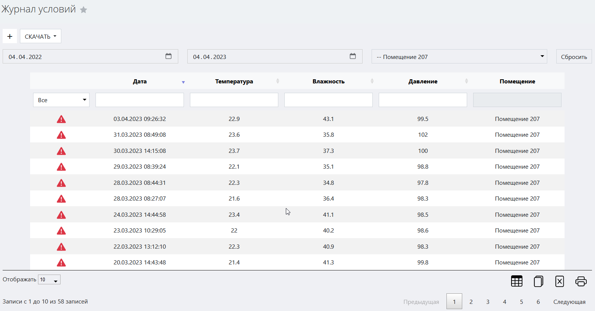
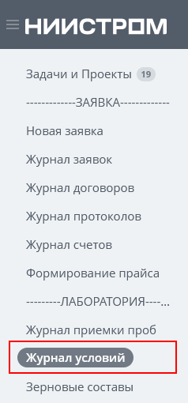
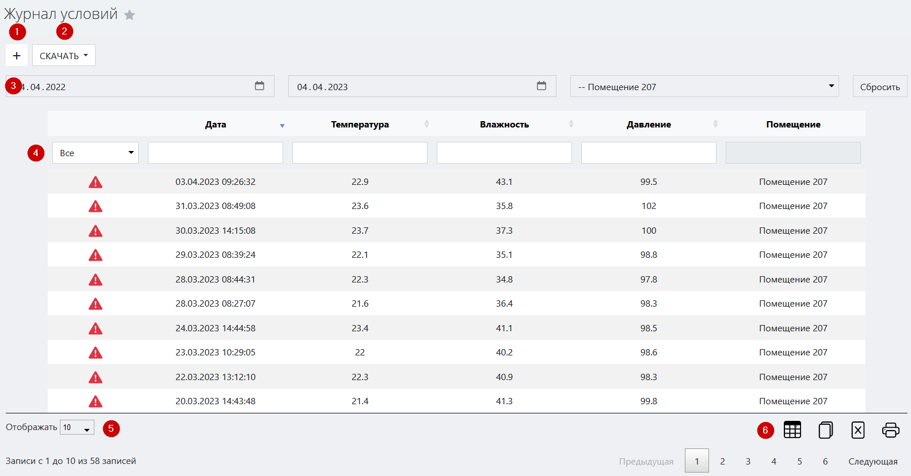
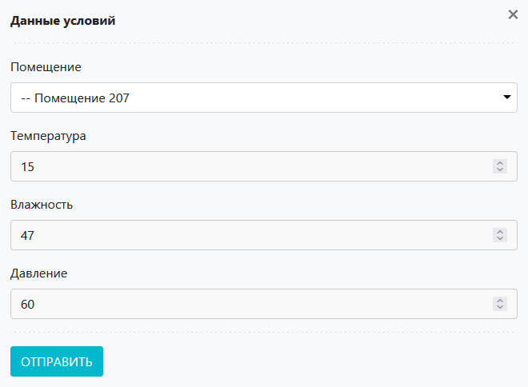
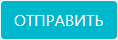
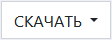
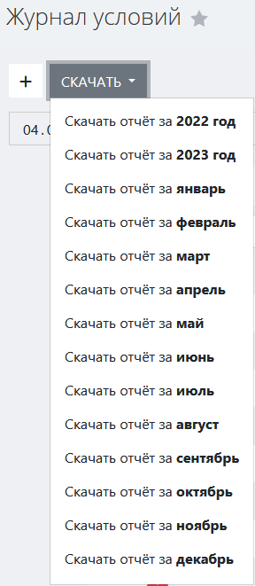
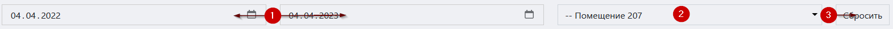
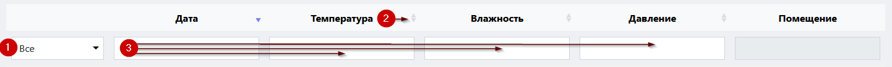
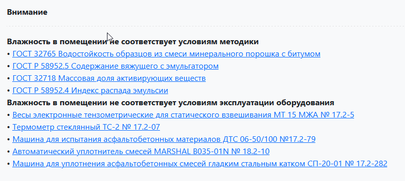

# Журнал условий

Данный журнал служит для регистрации и учета условий окружающй среды в помещениях испытателных или иных лабораторий. 

<!-- @import "[TOC]" {cmd="toc" depthFrom=1 depthTo=6 orderedList=false} -->

<!-- code_chunk_output -->

- [Журнал условий](#журнал-условий)
  - [Как перейти в журнал условий](#как-перейти-в-журнал-условий)
  - [Функции журнала](#функции-журнала)
  - [Структура журнала](#структура-журнала)
    - [Кнопка вызова интерфейса регистрации условий](#кнопка-вызова-интерфейса-регистрации-условий)
      - [Интерфейс регистрации условий](#интерфейс-регистрации-условий)
    - [Кнопка выбора отчета для скачивания](#кнопка-выбора-отчета-для-скачивания)
    - [Область фильтров](#область-фильтров)
    - [Таблица условий](#таблица-условий)
      - [Структура таблицы](#структура-таблицы)
    - [Выбор количества отображаемых строк в таблице](#выбор-количества-отображаемых-строк-в-таблице)
    - [Иконки сервисных функций](#иконки-сервисных-функций)
    - [Легенда](#легенда)

<!-- /code_chunk_output -->

## Как перейти в журнал условий

Перейти в журнал условий вы можете по ссылке в левом меню Битрикс 24.

## Функции журнала

1. Ведение учета условий во всех рабочих помещениях лаборатории / испытательного центра
2. Мониторинг соответствия условий методикам и сигнализация в случае несоответствия
3. Обеспечение доступа к интерфейсу регистрации условий
4. Отображение записей в таблице по заданным параметрам (фильтрация)
5. Формирование файлов годового и месячного отчета об условиях в формате docx

## Структура журнала

Журнал договоров состоит из следующих элементов:
1. Иконка вызова интерфейса регистрации условий	
2. Кнопка выбора отчета для скачивания
3. Область фильтров
4. Таблица условий
5. Выбор количества отображаемых строк в таблице
6. Иконки сервисных функций

### Кнопка вызова интерфейса регистрации условий

 Нажмите на данную кнопку чтобы вызвать интерфейс регистрации условий.

#### Интерфейс регистрации условий

Для того, чтобы внести в БД ЛИМС условия (ежедневно делается ответственным за помещение):

1. Вызовите интерфейс регистрации условий
2. В поле «Помещение» выберите нужное помещение
3. В полях «Температура», «Влажность» и «Давление» установите нужные значения (вручную или при помощи стрелок в правой части поля)
4. Нажмите кнопку 

> **Результат:** условия зарегистрированы, запись появилась в таблице журнала условий.

### Кнопка выбора отчета для скачивания 

  

> :warning: Данная кнопка становится доступной только тогда, когда в поле выбора помещения в области фильтров установлено значение.

Нажмите на даную иконку и в выпадающем списке выберите нужный отчет. После выбора начнется скачивание файла отчета в формате docx на ваш локальный компьютер.

### Область фильтров

 
Данная область содержит в себе поля для задания параметров сортировки информации в таблице (см. соотв. номер ниже).
 
1. **Поля выбора даты**
Данные поля предназначены для отображения записей об условиях, созданных в рамках указанного временного диапазона. Левое поле задает дату начала диапазона, а правое – дату конца диапазона. Поместите курсор в данные поля и в открывшемся окне календаря выберите нужную дату или впишите ее вручную.
2. **Поле выбора помещения**
Установите курсор в данное поле и в выпадающем списке выберите помещение, условия в рамках которого вам необходимо отобразить.
3. **Кнопка сброса фильтров**
Нажмите на данную кнопку, чтобы сбросить все примененные фильтры. 

### Таблица условий

Данная таблица содержит ежедневные записи об условиях во всех рабочих помещениях испытательного центра / лаборатории, а также отметки о соответствии / несоответствии условий методикам. 

#### Структура таблицы
Первая строка таблицы представляет собой поля поиска по столбцам (см. соотв. номер ниже).

 
1. Установите курсор в данное поле и в выпадающем списке выберите нужный статус записи об условиях.
2. Нажмите на стрелки для сортировки по алфавиту или по возрастанию / убыванию (в зависимости от типа значений в столбце).
3. Введите в данные поля слово или значение, которое вы хотите найти в строках соответствующего столбца. В результате в таблице отобразятся все строки, содержащие искомую информацию.

Таблица состоит из следующих столбцов:

* **Отметка о статусе** – здесь содержится иконка, обозначающая сответствие / несоответствие записи об условиях применяемой методике.
  >:warning:При нажатии на иконку  (несоответствие) будет выведено модальное окно, содержащее пояснения о конкретных несоответствиях со ссылками на НТД 
  

  
  

* **Дата** – дата создания записи об условиях
* **Температура** – показатель температуры
* **Влажность** – показатель влажности
* **Давление** – показатель давления
* **Помещение** – номер помещения, к которому относится запись об условиях

### Выбор количества отображаемых строк в таблице

Наведите курсор на окно выбора количества отображаемых строк в таблице. В выпадающем списке выберите нужное количество (10, 25, 50, 100). После этого в таблице отобразится выбранное количество строк.

### Иконки сервисных функций

 Данная иконка служит для скрытия столбцов в таблице. При нажатии на нее появится меню выбора столбцов. Нажмите на кнопку названия, чтобы скрыть соответствующий столбец. Результат вы увидите сразу, страницу перезагружать не требуется.
 При нажатии на данную иконку произойдет копирование содержимого таблицы, представленной на экране, в буфер обмена. Далее вы можете вставить данные таблицы в любой текстовый или табличный документ.
 При нажатии на данную иконку произойдет скачивание таблицы, представленной на экране, на ваш локальный компьютер в формате xlsx.
 Данная иконка служит для вывода на печать представленной на экране таблицы. При нажатии на нее откроется окно выбора параметров печати и предварительного просмотра.

### Легенда

В первом столбце таблицы присутствуют иконки, обозначающие статус соответствия / несоответствия записи об условиях применяемой методике.
 Соответствует
 Не соответствует