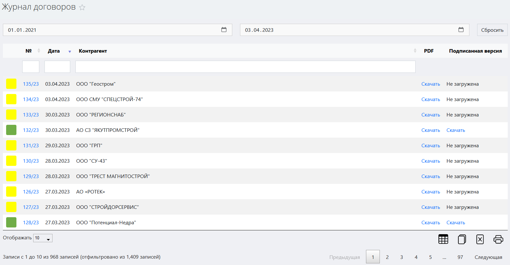
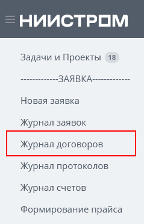
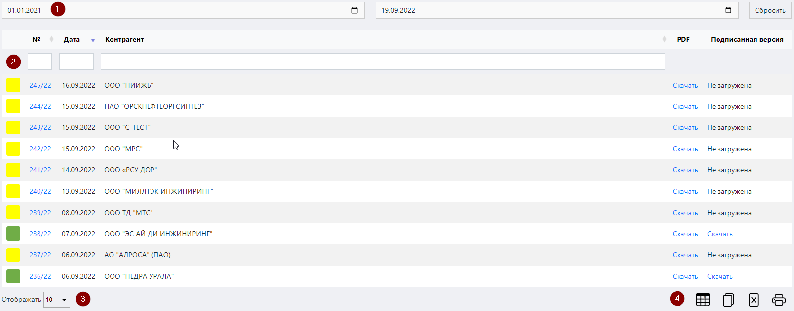
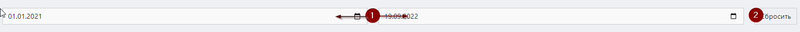
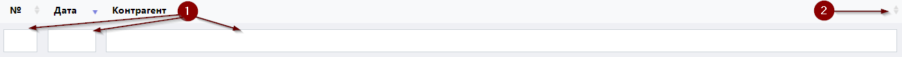

# Журнал договоров

Данный журнал служит для регистрации и учета всех созданных договоров. 

<!-- @import "[TOC]" {cmd="toc" depthFrom=1 depthTo=6 orderedList=false} -->

<!-- code_chunk_output -->

- [Журнал договоров](#журнал-договоров)
  - [Как перейти в журнал договоров](#как-перейти-в-журнал-договоров)
  - [Функции журнала](#функции-журнала)
  - [Структура журнала](#структура-журнала)
    - [Область фильтров](#область-фильтров)
    - [Таблица договоров](#таблица-договоров)
      - [Структура таблицы](#структура-таблицы)
    - [Стрелки горизонтальной навигации](#стрелки-горизонтальной-навигации)
    - [Выбор количества отображаемых строк в таблице](#выбор-количества-отображаемых-строк-в-таблице)
    - [Иконки сервисных функций](#иконки-сервисных-функций)
    - [Легенда](#легенда)

<!-- /code_chunk_output -->

## Как перейти в журнал договоров

Перейти в журнал договоров вы можете по ссылке в левом меню Битрикс 24.

## Функции журнала

1. Ведение учета всех созданных договоров
2. Отображение записей в таблице по заданным параметрам (фильтрация)
3. Отображение статуса договора
4. Обеспечение доступа к карточке договора
5. Формирование файла договора в формате pdf
6. Обеспечение доступа к скану подписанной версии договора

## Структура журнала

Журнал договоров состоит из следующих элементов:
1.	Область фильтров.
2.	Таблица договоров.
3.	Выбор количества отображаемых строк в таблице.
4.	Иконки сервисных функций.

### Область фильтров

 
Данная область содержит в себе поля для задания параметров сортировки информации в таблице (см. соотв. номер ниже).
 
1.	**Поля выбора даты**
Данные поля предназначены для отображения договоров, созданных в рамках указанного временного диапазона. Левое поле задает дату начала диапазона, а правое – дату конца диапазона. Поместите курсор в данные поля и в открывшемся окне календаря выберите нужную дату или впишите ее вручную.
2.	**Кнопка сброса фильтров**
Нажмите на данную кнопку, чтобы сбросить все примененные фильтры. 

### Таблица договоров

Данная таблица содержит в себе первичную информацию обо всех созданных договорах. В строках таблицы содержится информация о номере договора, дате, наименовании контрагента и т.п.

#### Структура таблицы
Первая строка таблицы представляет собой поля поиска по столбцам (см. соотв. номер ниже).

 
1.	Введите в данные поля слово или значение, которое вы хотите найти в строках соответствующего столбца. В результате в таблице отобразятся все строки, содержащие искомую информацию.
2.	Нажмите на стрелки для сортировки по алфавиту или по возрастанию / убыванию (в зависимости от типа значений в столбце).

Таблица состоит из следующих столбцов:

* **№** – номер-ссылка на договор. Нажав на нее, вы попадете в интерфейс соответствующего договора.
* **Дата** – дата создания договора.
* **Контрагент** – наименование компании-заказчика.
* **PDF** – ссылка на файл договора в формате pdf. 
* **Подписанная версия** – ссылка на файл в формате pdf, содержащий скан-копию подписанного клиентом договора.

### Стрелки горизонтальной навигации

Данные стрелки служат для горизонтальной навигации по таблице. Просто наведите курсор на нужную стрелку, и таблица начнет горизонтальную прокрутку, открывая доступ к столбцам, скрытым за пределами экрана.

### Выбор количества отображаемых строк в таблице

Наведите курсор на окно выбора количества отображаемых строк в таблице. В выпадающем списке выберите нужное количество (10, 25, 50, 100). После этого в таблице отобразится выбранное количество строк.

### Иконки сервисных функций

 Данная иконка служит для скрытия столбцов в таблице. При нажатии на нее появится меню выбора столбцов. Нажмите на кнопку названия, чтобы скрыть соответствующий столбец. Результат вы увидите сразу, страницу перезагружать не требуется.
 При нажатии на данную иконку произойдет копирование содержимого таблицы, представленной на экране, в буфер обмена. Далее вы можете вставить данные таблицы в любой текстовый или табличный документ.
 При нажатии на данную иконку произойдет скачивание таблицы, представленной на экране, на ваш локальный компьютер в формате xlsx.
 Данная иконка служит для вывода на печать представленной на экране таблицы. При нажатии на нее откроется окно выбора параметров печати и предварительного просмотра.

### Легенда

В начале каждой строки таблицы находится цветовой код, который обозначает статус, присвоенный договору. 

<table cellpadding="3" >
    <tr><td td bgcolor=#FFFF00 width=15></td><td>Договор не подписан</td></tr>
    <tr><td td bgcolor=#00763B width=15></td><td>Договор подписан</td></tr>

  </table>	  