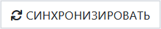
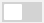

# Журнал определяемых характеристик / показателей

Данный журнал предназначен для учета всех определяемых характеристик в соответствии с реестром ФСА и включения их в списки выбора соответствующих полей сущностей ЛИМС.

<!-- @import "[TOC]" {cmd="toc" depthFrom=1 depthTo=6 orderedList=false} -->

<!-- code_chunk_output -->

- [Журнал определяемых характеристик / показателей](#журнал-определяемых-характеристик--показателей)
  - [Как перейти в журнал определяемой характеристики / показателя](#как-перейти-в-журнал-определяемой-характеристики--показателя)
  - [Функции журнала](#функции-журнала)
  - [Как пользоваться журналом](#как-пользоваться-журналом)
  - [Структура журнала](#структура-журнала)
    - [Иконка возврата в карточку методики](#иконка-возврата-в-карточку-методики)
    - [Кнопка синхронизации с БД ФСА](#кнопка-синхронизации-с-бд-фса)
    - [Строка поиска](#строка-поиска)
    - [Таблица определяемых характеристик / показателей](#таблица-определяемых-характеристик--показателей)
    - [Поле выбора количества отображаемых строк в таблице](#поле-выбора-количества-отображаемых-строк-в-таблице)

<!-- /code_chunk_output -->

##  Как перейти в журнал определяемой характеристики / показателя

Перейти в журнал вы можете тремя способами:

**1. Из интерфейса журнала области аккредитации.** Для этого:
а) Перейдите в журнал области аккредитации.
б) В столбце «Определяемая характеристика / показатель» перейдите по ссылке в соответствующей строке. 
в) В конце строки «Определяемая характеристика / показатель» блока «Основные характеристики» нажмите на икноку 
 
**2. Из карточки технического задания.** Для этого:
а) Перейдите в журнал заявок.
б) В столбце «ТЗ» перейдите по номеру-ссылке в строке соответствующей заявки.
в) В болке «Материалы» карточки ТЗ нажмите на иконку  напротив интересующей вас методики.
г) В карточке методики в конце строки «Определяемая характеристика / показатель» блока «Основные характеристики» нажмите на икноку 
 
**3. Из карточки ГОСТа.** Для этого:
а) Перейдите в журнал области аккредитации.
б) В столбце «Номер документа» перейдите по ссылке типа «ГОСТ 31938».
в) В блоке «Методики» карточки ГОСТа нажмите на иконку  в конце строки соответствующей методики.
в) В карточке методики в конце строки «Определяемая характеристика / показатель» блока «Основные характеристики» нажмите на икноку 

## Функции журнала

1. Синхронизация с БД ФСА для загрузки и обновления актуального списка характеристик / показателей.
2. Включение  характеристики / показателя в списки выбора соответствующих полей сущностей ЛИМС.

## Как пользоваться журналом

1. Введите в строку поиска название нужной вам характеристики /показателя.
> **Результат:** в таблице отобразится строка, содержащая запись об искомой характеристике /показателе (или несколько записей в случае совпадения частей названия)

:warning: Если по вашему запросу ничего не найдено, то нажмите кнопку  
> **Результат:** по прошествии 1-2 минут список обновится, и вы сможете ввести повторный запрос. Если и он не дал результата, то попробуйте сформулировать запрос иначе.

2. Установите переключатель  в положение .
> **Результат:** система примет данный показатель как используемый, и у вас появится возможность выбирать данную характеристику / показатель в выпадающих  списках соответствующих полей сущностей ЛИМС. Так, например, в карточке методики в  строке «Определяемая характеристика / показатель» блока «Основные характеристики» вы сможете выбрать активированный вами показатель 

## Структура журнала

Журнал определяемой характеристики / показателя состоит из слежующих блоков:

1. Икнока возврата в карточку методики
2. Кнопка синхронизации с БД ФСА
3. Строка поиска
4. Таблица определяемых характеристик / показателей
5. Поле выбора количества отображаемых строк в таблице

### Иконка возврата в карточку методики

 Нажмите на данную иконку чтобы вернуться в карточку методики, из которой вы перешли в журнал.

### Кнопка синхронизации с БД ФСА

 Нажмите на данную кнопку чтобы запустить синхронизацию с БД ФСА для актуализации списка характеристик / показателей, содержащихся в БД ЛИМС.

### Строка поиска

Введите в данную строку наименование характеристики / показателя. В результате в таблице отобразится запись (записи), релевантная запросу.

### Таблица определяемых характеристик / показателей

В данной таблице содержится полный список всех характеристик / показателей, содержащихся в нормативно-технической документации ФСА.

Таблица состоит из следующих столбцов:

* **Статус характеристики / показателя** – если данная характеристика / показатель актуальны на стороне ФСА, то в данном столбце вы увидите иконку 
* **ИД ФСА** – идентификатор характеристики / показателя в БД ФСА
* **Название** – наименование характеристики / показателя
* **Используется** – активируйте данный переключатель, если вам необходимо добавить характеристику / показатель в списки выбора полей сущностей ЛИМС.

### Поле выбора количества отображаемых строк в таблице

Наведите курсор на окно выбора количества отображаемых строк в таблице. В выпадающем списке выберите нужное количество (10, 25, 50, 100). После этого в таблице отобразится выбранное количество строк.