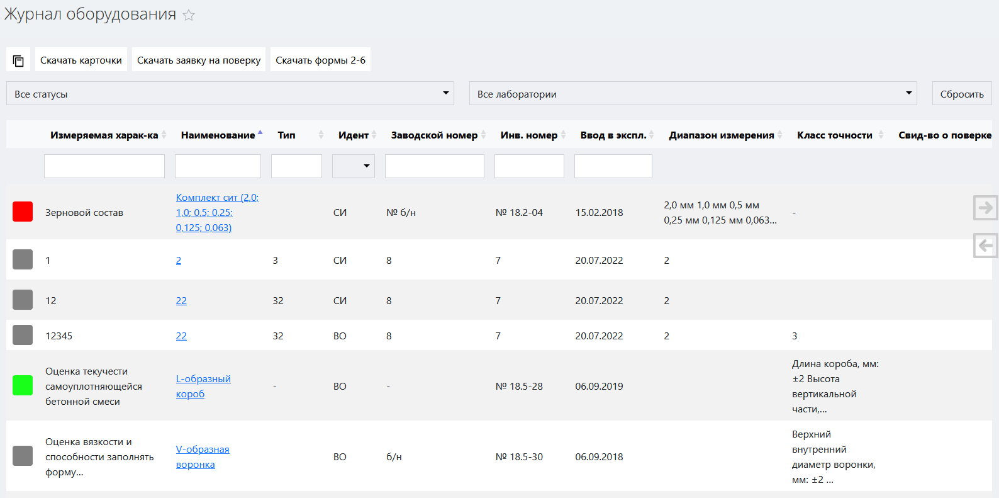
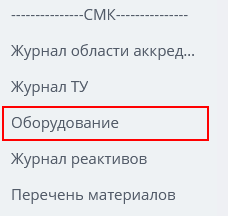
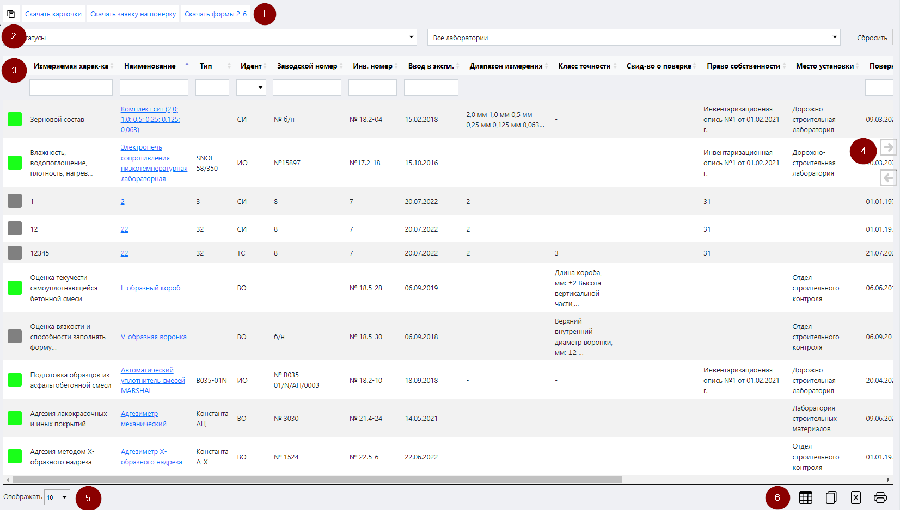
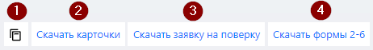
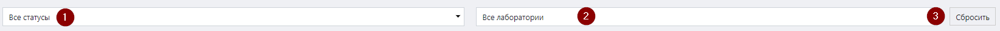
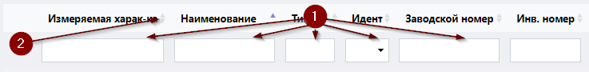
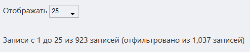

# Журнал оборудования

Данный журнал служит для учета полного спектра лабораторного оборудования, находящегося на балансе предприятия. Он содержит сведенную в таблицу информацию обо всем парке оборудования лаборатории, карточки которого созданы в ЛИМС.

<!-- @import "[TOC]" {cmd="toc" depthFrom=1 depthTo=6 orderedList=false} -->

<!-- code_chunk_output -->

- [Журнал оборудования](#журнал-оборудования)
  - [Как перейти в журнал оборудования](#как-перейти-в-журнал-оборудования)
  - [Функции журнала](#функции-журнала)
  - [Структура журнала](#структура-журнала)
    - [Область действий](#область-действий)
    - [Область фильтров](#область-фильтров)
    - [Таблица договоров](#таблица-договоров)
    - [Стрелки горизонтальной навигации](#стрелки-горизонтальной-навигации)
    - [Выбор количества отображаемых строк в таблице](#выбор-количества-отображаемых-строк-в-таблице)
    - [Иконки сервисных функций](#иконки-сервисных-функций)
    - [Легенда](#легенда)

<!-- /code_chunk_output -->

## Как перейти в журнал оборудования

Перейти в журнал оборудования вы можете по ссылке в левом меню Битрикс 24.

## Функции журнала

1. Ведение учета всего лабораторного оборудования
2. Отображение записей в таблице по заданным параметрам (фильтрация)
3. Отображение статусов оборудования
4. Обеспечение доступа к карточке оборудования, интерфейсу ТЗ и Акту приемки проб посредством ссылок
5. Формирование формы заявки на поверку
6. Формирование форм рабочей документации №2-6

## Структура журнала

Интерфейс журнала оборудования состоит из следующих элементов:
1.	Область действий.
2.	Область фильтров.
3.	Таблица договоров.
4.	Стрелки горизонтальной навигации.
5.	Выбор количества отображаемых строк в таблице.
6.	Иконки сервисных функций.
 
### Область действий

 
В данной области находятся следующие кнопки действий (см. соотв. номер):
1.	Нажав на данную иконку, вы попадете в интерфейс заполнения карточки оборудования.
2.	Нажав на данную кнопку, вы скачаете на свой локальный компьютер все зарегистрированные в системе карточки оборудования в одном файле формата doc.
3.	Нажав на данную кнопку, вы скачаете на свой локальный компьютер заявку на поверку оборудования в формате doc.
4.	Нажав на данную кнопку, вы скачаете на свой локальный компьютер формы для подачи информации о лаборатории в Росаккредитацию.

### Область фильтров

Данная область содержит в себе поля для задания параметров сортировки информации в таблице (см. соотв. номер ниже).
 

1. **Поле выбора статуса**
Установите курсор в данное поле и выберите в раскрывшемся списке нужный статус: в таблице отобразятся все карточки оборудования, которым он присвоен.
2. **Поле выбора лаборатории**
Установите курсор в данное поле и выберите в раскрывшемся списке нужную лабораторию: в таблице отобразятся все карточки оборудования, относящегося к данной лаборатории.
3. **Кнопка сброса фильтров**
Нажмите на данную кнопку, чтобы сбросить все примененные фильтры. 

### Таблица договоров

Данная таблица содержит в себе первичную информацию обо всем парке оборудования лаборатории.

#### Структура таблицы
Первая строка таблицы представляет собой набор полей поиска, осуществляющих сортировку по заданному параметру в рамках столбца, которому данное поле соответствует.

 
1.	Введите в данные поля слово или значение, которое вы хотите найти в строках соответствующего столбца. В результате в таблице отобразятся все строки, содержащие искомую информацию.
2.	Нажмите на стрелки для сортировки по алфавиту или по возрастанию / убыванию (в зависимости от типа значений в столбце).

Таблица состоит из следующих столбцов:

* **Измеряемая характеристика** – характеристика, измеряемая данным оборудованием.
* **Наименование** – как называется оборудование.
* **Тип** – тип оборудования.
* **Идентификатор** – обозначает класс оборудования:
* **ИО** – испытательное оборудование.
* **ВО** – вспомогательное оборудование.
* **СИ** – средства измерения.
* **Заводской номер** – номер, присвоенный оборудованию заводом-изготовителем.
* **Инвентарный номер** – инвентарный номер оборудования, присвоенный лабораторией, его эксплуатирующей.
* **Ввод в эксплуатацию** – дата ввода оборудования в эксплуатацию.
* **Диапазон измерения** – диапазон измерения данного оборудования.
* **Класс точности** – класс точности данного оборудования.
* **Свидетельство о поверке** – номер свидетельства о поверке данного оборудования.
* **Право собственности** – документ-основание, подтверждающее право собственности лаборатории на данное оборудование.
* **Место установки** – место установки оборудования в рамках лаборатории (в каком помещении).
* **Поверка от** – дата последней поверки данного оборудования.
* **Поверка до** – дата, до которой действительна текущая поверка.
* **В области аккредитации** – находится ли данное оборудование в области аккредитации.
* **В наличии** – наличие данного оборудования в лаборатории.
* **Проверено** – факт проверки оборудования.
* **Производитель** – наименование компании-производителя данного оборудования.
* **Примечание** – любая необходимая информация.

### Стрелки горизонтальной навигации

Данные стрелки служат для горизонтальной навигации по таблице. Просто наведите курсор на нужную стрелку, и таблица начнет горизонтальную прокрутку, открывая доступ к столбцам, скрытым за пределами экрана.

### Выбор количества отображаемых строк в таблице

Наведите курсор на окно выбора количества отображаемых строк в таблице. В выпадающем списке выберите нужное количество (10, 25, 50, 100). После этого в таблице отобразится выбранное количество строк.

### Иконки сервисных функций

 Данная иконка служит для скрытия столбцов в таблице. При нажатии на нее появится меню выбора столбцов. Нажмите на кнопку названия, чтобы скрыть соответствующий столбец. Результат вы увидите сразу, страницу перезагружать не требуется.
 При нажатии на данную иконку произойдет копирование содержимого таблицы, представленной на экране, в буфер обмена. Далее вы можете вставить данные таблицы в любой текстовый или табличный документ.
 При нажатии на данную иконку произойдет скачивание таблицы, представленной на экране, на ваш локальный компьютер в формате xlsx.
 Данная иконка служит для вывода на печать представленной на экране таблицы. При нажатии на нее откроется окно выбора параметров печати и предварительного просмотра.

### Легенда

В начале каждой строки таблицы находится цветовой код, который обозначает статус, присвоенный карточке оборудования. 

<table cellpadding="3" >
    <tr><td style="background-color: grey" width=15></td><td>Оборудование списано и находится на консервации</td></tr>
    <tr><td td bgcolor=#00763B width=15></td><td>С оборудованием все в порядке. Оборудование в эксплуатации</td></tr>
    <tr><td td bgcolor=#FF0000 width=15></td><td>Истек срок поверки</td></tr>
</table>	  