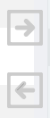

# Журнал счетов

Данный журнал служит для учета всех выставленных в ходе работ счетов на оплату клиентами услуг по проведению испытаний. 

<!-- @import "[TOC]" {cmd="toc" depthFrom=1 depthTo=6 orderedList=false} -->

<!-- code_chunk_output -->

- [Журнал счетов](#журнал-счетов)
  - [Как перейти в журнал счетов](#как-перейти-в-журнал-счетов)
  - [Функции журнала](#функции-журнала)
  - [Структура журнала](#структура-журнала)
    - [Область фильтров](#область-фильтров)
    - [Таблица счетов](#таблица-счетов)
      - [Структура таблицы](#структура-таблицы)
    - [Стрелки горизонтальной навигации](#стрелки-горизонтальной-навигации)
    - [Выбор количества отображаемых строк в таблице](#выбор-количества-отображаемых-строк-в-таблице)
    - [Иконки сервисных функций](#иконки-сервисных-функций)
    - [Легенда](#легенда)

<!-- /code_chunk_output -->

## Как перейти в журнал счетов

Перейти в журнал счетов вы можете по ссылке в левом меню Битрикс 24.

## Функции журнала

1. Ведение учета всех созданных в ходе работы счетов на оплату
2. Отображение записей в таблице по заданным параметрам (фильтрация)
3. Отображение статуса счета
4. Обеспечение доступа к карточке заявки, в рамках которой былсоздан данный счет

## Структура журнала

Журнал счетов состоит из следующих элементов:
1.	Область фильтров
2.	Таблица счетов
3.	Выбор количества отображаемых строк в таблице
4.	Иконки сервисных функций

### Область фильтров

 
Данная область содержит в себе поля для задания параметров сортировки информации в таблице (см. соотв. номер ниже).
 
1.	**Поля выбора даты**
Данные поля предназначены для отображения актов приемки проб, созданных в рамках указанного временного диапазона. Левое поле задает дату начала диапазона, а правое – дату конца диапазона. Поместите курсор в данные поля и в открывшемся окне календаря выберите нужную дату или впишите ее вручную.
2.	**Поле выбора статуса**
В зависимости от типа событий, имеющих место при работе со счетом, последнему присваивается определенный статус, который имеет название и цветовой код (подробнее см. раздел [«Легенда»](#легенда)). Поместив курсор в данное поле и выбрав нужный статус, вы выведите в таблицу те счета, которым он присвоен. При выборе варианта «Акт ВР сформирован, но не оплачен» система выведет в таблицу все строки, в которых отсутствует дата отправки акта ВР вне зависимости от статуса.
3.	**Поле выбора лаборатории**
Данное поле предназначено для вывода в таблицу счетов, в родительских заявках которых содержатся методики, относящиеся к выбранной лаборатории. Установите курсор в данное поле и в раскрывшемся списке выберите нужную лабораторию.
4.	**Кнопка сброса фильтров**
Нажмите на данную кнопку, чтобы сбросить все примененные фильтры. 

### Таблица счетов

Данная таблица содержит в себе первичную информацию обо всех счетах, созданных в ходе работы и содержащихся в БД ЛИМС. В строках таблицы содержится информация о номере счета, дате его создания, сумме, наименовании заказчика и т.п.

#### Структура таблицы
Первая строка таблицы представляет собой поля поиска по столбцам (см. соотв. номер ниже).

 
1.	Введите в данные поля слово или значение, которое вы хотите найти в строках соответствующего столбца. В результате в таблице отобразятся все строки, содержащие искомую информацию.
2.	Нажмите на стрелки для сортировки по алфавиту или по возрастанию / убыванию (в зависимости от типа значений в столбце).

Таблица состоит из следующих столбцов:

* **№** – номер счета.
* **Дата** – дата создания счета.
* **Сумма** – общая сумма счета.
* **Контрагент** – наименование компании-заказчика.
* **Материал** – краткое описание материала, являющегося объектом испытаний.
* **Ответственный** – фамилии всех сотрудников, принимающих участие в обработке заявки, в рамках которой был создан акт приемки проб.
* **Договор** – номер договора, в рамках которого создан текущий счет.
* **Заявка** – номер-ссылка на заявку, в рамках которой создан акт приемки проб в данной строке. Нажав на нее, вы попадете в интерфейс указанной заявки.
* **Акт ВР** – номер акта выполненных работ.
* **Дата акта ВР** – дата создания акта ВР.
* **Дата отправки акта ВР** – дата, когда акт ВР был отправлен заказчику.

### Стрелки горизонтальной навигации

Данные стрелки служат для горизонтальной навигации по таблице. Просто наведите курсор на нужную стрелку, и таблица начнет горизонтальную прокрутку, открывая доступ к столбцам, скрытым за пределами экрана.

### Выбор количества отображаемых строк в таблице

Наведите курсор на окно выбора количества отображаемых строк в таблице. В выпадающем списке выберите нужное количество (10, 25, 50, 100). После этого в таблице отобразится выбранное количество строк.

### Иконки сервисных функций

 Данная иконка служит для скрытия столбцов в таблице. При нажатии на нее появится меню выбора столбцов. Нажмите на кнопку названия, чтобы скрыть соответствующий столбец. Результат вы увидите сразу, страницу перезагружать не требуется.
 При нажатии на данную иконку произойдет копирование содержимого таблицы, представленной на экране, в буфер обмена. Далее вы можете вставить данные таблицы в любой текстовый или табличный документ.
 При нажатии на данную иконку произойдет скачивание таблицы, представленной на экране, на ваш локальный компьютер в формате xlsx.
 Данная иконка служит для вывода на печать представленной на экране таблицы. При нажатии на нее откроется окно выбора параметров печати и предварительного просмотра.

### Легенда

В начале каждой строки таблицы находится цветовой код, который обозначает статус, присвоенный данному счету. 

<table cellpadding="3" >
    <tr><td bgcolor= #FF3399 width=15></td><td>счет оплачен не полностью</td></tr>
    <tr><td bgcolor=#00763B width=15></td><td>счет оплачен полностью</td></tr>
    <tr><td bgcolor=#FF0000 width=15></td><td>счет не оплачен</td></tr>
</table>	  