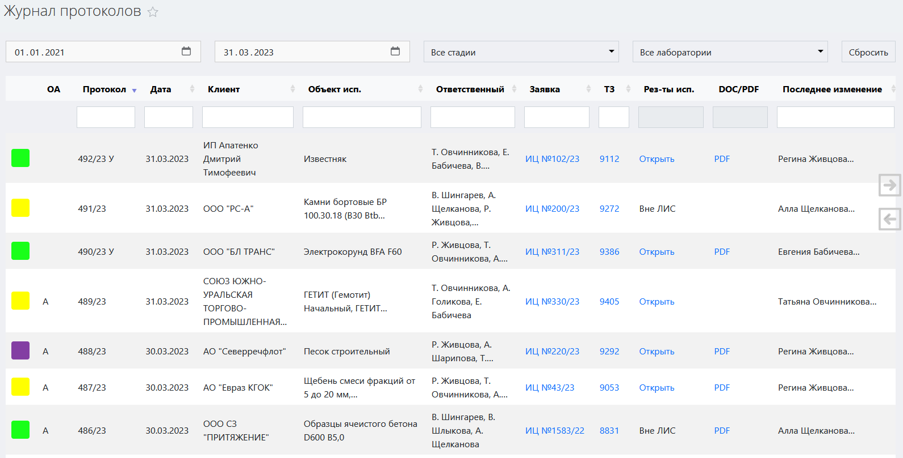
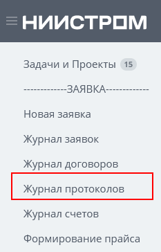
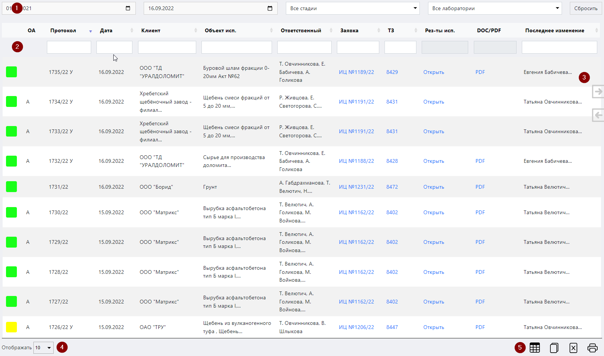
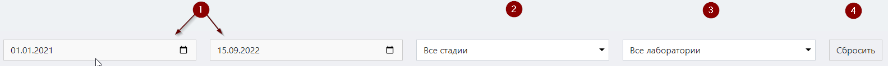
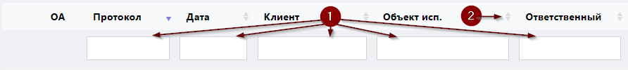

# Журнал протоколов

Данный журнал служит для учета всех созданных и выданных клиентам проторколов испытаний. 

<!-- @import "[TOC]" {cmd="toc" depthFrom=1 depthTo=6 orderedList=false} -->

<!-- code_chunk_output -->

- [Журнал протоколов](#журнал-протоколов)
  - [Как перейти в журнал протоколов](#как-перейти-в-журнал-протоколов)
  - [Функции журнала](#функции-журнала)
  - [Структура журнала](#структура-журнала)
    - [Область фильтров](#область-фильтров)
    - [Таблица протоколов](#таблица-протоколов)
      - [Структура таблицы](#структура-таблицы)
    - [Стрелки горизонтальной навигации](#стрелки-горизонтальной-навигации)
    - [Выбор количества отображаемых строк в таблице](#выбор-количества-отображаемых-строк-в-таблице)
    - [Иконки сервисных функций](#иконки-сервисных-функций)
    - [Легенда](#легенда)

<!-- /code_chunk_output -->

## Как перейти в журнал протоколов

Перейти в журнал протоколов вы можете по ссылке в левом меню Битрикс 24.

## Функции журнала

1. Ведение учета всех созданных протоколов
2. Отображение записей в таблице по заданным параметрам (фильтрация)
3. Отображение статуса протокола
4. Обеспечение доступа к карточке заявки, в рамках которой былсоздан данный протокол
5. Обеспечение доступа к интерфейсу ТЗ, на основании которого проводились испытания
6. Обеспечение доступа к интерфейсам результатов испытаний, на основании которых сформирован протокол
7. Формирование файла выданного протокола в формате pdf

## Структура журнала

Журнал протоколов состоит из следующих элементов:
1. Область фильтров
2. Таблица протоколов
3. Стрелки горизонтальной навигации
3. Выбор количества отображаемых строк в таблице
4. Иконки сервисных функций

### Область фильтров

 
Данная область содержит в себе поля для задания параметров сортировки информации в таблице (см. соотв. номер ниже).
 
1.	**Поля выбора даты**
Данные поля предназначены для отображения актов приемки проб, созданных в рамках указанного временного диапазона. Левое поле задает дату начала диапазона, а правое – дату конца диапазона. Поместите курсор в данные поля и в открывшемся окне календаря выберите нужную дату или впишите ее вручную.
2.	**Поле выбора стадии**
В зависимости от типа событий, имеющих место при работе с заявкой, последней присваивается определенный статус (стадия), который имеет название и цветовой код (подробнее см. раздел [«Легенда»](#легенда)). Поместив курсор в данное поле и выбрав нужную стадию, вы выведите в таблицу те протоколы, чьи заявки находятся в данной стадии.
3.	**Поле выбора лаборатории**
Данное поле предназначено для вывода в таблицу счетов, в родительских заявках которых содержатся методики, относящиеся к выбранной лаборатории. Установите курсор в данное поле и в раскрывшемся списке выберите нужную лабораторию.
4.	**Кнопка сброса фильтров**
Нажмите на данную кнопку, чтобы сбросить все примененные фильтры. 

### Таблица протоколов

Данная таблица содержит в себе первичную информацию обо всех созданных протоколах. В строках таблицы содержится информация о номере протокола, дате, номерах подчиненных документов, о наименовании заказчика и т.п.

#### Структура таблицы
Первая строка таблицы представляет собой поля поиска по столбцам (см. соотв. номер ниже).

 
1.	Введите в данные поля слово или значение, которое вы хотите найти в строках соответствующего столбца. В результате в таблице отобразятся все строки, содержащие искомую информацию.
2.	Нажмите на стрелки для сортировки по алфавиту или по возрастанию / убыванию (в зависимости от типа значений в столбце).

Таблица состоит из следующих столбцов:

* **ОА (область аккредитации)** – если в данной ячейке строки содержится литера А, это означает, что методики, измерения и оборудование в рамках данного протокола испытаний находится в области аккредитации.
* **Протокол** – номер-ссылка на данный протокол. Нажав на нее. Вы попадете в интерфейс данного протокола испытаний.
* **Дата** – дата создания протокола.
* **Клиент** – наименование компании-заказчика.
* **Объект испытаний** – краткое описание объекта испытаний.
* **Ответственный** – фамилии всех сотрудников, принимающих участие в работе с данным протоколом.
* **Заявка** – номер-ссылка на заявку, которой принадлежит данный протокол. Нажав на нее, вы попадете в интерфейс заявки.
* **ТЗ** – номер-ссылка на подчиненное техническое задание. Нажав на него, вы попадете в интерфейс ТЗ.
* **Результаты испытаний** – ссылка на результаты испытаний, проведенных в рамках заявки, которой принадлежит данный протокол. 
* **DOC/PDF** – ссылка на загруженный файл протокола в формате pdf. Если протокол выдан вне ЛИС, или файл pdf протокола не загружен в систему, то данная ссылка будет отсутствовать.
* **Последнее изменение** – содержит имя и фамилию сотрудника, который внес в данный протокол последние изменения.

### Стрелки горизонтальной навигации

Данные стрелки служат для горизонтальной навигации по таблице. Просто наведите курсор на нужную стрелку, и таблица начнет горизонтальную прокрутку, открывая доступ к столбцам, скрытым за пределами экрана.

### Выбор количества отображаемых строк в таблице

Наведите курсор на окно выбора количества отображаемых строк в таблице. В выпадающем списке выберите нужное количество (10, 25, 50, 100). После этого в таблице отобразится выбранное количество строк.

### Иконки сервисных функций

 Данная иконка служит для скрытия столбцов в таблице. При нажатии на нее появится меню выбора столбцов. Нажмите на кнопку названия, чтобы скрыть соответствующий столбец. Результат вы увидите сразу, страницу перезагружать не требуется.
 При нажатии на данную иконку произойдет копирование содержимого таблицы, представленной на экране, в буфер обмена. Далее вы можете вставить данные таблицы в любой текстовый или табличный документ.
 При нажатии на данную иконку произойдет скачивание таблицы, представленной на экране, на ваш локальный компьютер в формате xlsx.
 Данная иконка служит для вывода на печать представленной на экране таблицы. При нажатии на нее откроется окно выбора параметров печати и предварительного просмотра.

### Легенда

В начале каждой строки таблицы находится цветовой код, который обозначает статус, присвоенный сделке, в рамках которой выдан протокол. 

<table cellpadding="3" >
    <tr><td style="background-color: #007FFE" width=15></td><td>Испытания еще не проводились. Пробы не получены</td></tr>
    <tr><td td Style="background: #000058" width=15></td><td>Заявка на стадии проверки технического задания</td></tr>
    <tr><td td bgcolor=#FFFF00 width=15></td><td>Пробы получены. Проводятся испытания</td></tr>
    <tr><td td bgcolor=#580000 width=15></td><td>Испытания в лаборатории завершены. Оплата не поступила</td></tr>
    <tr><td td bgcolor=#6200C4 width=15></td><td>Испытания завершены. Оплата получена или не требуется. Акты ВР не отправлены</td></tr>
    <tr><td td bgcolor=#00FF00 width=15></td><td>Акты выполненных работ отправлены заказчику</td></tr>
    <tr><td td bgcolor=#00763B width=15></td><td>Акты выполненных работ получены. Заявка успешно завершена</td></tr>
    <tr><td td bgcolor=#FF0000 width=15></td><td>Испытания не проведены. Заявка прекращена</td></tr>
  </table>	  