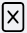

# Журнал приемки проб

Данный журнал служит для учета всех поступивших в лабораторию проб, их характеристик и параметров. 

<!-- @import "[TOC]" {cmd="toc" depthFrom=1 depthTo=6 orderedList=false} -->

<!-- code_chunk_output -->

- [Журнал приемки проб](#журнал-приемки-проб)
  - [Как перейти в журнал приемки проб](#как-перейти-в-журнал-приемки-проб)
  - [Функции журнала](#функции-журнала)
  - [Структура журнала](#структура-журнала)
    - [Область фильтров](#область-фильтров)
    - [Таблица актов приемки проб](#таблица-актов-приемки-проб)
      - [Структура таблицы](#структура-таблицы)
    - [Стрелки горизонтальной навигации](#стрелки-горизонтальной-навигации)
    - [Выбор количества отображаемых строк в таблице](#выбор-количества-отображаемых-строк-в-таблице)
    - [Иконки сервисных функций](#иконки-сервисных-функций)

<!-- /code_chunk_output -->

## Как перейти в журнал приемки проб

Перейти в журнал оборудования вы можете по ссылке в левом меню Битрикс 24.

## Функции журнала

1. Ведение учета поступивших проб
2. Отображение записей в таблице по заданным параметрам (фильтрация)
3. Обеспечение механизма прослеживаемости пробы (дата поступления, срок хранения, нахождение в определенной лаборатории)
4. Обеспечение доступа к карточке заявки, в рамках которой была принята данная проба

## Структура журнала

Журнал приемки проб состоит из следующих элементов:
1.	Область фильтров
2.	Таблица актов приемки проб
3.	Выбор количества отображаемых строк в таблице
4.	Иконки сервисных функций
 
### Область фильтров

 
Данная область содержит в себе поля для задания параметров сортировки информации в таблице (см. соотв. номер ниже).
 
1.	**Поля выбора даты**
Данные поля предназначены для отображения актов приемки проб, созданных в рамках указанного временного диапазона. Левое поле задает дату начала диапазона, а правое – дату конца диапазона. Поместите курсор в данные поля и в открывшемся окне календаря выберите нужную дату или впишите ее вручную.
2.	**Поле выбора лаборатории**
Данное поле предназначено для вывода в таблицу актов приемки проб, содержащих методики, относящиеся к выбранной лаборатории. Установите курсор в данное поле и в раскрывшемся списке выберите нужную лабораторию.
3.	**Кнопка сброса фильтров**
Нажмите на данную кнопку, чтобы сбросить все примененные фильтры. 

### Таблица актов приемки проб

Данная таблица содержит в себе первичную информацию об актах приемки проб. В строках таблицы содержится информация о номере акта, шифрах, дате создания акта, наименовании заказчика и т.п.

#### Структура таблицы
Первая строка таблицы представляет собой набор полей поиска, осуществляющих сортировку по заданному параметру в рамках столбца, которому данное поле соответствует (см. соотв. номер ниже).

 
1.	Введите в данные поля слово или значение, которое вы хотите найти в строках соответствующего столбца. В результате в таблице отобразятся все строки, содержащие искомую информацию.
2.	Нажмите на стрелки для сортировки по алфавиту или по возрастанию / убыванию (в зависимости от типа значений в столбце).

Таблица состоит из следующих столбцов:

* **Акт ПП** – номер акта приемки проб.
* **Шифры** – в данной строке содержатся шифры проб в рамках данного акта. По количеству шифров в ячейке можно определить количество проб.
* **Основание** – номер договора-основания, в рамках которого проводятся испытания.
* **Дата** – дата приемки проб в рамках данного акта. 
* **Клиент** – наименования компании-заказчика.
* **Объект** – краткое описание объекта испытаний.
* **Ответственный** – фамилии всех сотрудников, принимающих участие в обработке заявки, в рамках которой был создан акт приемки проб.
* **Заявка** – номер-ссылка на заявку, в рамках которой создан акт приемки проб в данной строке.
* **Лаборатория** – название лаборатории, в которой проводятся испытания проб, принятых по данному акту.
* **Протокол** – номер-ссылка на протокол результатов испытаний проб, принятых по данному акту

### Стрелки горизонтальной навигации

Данные стрелки служат для горизонтальной навигации по таблице. Просто наведите курсор на нужную стрелку, и таблица начнет горизонтальную прокрутку, открывая доступ к столбцам, скрытым за пределами экрана.

### Выбор количества отображаемых строк в таблице

Наведите курсор на окно выбора количества отображаемых строк в таблице. В выпадающем списке выберите нужное количество (10, 25, 50, 100). После этого в таблице отобразится выбранное количество строк.

### Иконки сервисных функций

 Данная иконка служит для скрытия столбцов в таблице. При нажатии на нее появится меню выбора столбцов. Нажмите на кнопку названия, чтобы скрыть соответствующий столбец. Результат вы увидите сразу, страницу перезагружать не требуется.
 При нажатии на данную иконку произойдет копирование содержимого таблицы, представленной на экране, в буфер обмена. Далее вы можете вставить данные таблицы в любой текстовый или табличный документ.
 При нажатии на данную иконку произойдет скачивание таблицы, представленной на экране, на ваш локальный компьютер в формате xlsx.
 Данная иконка служит для вывода на печать представленной на экране таблицы. При нажатии на нее откроется окно выбора параметров печати и предварительного просмотра.
