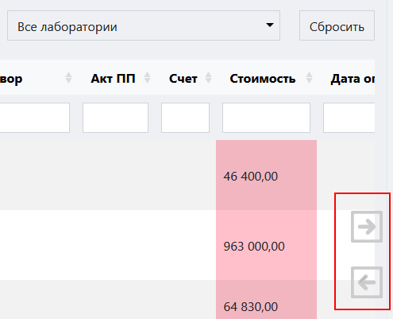

# Журнал заявок
 
Журнал заявок содержит информацию обо всех заявках на испытания, созданных в системе ЛИМС U-Lab за все время работы. Из него можно перейти в карточку заявки, в интерфейс ТЗ и в журнал актов приемки проб. 

<!-- @import "[TOC]" {cmd="toc" depthFrom=1 depthTo=6 orderedList=false} -->

<!-- code_chunk_output -->

- [Журнал заявок](#журнал-заявок)
  - [Как перейти в журнал](#как-перейти-в-журнал)
  - [Функции журнала](#функции-журнала)
  - [Структура журнала заявок](#структура-журнала-заявок)
    - [Область фильтров](#область-фильтров)
    - [Таблица заявок](#таблица-заявок)
      - [Структура таблицы](#структура-таблицы)
    - [Стрелки горизонтальной навигации](#стрелки-горизонтальной-навигации)
    - [Окно выбора количества отображаемых строк в таблице](#окно-выбора-количества-отображаемых-строк-в-таблице)
    - [Иконки сервисных функций](#иконки-сервисных-функций)
    - [Легенда](#легенда)

<!-- /code_chunk_output -->

## Как перейти в журнал

Перейти в журнал заявок вы можете по соответствующей ссылке в левом меню Битрикс 24.

## Функции журнала

1. Ведение учета всех созданных заявок
2. Отображение записей в таблице по заданным параметрам (фильтрация)
3. Отображение статусов заявок
4. Обеспечение доступа к карточке заявки, интерфейсу ТЗ и Акту приемки проб посредством ссылок

## Структура журнала заявок

Интерфейс журнала заявок состоит из следующих элементов:
1.	Область фильтров
2.	Таблица заявок
3.	Стрелки горизонтальной навигации
4.	Окно выбора количества отображаемых строк в таблице
5.	Иконки сервисных функций

### Область фильтров

Данная область предназначена  для задания параметров сортировки информации в таблице журнала. Она содержит следующие элементы:
 
1. **Поля выбора даты** – предназначены для отображения заявок, созданных в рамках указанного в них временного диапазона. Левое поле задает дату начала диапазона, а правое – дату конца диапазона. Поместите курсор в данные поля и в открывшемся окне календаря выберите нужную дату или впишите ее вручную.
2. **Поле выбора стадии** – в зависимости от типа событий, имеющих место при работе с заявкой, последней присваивается определенный статус (далее стадия), который имеет название и цветовой код (подробнее см. Раздел 7 «Легенда»). Поместив курсор в данное поле и выбрав нужную стадию, вы выведите в таблицу те заявки, которые на ней находятся.
3. **Поле выбора лаборатории** – данное поле предназначено для вывода в таблицу заявок, содержащих методики, относящиеся к выбранной лаборатории. Установите курсор в данное поле и в раскрывшемся списке выберите нужную лабораторию.
4. **Кнопка сброса фильтров** – нажмите на данную кнопку, чтобы сбросить все примененные фильтры. 

### Таблица заявок

Данная таблица содержит в себе первичную информацию обо всех заявках, содержащихся в базе данных ЛИМС. В строках таблицы содержится информация о номере заявки, номерах подчиненных документов, о наименовании заказчика и т.п.

#### Структура таблицы

Первая строка таблицы представляет из себя набор полей поиска, осуществляющих сортировку по заданному параметру в рамках столбца, которому данное поле соответствует.
 
1.	Введите в данное поле слово или значение, которое вы хотите найти в строках данного столбца. В результате в таблице отобразятся все строки, содержащие искомую информацию.
2.	Стрелки сортировки по алфавиту или по возрастанию / убыванию.

Таблица состоит из следующих столбцов:
* **Цветовой код статуса заявки** – наведите курсор на цветной квадрат чтобы вызвать всплывающую подсказку.
* **Заявка** – содержит номер-ссылку на заявку в данной строке. Нажав на него, вы попадете в интерфейс заявки.
* **Дата** – дата создания данной заявки.
* **Клиент** – наименование компании-заказчика.
* **Объект испытаний** – краткое описание объекта испытаний.
* **Ответственный** – фамилии всех сотрудников, принимающих участие в обработке данной заявки.
* **ТЗ** – номер-ссылка на подчиненное техническое задание. Нажав на него, вы попадете в интерфейс ТЗ.
* **Договор** – номер договора, на основании которого проводятся испытания в рамках данной заявки.
* **Акт ПП** – номер-ссылка на акт приемки проб в рамках данной заявки. Нажав на него, вы попадете в интерфейс акта приемки проб.
* **Стоимость** – стоимость выполнения работ по данной заявке. Если ячейка в данном столбце горит красным, то это значит, что оплата счета в рамках данной заявки еще не проведена.
* **Дата оплаты** – дата поступления оплаты в рамках данной заявки.
* **Результаты испытаний** – ссылка на результаты испытаний, проведенных в рамках данной заявки. 
* **Протокол** – номер-ссылка на протокол испытаний в рамках данной заявки. Нажав на нее, вы попадете в интерфейс протокола испытаний.
* **Фото испытаний** – ссылка на фотографии процесса испытаний.
* **Срок до** – планируемый срок реализации мероприятий в рамках данной заявки.

### Стрелки горизонтальной навигации

Данные стрелки служат для горизонтальной навигации по таблице. Просто наведите курсор на нужную стрелку, и таблица начнет горизонтальную прокрутку, открывая доступ к столбцам, скрытым за пределами экрана.

### Окно выбора количества отображаемых строк в таблице

Наведите курсор на окно выбора количества отображаемых строк в таблице. В выпадающем списке выберите нужное количество (10, 25, 50, 100). После этого в таблице отобразится выбранное количество строк.

### Иконки сервисных функций

 данная иконка служит для скрытия столбцов в таблице. При нажатии на нее появится меню выбора столбцов. Нажмите на кнопку названия, чтобы скрыть соответствующий столбец. Результат вы увидите сразу, страницу перезагружать не требуется.
 при нажатии на данную иконку произойдет копирование содержимого таблицы, представленной на экране, в буфер обмена. Далее вы можете вставить данные таблицы в любой текстовый или табличный документ.
 при нажатии на данную иконку произойдет скачивание таблицы, представленной на экране, на ваш локальный компьютер в формате xlsx.
 данная иконка служит для вывода на печать представленной на экране таблицы. При нажатии на нее откроется окно выбора параметров печати и предварительного просмотра.

### Легенда

В начале каждой строки таблицы находится цветовой код, который обозначает стадию, на которой находится данная заявка. Ниже представлена расшифровка цветовых кодов стадий заявки.
<table cellpadding="3" >
    <tr><td style="background-color: #007FFE" width=15></td><td>Испытания еще не проводились. Пробы не получены</td></tr>
    <tr><td td bgcolor=#000058 width=15></td><td>Заявка на стадии проверки технического задания</td></tr>
    <tr><td td bgcolor=#FFFF00 width=15></td><td>Пробы получены. Проводятся испытания</td></tr>
    <tr><td td bgcolor=#580000 width=15></td><td>Испытания в лаборатории завершены. Оплата не поступила</td></tr>
    <tr><td td bgcolor=#6200C4 width=15></td><td>Испытания завершены. Оплата получена или не требуется</td></tr>
    <tr><td td bgcolor=#00FF00 width=15></td><td>Акты выполненных работ отправлены заказчику</td></tr>
    <tr><td td bgcolor=#00763B width=15></td><td>Акты выполненных работ получены. Заявка успешно завершена</td></tr>
    <tr><td td bgcolor=#FF0000 width=15></td><td>Испытания не проведены. Заявка прекращена</td></tr>
  </table>	  