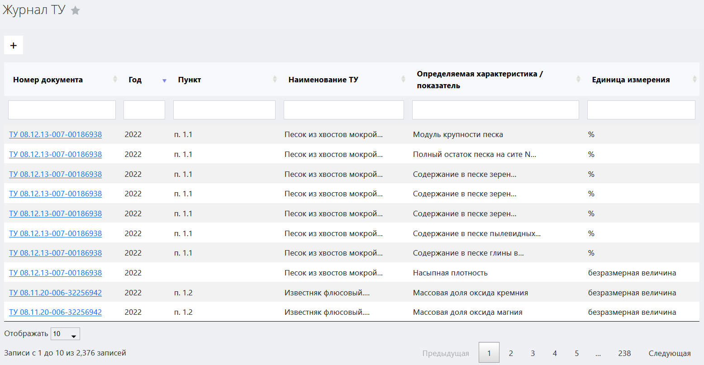
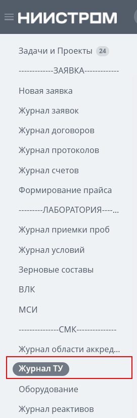
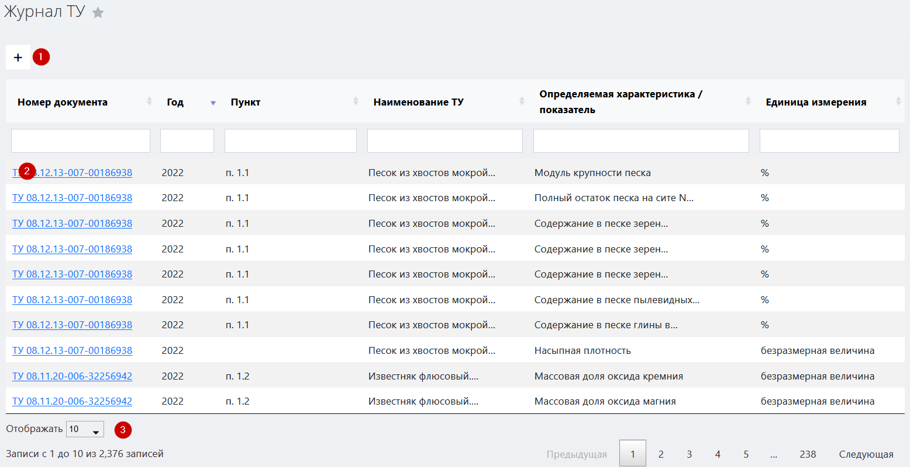
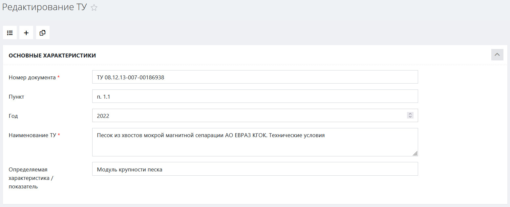

# Журнал технических условий

Данный журнал служит для регистрации и учета всех ТУ, зарегистрированных в БД ЛИМС. Он содержит основную рабочую информацию обо всех ТУ.

<!-- @import "[TOC]" {cmd="toc" depthFrom=1 depthTo=6 orderedList=false} -->

<!-- code_chunk_output -->

- [Журнал технических условий](#журнал-технических-условий)
  - [Как перейти в журнал ТУ](#как-перейти-в-журнал-ту)
  - [Функции журнала](#функции-журнала)
  - [Структура журнала](#структура-журнала)
    - [Кнопка вызова интерфейса регистрации нового ТУ](#кнопка-вызова-интерфейса-регистрации-нового-ту)
      - [Интерфейс регистрации нового ТУ](#интерфейс-регистрации-нового-ту)
    - [Таблица методик](#таблица-методик)
      - [Структура таблицы](#структура-таблицы)
    - [Выбор количества отображаемых строк в таблице](#выбор-количества-отображаемых-строк-в-таблице)

<!-- /code_chunk_output -->

## Как перейти в журнал ТУ

Перейти в журнал ТУ вы можете по ссылке в левом меню Битрикс 24.

## Функции журнала

1. Ведение учета всех ТУ, принятых в работу
2. Обеспечение доступа к интерфейсу регистрации нового ТУ
3. Обеспечение доступа к карточке ТУ для получения рабочей информации
4. Отображение записей в таблице по заданным параметрам (фильтрация)

## Структура журнала

Журнал ТУ состоит из следующих элементов:
1. Иконка вызова интерфейса регистрации нового ТУ	
2. Таблица методик
3. Выбор количества отображаемых строк в таблице

### Кнопка вызова интерфейса регистрации нового ТУ

 Нажмите на данную кнопку чтобы вызвать интерфейс регистрации нового ТУ.

#### Интерфейс регистрации нового ТУ

Подробнее о данном интерфейсе см. [Карточка ТУ](\LIMS_Manual_Stand\GOST_card\GOST_card.html)

Для того, чтобы зарегистрировать новые ТУ:

1. Заполните все поля блока «Основные характеристики»
2. Заполните все поля блока «Единицы и нормы»
3. В блоке «ТИпы и марки материала» выберите материал и установите его параметры.
4. Нажмите кнопку 

> **Результат:** ТУ зарегистрированы, соответствующая запись появилась в таблице журнала области аккредитации.

### Таблица методик

Данная таблица содержит первичную информацию обо всех методиках, зарегистрированных в БД ЛИМС, и их отношении к области аккредитации.

#### Структура таблицы
Первая строка таблицы представляет собой поля поиска по столбцам. Установите курсор в любое из полей и введите информацию, по которой вы хотите отсортировать содержимое таблицы.

Таблица состоит из следующих столбцов:

* **Номер документа** номер ТУ
* **Год** – год выпуска ТУ
* **Пункт** – пункт ТУ, регламентирующий данную характеристику / показатель
* **Наименование ТУ**
* **Определяемая характеристика / показатель** 
* **Единица измерения**

### Выбор количества отображаемых строк в таблице

Наведите курсор на окно выбора количества отображаемых строк в таблице. В выпадающем списке выберите нужное количество (10, 25, 50, 100). После этого в таблице отобразится выбранное количество строк.
