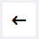
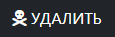

# Карточка методики

В карточке методики содержится исчерпывающая информация о данной методике, касающаяся вопросов ее использования в рамках лаборатории. 

<!-- @import "[TOC]" {cmd="toc" depthFrom=1 depthTo=6 orderedList=false} -->

<!-- code_chunk_output -->

- [Карточка методики](#карточка-методики)
  - [Как перейти в карточку методики](#как-перейти-в-карточку-методики)
  - [Функции карточки методики](#функции-карточки-методики)
  - [Структура карточки методики](#структура-карточки-методики)
    - [Иконка возврата в карточку ГОСТа](#иконка-возврата-в-карточку-госта)
    - [Блок «Основные характеристики»](#блок-основные-характеристики)
    - [Блок «Единицы измерения и нормы»](#блок-единицы-измерения-и-нормы)
    - [Блок «Лаборатории и сотрудники»](#блок-лаборатории-и-сотрудники)
    - [Блок «Условия применения»](#блок-условия-применения)
    - [Блок «Дополнительные характеристики»](#блок-дополнительные-характеристики)
    - [Блок «Расчет неопределенности»](#блок-расчет-неопределенности)
    - [Блок «Оборудование»](#блок-оборудование)
    - [Блок действий](#блок-действий)

<!-- /code_chunk_output -->

## Как перейти в карточку методики

Доступ к карточке методики вы можете получить тремя способами.
1. Из интерфейса журнала области аккредитации. Для этого:
а) Перейдите в журнал области аккредитации.
б) В столбце «Определяемая характеристика / показатель» перейдите по ссылке в соответствующей строке. 
 
2. Из карточки технического задания. Для этого:
а) Перейдите в журнал заявок.
б) В столбце «ТЗ» перейдите по номеру-ссылке в строке соответствующей заявки.
в) В болке «Материалы» карточки ТЗ нажмите на иконку  напротив интересующей вас методики.
 
3. Из карточки ГОСТа. Для этого:
а) Перейдите в журнал области аккредитации.
б) В столбце «Номер документа» перейдите по ссылке типа «ГОСТ 31938».
в) В блоке «Методики» карточки ГОСТа нажмите на иконку  в конце строки соответствующей методики.

## Функции карточки методики

1. Управление всеми ключевыми параметрами методики, зарегистрированной в БД ЛИМС
2. Управление матрицей компетенций: тем сотрудникам, которые установлены ответственными за данную метолику в блоке «Лаборатории и сотрудники» в [матрице компетенций]() автоматически присваиваются те же самые компетенции (и наоборот)
3. Контроль актуальности методики
4. Управление привязкой оборудования к методике

## Структура карточки методики

Карточка методики состоит из следующих блоков:
1.  Иконка возврата в карточку ГОСТа
2. Основные характеристики
3. Единицы измерения и нормы
4. Лаборатории и сотрудники
5. Условия применения
6. Дополнительные характеристики
7. Контроль
8. Расчет неопределенности
9. Оборудование
10. Блок действий

### Иконка возврата в карточку ГОСТа

 Нажмите на данную иконку чобы вернуться в карточку ГОСТа, к которому относится данная методика.

### Блок «Основные характеристики» 

Блок содержит следующие поля:
* **№ документа** – № нормативного документа (методики)
* **Пункт документа** – пункт, согласно которому проводятся испытания
* **Определяемая характеристика / показатель** – характеристика, определяемая при помощи данной методики.
* **Определяемая характеристика / показатель (ФСА)** – то же, что и пред., но данное поле синхронизировано с БД ФСА для того, чтобы вы могли выбрать из выпадающего списка нужную характеристику, в точности соответствующую регламенту ФСА.
* **Метод** – наименование метода, например, «отбор проб»
* **Номер в области аккредитации** – порядковый номер данного ГОСТа в базе данных ЛИМС U-Lab
* **Флажок «Методика не для испытаний»** – установите в том случае, если данная методика не для испытаний (а, например, для измерений или отбора)

>:warning: Нажав на иконку  в строке «Определяемая характеристика / показатель (ФСА)», вы попадете в [журнал характеристик](). В выпадающем списке данной строки вы можете выбрать только те характеристики или показатели, напротив которых в журнале характеристик активирован переключатель 

### Блок «Единицы измерения и нормы» 

Блок содержит следующие поля:
* **Единица измерения** – единица измерения контролируемых параметров. Установите курсор в данное поле, и в выпадающем списке выберите нужную единицу измерения.
* **Знаков после запятой в результате** – количество знаков после запятой в результирующем значении. Установите нужное значение вручную или при помощи стрелок в правой части поля.
* **Диапазон определения** – верхняя и нижняя границы нормы. Радиокнопками вы можете задать тип диапазона (внутренний / внешний / не нормируется).
* **Флажок «Нормы текстом?»** – установите, если нормы должны быть прописаны текстом.
* **Флажок «Фактические значения текстом?»** – установите, если значения должны быть прописаны текстом.
* **Лист измерения** – тип листа измерения. Установите курсор в данное поле, и в выпадающем списке выберите нужный.
* **Флажок «Два результата»** – установите, если результатов измерений должно быть больше одного.

>:warning: Нажав на иконку  в строке «Единица измерения», вы попадете в [журнал единиц измерения](). В выпадающем списке данной строки вы можете выбрать только те единицы измерения, напротив которых в журнале активирован переключатель 

### Блок «Лаборатории и сотрудники» 

В данном блоке содержится информация о лабораториях, в рамках которых применяется данная методика, а также сотрудниках, ответственных за проведение испытаний в рамках данной методики.

Данный блок должен содержать следующие поля:
* **Лаборатории** – лаборатории, в которых проводятся испытания в рамках данной методики. Установите курсор в данное поле, и в выпадающем списке выберите нужную лабораторию.
* **Помещения**– помещения, в которых находятся данные лаборатории. Установите курсор в данное поле, и в выпадающем списке выберите нужное помещение.
* **Ответственные** – сотрудники, ответственные за проведение испытаний в рамках данных методик. Установите курсор в данное поле, и в выпадающем списке выберите нужного сотрудника.
 
### Блок «Условия применения» 

В данном блоке содержится информация о нормативных параметрах условий окружающей среды: **температуре, влажности и атмосферном давлении.** Вручную или при помощи стрелок в правой части поля установите диапазон нормативных значений в каждой строке. Если диапазон не нормируется, то установите соответствующий флажок в конце строки.

### Блок «Дополнительные характеристики» 

Содержит сведения о дополнительных характеристиках методики.

Поле **Стоимость (руб.)** – стоимость исследований в рамках методики (если установлена). 

### Блок «Контроль» 

Данный блок предназначен для отображения следующей контрольной информации:

* **Актуально?** – актуальна ли методика на данный момент времени.
    >:warning: По умолчанию все методики считаются актуальными. Статус неактуальной присваивается методике только после нажатия кнопки  в [Блоке действий](#блок-действий) в нижней части карточки.
* **Подтверждено?** – подтверждена ли отделом СМК верность информации в данной карточке. Методика становится подтвержденной посте того, как ответственный сотрудник нажимает кнопку  в [Блоке действий](#блок-действий).
* **Флажок «В области аккредитации?»** – установите его, если методика в области аккредитации.
* **Флажок «Расширенная область?»** – установите его, если данная методика на расширении области аккредитации.

### Блок «Расчет неопределенности» 

Cодержит строку / строки (для добавления строки нажмите ) для введения диапазона неопределенности в поля **«От»** и **«До»** и погрешности в поле **«U(w)»**. Ввод осуществляется либо вручную, либо при помощи стрелок в правой части поля.
 
### Блок «Оборудование» 

Содержит первичную информацию об оборудовании, на котором проводятся испытания в рамках данной меодики, и которое к ней привязано.

Блок представляет собой таблицу, состоящую из следующих столбцов:
* **Оборудование ГОСТ** – оборудование, регламентированное ГОСТ для проведения испытаний по данной методике.
* **Оборудование ИЦ** – оборудование, на котором испытания по данной методике проводятся в ИЦ / лаборатории
* **Тип** – тип оборудования/ Их всего три:
    * **СИ** – средство измерения (то, при помощи чего проводят измерения, например, термометр)
    * **ИО** – испытательное оборудование (то, что создает условия, например, печь)
    * **ВО** – вспомогательное оборудование
* **Заключение** – соответствует или не соответствует ГОСТ оборудование, применяемое ИЦ / лабораторией.

>:warning: для получения более подробной информации об оборудовании, перейдите в карточку оборудования. нажав на иконку 

Для добавления строки в таблицу, нажмите  в верхнем правом углу таблицы.
Для удаления строки нажмите 

### Блок действий

 – нажмите данную кнопку чтобы сохранить всю введенную информацию.
 – нажмите данную кнопку чтобы присвоить карточке статус «Проверено».
> **Результат:** в блоке «Контроль» в строке «Подтверждено» значение изменится на «Да». В журнале области аккредитации в первом столбце таблицы напротив данной методики появится иконка 

 – нажмите данную кнопку чтобы присвоить методике статус «Неактуально».
> **Результат:** в блоке «Контроль» в строке «Актуально» значение изменится на «Нет». В журнале области аккредитации при установки в поле выбора категории в области фильтров значения «Не актальные» в таблице будет в числе прочих выводиться и данная методика 

 – нажмите данную кнопку, если вам необходимо удалить карточку данной методики.
>:warning: При удалении карточки методики в системе удаляются также все связанные с ней таблицы привязки оборудования, сотрудников, лабораторий и помещений.
**Данная кнопка доступна только руководителю СМК и администратору.**