# Карточка заявки

<!-- @import "[TOC]" {cmd="toc" depthFrom=1 depthTo=6 orderedList=false} -->

<!-- code_chunk_output -->

- [Карточка заявки](#карточка-заявки)
  - [Как перейти в карточку заявки](#как-перейти-в-карточку-заявки)
  - [Функции карточки заявки](#функции-карточки-заявки)
  - [Компоненты карточки заявки](#компоненты-карточки-заявки)
    - [Блок основных действий](#блок-основных-действий)
    - [Блок «Общая информация»](#блок-общая-информация)
    - [Блок «Документы»](#блок-документы)
      - [Строка «Техническое задание»](#строка-техническое-задание)
      - [Строка «Коммерческое предложение»](#строка-коммерческое-предложение)
      - [Строка «Договор»](#строка-договор)
      - [Строка «Приложение к договору»](#строка-приложение-к-договору)
      - [Строка «Счет»](#строка-счет)
      - [Групповое действие с полями «Договор», «Протокол согласования цены» и «Счет»](#групповое-действие-с-полями-договор-протокол-согласования-цены-и-счет)
      - [Строка «Оплата»](#строка-оплата)
      - [Строка (строки) «Акт приемки проб»](#строка-строки-акт-приемки-проб)
      - [Строка / строки «Направление в лабораторию»](#строка--строки-направление-в-лабораторию)
      - [Строка «Результаты испытаний»](#строка-результаты-испытаний)
      - [Строка «Протокол»](#строка-протокол)
      - [Строка «Завершение испытаний»](#строка-завершение-испытаний)
      - [Строка «Акт выполненных работ»](#строка-акт-выполненных-работ)
  - [Блок «Комментарий»](#блок-комментарий)
  - [Блок «Документы клиента»](#блок-документы-клиента)
  - [Блок «Списки версий»](#блок-списки-версий)
  - [Завершение заявки](#завершение-заявки)
    - [Статусы заявок](#статусы-заявок)
      - [Легенда](#легенда)

<!-- /code_chunk_output -->

## Как перейти в карточку заявки
Вы можете осуществить переход в карточку заявки двумя способами:
1. При создании новой заявки после сохранения введенной информации в соответствующем интерфейсе (см. инстр. «Интерфейс создания заявки на испытания») нажмите на иконку  в верхнем левом углу.

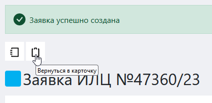

2. Перейти в журнал заявок по сответствующей ссылке в левом меню Битрикс 24 и в столбце «Заявка» перейти по ссылке в соответствующей строке.

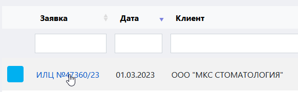

## Функции карточки заявки

Карточка заявки служит для:
* хранения всей информации по заявке;
* регистрации изменений в процессе работы с заявкой;
* присвоения заявке статуса в зависимости от степени завершенности работы с ней;
* обеспечения доступа ко всем сущностям, интерфейсам и документам, имеющим отношение к заявке;
* осуществления операций генерации сущностей, а также формирования и отправки документов;
* хранения сканов документов по данной заявке;
* версионирования сформированных в рамках заявки документов. 

## Компоненты карточки заявки

Карточка заявки состоит из следующих блоков:
* блок основных действий;
* блок «Общая информация»;
* блок «Документы»;
* блок «Комментарий»;
* блок «Документы клиента»;
* блок «Списки версий».

### Блок основных действий

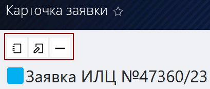

Данный блок находится в левой верхней части карточки. Возможные действия: 
 – возврат в журнал заявок.
 – переход к интерфейсу создания заявки (в случае, если необходимо отредактировать входные данные).
 – удалить заявку.

### Блок «Общая информация»

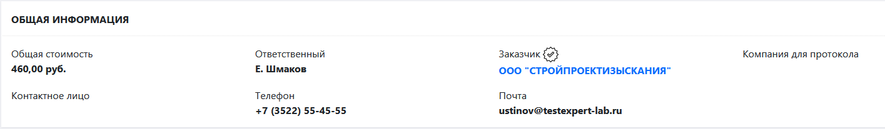

Данный блок дает общие сведения о заявке и содержит следующую информацию:
* **Статус** (обозначен цветовым кодом в виде квадрата) – при наведении курсора выдает всплывающую подсказку с пояснением статуса.
* **Индекс заявки** – тип (обозначен буквенным кодом, напр. ИЛЦ), номер заявки (обозначен цифрами, напр. #47360/23, где /23 – обозначение года создания заявки).
* **Общая стоимость** – общая конечная стоимость заявки (складывается из совокупной стоимости всех испытаний с учетом примененных скидок).
* **Контактное лицо** – ответственный сотрудник со стороны заказчика.
* **Ответственный** – один или несколько сотрудников, ответственные за обработку и выполнение данной заявки. Это менеджеры по работе с клиентами, лаборанты и начальник лаборатории.
* **Телефон** – номер телефона заказчика для связи.
* **Заказчик** – название компании заказчика. Если здесь имеется символ , то компания-заказчик является проверенной и благонадежной.
* **Почта** – адрес электронной почты для связи с заказчиком.
* **Компания для протокола** – наименование компании .на которую выдается протокол (в случае если заказчиком выступает другая компания)

### Блок «Документы»
В данном блоке содержится основная необходимая информация обо всех документах, касающихся заявки, о поступлении оплаты и о завершении  испытаний по данной заявке. 

Блок «Документы» представляет собой таблицу, состоящую из следующих столбцов:
* **Тип документа** – тип документа
* **Номер** – номер документа в системе
* **Дата** – дата последнего изменения документа.
* **Дата отправки** – дата последней отправки документа (если документ подвергался изменениям и отправлялся повторно).
* **Операции** – кнопки возможных операций с данным документом.

#### Строка «Техническое задание»
В данной строке содержится информация о техническом задании. 

> Для того чтобы перейти в карточку ТЗ, нажмите на его номер в соответствующем столбце.

**Возможные операции:**

 – нажав на данную иконку, вы перейдете в интерфейс ТЗ.

 – при нажатии на данную кнопку произойдет отправка бланка заявки на создание ТЗ на адрес электронной почты, указанный в карточке компании заказчика. Если электронных адресов указано несколько, появится их список, и будет предложено выбрать, куда именно отправить документ.

#### Строка «Коммерческое предложение»
В данной строке содержится информация о номере КП в системе, дате его последних изменений и дате последней отправки. 

**Возможные операции:**

 – при нажатии на данную иконку система автоматически сформирует КП на основе ТЗ и предложит выбрать путь для сохранения файла, содержащего КП, в формате docx и автоматически создаст в системе U-Lab копии файла в формате pdf и docx.  Получить доступ к ним можно из блока [«Списки версий»](#-блок-списки-версий-).

 – при нажатии на данную иконку происходит отправка файла, содержащего КП, на адрес электронной почты, указанный в карточке компании заказчика. Если электронных адресов указано несколько, появится их список, и будет предложено выбрать, куда именно отправить документ.

#### Строка «Договор»
	
В данной строке содержится информация о номере договора, дате его последнего изменения и дате его последней оправки заказчику. Договор  формируется внутри системы U-Lab автоматически. 

> Для того чтобы перейти в карточку договора , нажмите на его номер договора в соответствующем столбце.	

**Возможные операции:**

 – при нажатии на данную иконку система перейдет в форму создания / редактирования договора, на основе которой будет сформирован файл договора. Копия данного файла автоматически сохраняется в системе в формате формате pdf и docx. Получить доступ к ней можно из блока [«Списки версий»](#-блок-списки-версий-).

 – при нажатии на данную иконку происходит отправка файла договора на адрес электронной почты, указанный в карточке компании-заказчика. Если электронных адресов указано несколько, появится их список, и будет предложено выбрать, куда именно отправить документ. 
 
#### Строка «Приложение к договору»
 
В данной строке содержится информация о номере, дате последнего 
изменения и дате последней отправки заказчику приложения к договору. Приложение – это документ, который формируется на основе технического задания.

**Возможные операции:**

 – при нажатии на данную иконку система должна автоматически 
сформировать файл приложения к договору (ТЗ) на основании заполненной карточки ТЗ и предложить выбрать путь для сохранения файла, содержащего ТЗ. Копия данного файла 
должна автоматически сохраняться в системе U-Lab в формате pdf. Получить доступ к ней 
должно быть возможно из блока «Списки версий».

 – при нажатии на данную иконку произойдет отправка файла, содержащего приложение к договору (ТЗ), на адрес электронной почты, указанный в карточке компании заказчика. Если электронных адресов указано несколько, появится их список и будет предложен выбор, куда именно отправить документ.

#### Строка «Счет»

В данной строке содержится информация о номере счета, дате его последнего изменения и дате последней отправки заказчику.

**Возможные операции:**

 – при нажатии на данную иконку система автоматически сформирует счет на основании заполненной карточки ТЗ и предложит выбрать путь для сохранения файла счета. Копия данного файла автоматически сохраняется в системе U-Lab в формате pdf. Получить доступ к ней можно из блока [«Списки версий»](#блок-списки-версий).

Данное действие может быть интегрировано с программой 1С для того, чтобы при формировании счета в системе U-Lab аналогичный документ формировался в 1С автоматически.

 – при нажатии на данную иконку происходит отправка файла счета на адрес электронной почты, указанный в карточке компании заказчика. Если электронных адресов указано несколько, появится их список, и будет предложено выбрать, куда именно отправить документ

#### Групповое действие с полями «Договор», «Протокол согласования цены» и «Счет»
В системе U-Lab реализована функция отправки заказчику пакета документов, куда входит договор, ТЗ и счет на оплату. Эти документы можно отправлять как пакетом, так и по отдельности. Для того, чтобы отправить две или три позиции:
1. Проставьте флажки в тех строках, документы из которых необходимо отправить.
2. Нажмите, чтобы совершить отправку. Если в системе содержится несколько электронных адресов, появится их список, и будет предложено выбрать, куда именно отправить документ.

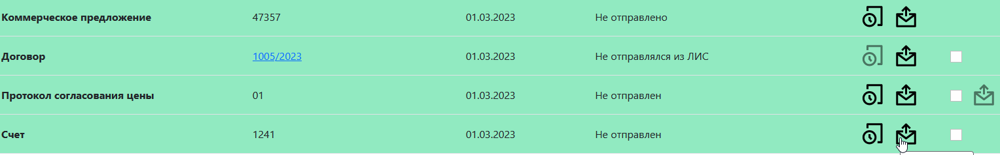

#### Строка «Оплата»
	
В данной строке содержится информация об оплате услуг по данной заявке. 

В столбце **«Номер»** указан статус данной оплаты. Всего имеется три статуса:
* **Не оплачено** – оплаты не поступало вообще;
* **Оплачено частично** – пришла только часть денег;
* **Оплачено полностью** – заявка оплачена в полном объеме.
	
В столбце **«Дата»** указана дата последней оплаты.

В столбце **«Операции»** указана сумма, которую должен оплатить / доплатить заказчик. Данная информация в системе ежедневно обновляется бухгалтерией через интеграцию с программой 1С или вручную.

**Возможные операции:**

 – при нажатии на данную кнопку открывается окно «Данные оплаты» в котором необходимо вручную ввести дату и сумму оплаты по данной заявке.

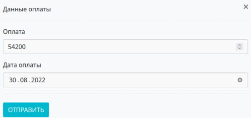

#### Строка (строки) «Акт приемки проб»
В данной строке содержится информация о состоянии акта 
приемки проб, который формируется по итогу приемки от заказчика проб. Здесь указан номер акта, дата последнего изменения и дата последней оправки документа заказчику.

>:warning: В зависимости от количества объектов испытаний в карточке заявки может быть несколько актов и, соответственно, несколько строк 

Вы можете попасть в интерфейс акта приемки проб, перейдя по номеру-ссылке в столбце «Номер»

**Возможные операции:**

 – при нажатии на данную иконку откроется форма данных акта приемки проб, которую необходимо заполнить и нажать кнопку «Сохранить».
>**Результат:** в системе будет сформирован акт приемки проб. Строка окрасится зеленым цветом, а в столбце «Номер» появится ссылка на созданный акт.

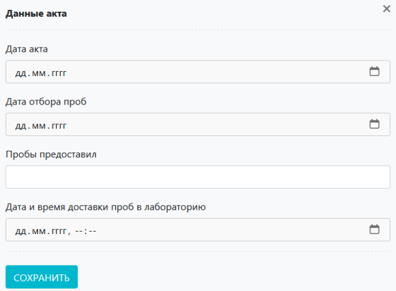

 	
 – при нажатии на данную иконку начнется скачивание файла, содержащего сформированный акт приемки проб.

 – если у вас подключен графический планшет, то откроется окно, в котором отобразится графическая подпись заказчика после того как он распишется на планшете. Данная подпись попадет в систему и отобразится в готовом акте приемки проб.

#### Строка / строки «Направление в лабораторию»

В данной строке содержится информация о направлении в лабораторию. 
>:warning: Если в схеме испытаний присутствуют методики, относящиеся к различным лабораториям, то на каждую лабораторию будет свое направление и. соответственно, своя строка

В столбце «Тип документа» указана аббревиатура лаборатории, а также 
обозначение типа материала. 

**Возможные операции**

 – при нажатии на данную иконку система автоматически сформирует направление в указанную лабораторию, после чего начнется скачивание файла направления в формате docx на локальный компьютер.

#### Строка «Результаты испытаний»
В данной строке находится информация о результатах испытаний по данной заявке: номер таблицы результатов и дата последних изменений. 
> :warning: Если результаты испытаний сформированы, нажмите на номер в соответствующем столбце данной строки, чтобы попасть в интерфейс результатов испытаний.

**Возможные операции:**

 – при нажатии на данную иконку вы попадете в интерфейс внесения результатов испытаний по данной заявке.

#### Строка «Протокол»

В данной строке содержится информация о протоколе испытаний: номер, дата последнего изменения и дата последней отправки заказчику.
>:warning: Изменения в результаты исследований могут быть внесены руководителем лаборатории даже после того, как протокол сформирован, и ему присвоен номер 

**Возможные операции:**

 – при нажатии на данную иконку система автоматически сформирует протокол результатов испытаний на основании заполненной таблицы результатов испытаний и предложит выбрать путь для сохранения файла протокола. Копия данного файла автоматически сохранится в системе в формате pdf. Получить доступ к ней можно из блока [«Списки версий»](#блок-списки-версий).

 – при нажатии на данную иконку произойдет отправка файла протокола на адрес электронной почты, указанный в карточке компании заказчика. Если электронных адресов указано несколько, появится их список, и будет предложено выбрать, куда именно отправить документ.

 – при нажатии на данную иконку вы попадете на страницу подписания документа при помощи электронной цифровой подписи.

 – при нажатии на данную кнопку вы перейдете в интерфейс подписания и отправки XML-файла протокола в личный кабинет ФСА (подробнее см. соотв. инструкцию).

#### Строка «Завершение испытаний»
В данной строке содержится информация о статусе испытания (завершено / не завершено) и о дате его завершения.

**Возможные операции:**

 – данная функция доступна только руководителю испытательного центра. При нажатии на данную иконку испытанию присваивается статус «Завершено», выставляется дата завершения, а также блокируются все возможности изменения информации в карточке за исключением возможности заполнить акт выполненных работ.

#### Строка «Акт выполненных работ»

В данной строке содержится информация об акте выполненных работ: номер, дата последнего изменения и дата последней отправки.

**Возможные операции:**

 – при нажатии на данную иконку откроется форма данных акта приемки проб, которую необходимо заполнить и нажать кнопку «Сохранить».
>**Результат:** в системе будет сформирован акт приемки проб. Строка окрасится зеленым цветом, а в столбце «Номер» появится ссылка на созданный акт.

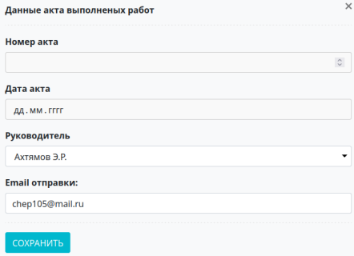

 – при нажатии на данную икноку происходит отправка файла, содержащего акт, на адрес электронной почты, указанный в карточке компании заказчика. Если электронных адресов указано несколько, появится список, и будет предложено выбрать, куда именно отправить документ. 

## Блок «Комментарий»

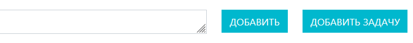

Данный блок служит для добавления в карточку заявки любой необходимой текстовой информации. 
* Впишите ее в поле «Комментарий» и нажмите кнопку «Добавить».
* Установив курсор мыши на правый нижний заштрихованный угол окна комментария, зажмите левую кнопку мыши и протяните курсор вниз. Так вы настроите удобный размер окна.
* Нажмите кнопку «Добавить задачу» для перехода во встроенный интерфейс работы с задачами Битрикс 24.

## Блок «Документы клиента»

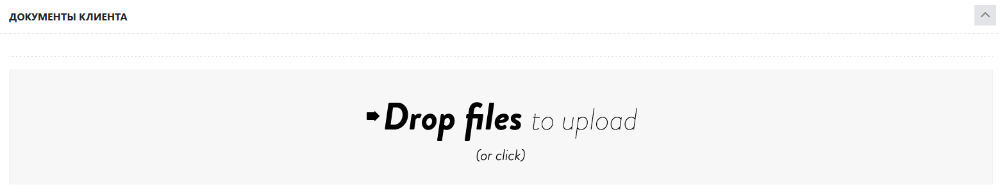

Данный блок служит для добавления и хранения любых документов, поступивших от заказчика, таких как скан подписанного договора, акт отбора проб и пр. Для того чтобы добавить документ:

1. Нажмите на  в правом верхнем углу блока, чтобы развернуть окно загрузки файлов.
2. Перетащите в окно «Drop files to upload» файл или нажмите на данное окно (в этом случае откроется окно выбора пути к нужному файлу на вашем компьютере).

## Блок «Списки версий»

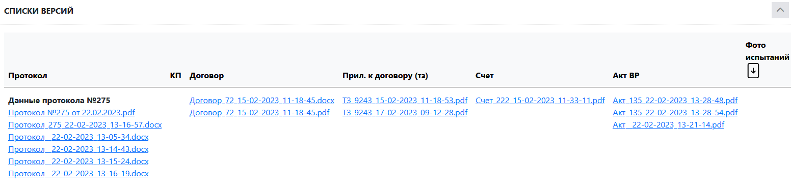

Данный блок содержит таблицу, в каждом столбце которой представлены версии документа, соответствующего названию столбца. Здесь вы можете найти все версии документов, которые были сгенерированы и изменены в системе U-Lab в рамках данной заявки. Для того, чтобы скачать документ, просто нажмите на его название. 

## Завершение заявки
После того как все необходимые действия по заявке проведены, и заявка полностью оплачена либо закрыта с негативным статусом, необходимо ее завершить. 
>:warning: **Завершает заявку только начальник лаборатории или бухгалтер**

Для того чтобы завершить заявку, нажмите   (кнопка находится после блока «Комментарий»). В результате появится меню выбора варианта завершения.  Всего существует три варианта: 
1. **Акты отправлены.** Это вариант положительного завершения заявки, когда оплата поступила, испытания проведены, и акты выполненных работ отправлены заказчику.
2. **Акты получены, сделка завершена.** Это вариант положительного завершения сделки, когда оплата поступила, испытания проведены, и заказчик вернул нам подписанные акты выполненных работ.
3. **Сделка проиграна.** Вариант отрицательного завершения, когда сделка по ряду причин не состоялась.

### Статусы заявок

В зависимости от этапа работы каждой заявке присваивается соответствующий текущей ситуации статус. Каждый статус имеет цветовой код, который можно увидеть как в журнале заявок в начале соответствующей строки, так и в левом верхнем углу карточки заявки.

#### Легенда

 <table cellpadding="3" >
    <tr><td style="background-color: #007FFE" width=15></td><td>Испытания еще не проводились. Пробы не получены</td></tr>
    <tr><td td bgcolor=#000058 width=15></td><td>Заявка на стадии проверки технического задания</td></tr>
    <tr><td td bgcolor=#FFFF00 width=15></td><td>Пробы получены. Проводятся испытания</td></tr>
    <tr><td td bgcolor=#580000 width=15></td><td>Испытания в лаборатории завершены. Оплата не поступила</td></tr>
    <tr><td td bgcolor=#6200C4 width=15></td><td>Испытания завершены. Оплата получена или не требуется</td></tr>
    <tr><td td bgcolor=#00FF00 width=15></td><td>Акты выполненных работ отправлены заказчику</td></tr>
    <tr><td td bgcolor=#00763B width=15></td><td>Акты выполненных работ получены. Заявка успешно завершена</td></tr>
    <tr><td td bgcolor=#FF0000 width=15></td><td>Испытания не проведены. Заявка прекращена</td></tr>
  </table>	  

      
      
    
	
	
	

	
	
	

