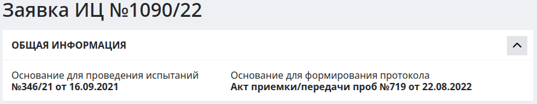

# Интерфейс внесения результатов испытаний

Интерфейс внесения результатов испытаний служит для внесения результатов испытаний и создания на их основе протоколов испытаний. 

<!-- @import "[TOC]" {cmd="toc" depthFrom=1 depthTo=6 orderedList=false} -->

<!-- code_chunk_output -->

- [Интерфейс внесения результатов испытаний](#интерфейс-внесения-результатов-испытаний)
  - [Как перейти в интерфейс результатов испытаний](#как-перейти-в-интерфейс-результатов-испытаний)
  - [Функции интерфейса внесения результатов испытаний](#функции-интерфейса-внесения-результатов-испытаний)
  - [Структура интерфейса](#структура-интерфейса)
    - [Блок основных действий](#блок-основных-действий)
    - [Общая информация](#общая-информация)
    - [Таблица созданных протоколов](#таблица-созданных-протоколов)
      - [Переключатели](#переключатели)
    - [Блок «Информация по протоколу»](#блок-информация-по-протоколу)
      - [Подблок «Общая информация»](#подблок-общая-информация)
      - [Подблок «Информация об оборудовании»](#подблок-информация-об-оборудовании)
      - [Подблок «Информация об испытаниях»](#подблок-информация-об-испытаниях)
      - [Подблок «Данные объекта испытаний»](#подблок-данные-объекта-испытаний)
    - [Сохранение изменений](#сохранение-изменений)
  - [Как создать протокол испытаний](#как-создать-протокол-испытаний)

<!-- /code_chunk_output -->

## Как перейти в интерфейс результатов испытаний
1. Перейдите в журнал заявок (см. [Журнал заявок](/ulab/request/list/)).

2. Перейдите в карточку соответствующей заявки.
3. Для внесения результатов испытаний нажмите на иконку  в строке «Результаты испытаний».
4. Если результаты испытаний уже внесены, то перейдите по номеру-ссылке в столбце «Номер» строки «Результаты испытаний».

Рисунок 1. Строка «Результаты испытаний» в карточке заявки

## Функции интерфейса внесения результатов испытаний

* внесение результатов испытаний;
* заполнение листов измерений (автоматический расчет результатов);
* формирование протоколов испытаний;
* создание файла протокола испытаний в формате docx и pdf с возможностью скачивания на локальный компьютер;
* удаление созданного протокола испытаний;
* автоматический контроль соответствия требованиям НТД;
* контроль области аккредитации.

## Структура интерфейса

Интерфейс «Результаты испытаний» состоит из следующих блоков:
* блок основных действий;
* блок «Общая информация»;
* блок «Таблица созданных протоколов»;
* блок «Таблица результатов испытаний»;
* блок «Информация по протоколу».

### Блок основных действий
 

Рисунок 2. Общий вид блока основных действий
 

Данный блок находится в левой верхней части интерфейса. Он состоит из двух основных кнопок-действий:

 **«Вернуться к списку»** – при нажатии на данную иконку вы перейдете в журнал заявок.
**«Карточка заявки»** – при нажатии на данную иконку вы вернетесь в карточку заявки.

### Общая информация

 

Рисунок 3. Общий вид блока «Общая информация»
 

Данный блок содержит следующую информацию:

1. **Основание для проведения испытаний** – здесь указывается номер и дата договора, на основании которого проводятся испытания.
2. **Основание для формирования протокола** – здесь указывается номер и дата акта приемки-передачи проб или иного документа, на основании которого будет сформирован протокол о проведенных испытаниях.

### Таблица созданных протоколов
 

Рисунок 3. Общий вид блока «Таблица созданных протоколов»
 
В данном блоке содержится информация обо всех созданных протоколах. 
Блок представляет собой таблицу, содержащую следующие столбцы:

* **Номер протокола** – номер протокола в системе U-Lab.
* **Дата протокола** – когда был создан протокол.
* **Вне ЛИС** – если протокол выдается вне системы U-Lab, в данной ячейке таблицы после активации аналогичного переключателя в подблоке «Информация об оборудовании» автоматически выставляется соответствующая отметка.
* **PDF-версия** – если протокол выдается вне ЛИС, то нажмите сюда для загрузки в систему скана протокола в формате PDF. Для удаления загруженного файла нахмите на красный крестик рядом с иконкой.
* **Сформировать протокол** – нажмите на данную иконку для того, чтобы сформировать файл протокола в формате docx.
* **Скачать протокол** – скачайте протокол в формате docx, нажав на иконку.
* **Присвоить номер** – нажмите эту кнопку, когда необходимо присвоить номер данному протоколу.
* **Удалить протокол** – если вам нужно удалить данный протокол, выберите его, нажав на значение в столбце «Номер протокола», а затем нажмите знак «-» в текущем столбце.
* **Разблокировать** – после присвоения протоколу номера, в нем автоматически блокируется возможность изменения уже внесенных значений и внесения новых. Активируйте данный переключатель в том случае, если вам необходимо разблокировать возможность внесения или изменения уже внесенных результатов после присвоения протоколу номера.
* **Протокол недействителен** – активируйте данный переключатель в том случае, если вам необходимо сделать данный протокол недействительным.
*********
<table >
<tr><td width=80 valign=top style="border: 0px"></td><td style="border: 0px" align=justify>Первоначально в блоке «Таблица созданных протоколов» находится только кнопка . Нажмите на нее, чтобы создать в таблице строку протокола. После этого можно приступать к заполнению таблицы результатов испытаний и включению в протокол необходимых проб.  
Чтобы включить в протокол нужную пробу, активируйте переключатель  в левом верхнем углу блока пробы в таблице результатов. 
Как только вы внесете всю необходимую информацию и выберете нужные пробы, нажмите кнопку , находящуюся в строке созданного протокола. После этого возможность внесения изменений в результаты испытаний и в блок «Информация по протоколу» будет заблокирована, и появится возможность сформировать и скачать готовый файл протокола.
</td>
</table>

***********

### Таблица результатов
В данном блоке содержится вся информация о результатах испытаний образцов в рамках данной заявки. 
Таблица содержит следующие столбцы:
* **Переключатель** – активируйте его для включения данной пробы в протокол
* **Материал** – материал пробы
* **Определяемые характеристики**
* **Единицы измерения**
* **Технические условия** – № и наименование ТУ
* **Нормативное значение** – нормативное значение согласно методике
* **Методика** – № методики и пункт
* **Фактическое значение** – значение, полученное в результате испытаний (нажмите + рядом с полем, чтобы добавить еще одно поле для внесения фактического значения)
* **Соответствие требованиям** – проверка на соответствие нормативным значениям, указанным в методике. Если значение не соответствует, данное поле будет обведено красной рамкой, внутри которой будет стоять восклицательный знак. Также имеется возможность выставить соответствие вручную. Для этого при создании протокола установите курсор в данное поле и в выпадающем списке выберите нужное значение
* **В ОА** – входит ли методика в область аккредитации
* **Номер протокола**

*********
<table >
<tr><td width=80 valign=top style="border: 0px"></td><td style="border: 0px" align=justify>Таблица разделена на блоки толстой серой линией. Каждый блок таблицы содержит информацию обо всех испытаниях в рамках одной пробы. Таким образом, сколько проб подвергались испытанию в рамках данной заявки, столько будет блоков в таблице.  
Для горизонтальной навигации по таблице используются серые стрелки ← и → в правой части экрана. 

Рисунок 4. Общий вид разделения блоков проб в таблице результатов

</td></tr>
</table>

***********

#### Переключатели
В начале каждого блока таблицы результатов испытаний в левой верхней его части имеется переключатель. Если его активировать, то в протокол попадет только данный блок. Также в начале таблицы есть аналогичный переключатель, при помощи которого вы можете включить в протокол все блоки таблицы.

### Блок «Информация по протоколу»
Данный блок содержит полную информацию о создаваемом протоколе. Он состоит из следующих подблоков:
* Общая информация
* Информация об оборудовании
* Информация об испытаниях
* Данные объекта испытаний

> :warning: **Для того чтобы вызвать данный блок** в таблице созданных протоколов после присвоения протоколу номера нажмите на номер протокола. Блок «Информация по протоколу» отобразитчя в нижней части страницы после таблицы результатов.

#### Подблок «Общая информация»
Данный подблок содержит следующие поля:

Рисунок 5. Общий вид подблока «Общая информация»
 

* **«Тип протокола»** – установите курсор в данное поле и в выпадающем списке выберите необходимый тип протокола – шаблон печатной формы (в разных шаблонах могут быть разные значения). Если вами выбран тип протокола с зерновым составом, то в нижней части блока «Общая информация» после подблока «Информация об оборудовании» сформируется совокупность полей «Зерновой состав», где необходимо будет ввести результаты просева.

Рисунок 6. Общий вид подблока   «Общая информация»
 

* **«Подпись в протоколе»** – установите курсор в данное поле и в выпадающем списке выберите сотрудника, чья фамилия должна значиться в договоре.
* **«Группа материала»** – установите курсор в данное поле и в выпадающем списке выберите необходимую группу материала.
* **Переключатель «Не оценивать на соответствие нормам»** – активируйте данный переключатель в том случае, если вам необходимо отключить оценку на соответствие нормам ТУ. В этом случае в столбце «Соответствие требованиям» в таблице результатов испытаний система установит пустое значение.

#### Подблок «Информация об оборудовании»

Рисунок 7. Общий вид разделения блоков проб в таблице результатов

 

Данный подблок содержит следующие поля:
* **«Используемое оборудование»** – здесь отображается все используемое оборудование согласно выбранной в протоколе методике испытаний. Если вам необходимо удалить позицию из списка в данном поле, наведите курсор на соответствующую строку и произведите двойной щелчок мыши по ней. Если у оборудования истек срок поверки, в данном списке оно будет обозначено красным цветом.
Если вы нажмете на строку с названием оборудования, в смежном поле справа отобразятся пункты ГОСТ, в рамках которых данное оборудование используется.
* **Поле выбора оборудования** – оно находится под полем «Используемое оборудование» и не имеет названия. Установив курсор в данное поле и в выпадающем списке выберите оборудование, которое необходимо добавить в предыдущее поле.
* **«Вернуть по умолчанию»** – нажав на данную надпись, вы откатите все произведенные вами изменения к значениям по умолчанию.

#### Подблок «Информация об испытаниях»

Рисунок 8. Общий вид подблока «Информация об испытаниях»

 

Данный подблок содержит следующие поля:
* **«Дата начала»** – здесь содержится информация о дате начала проведения испытаний. Для того чтобы выставить дату, установите курсор в данное поле и в раскрывшемемся календаре выберите нужное значение. Вы также можете ввести дату начала вручную.
* **«Дата окончания»** – здесь содержится информация о дате окончания проведения испытаний. Чтобы установить нужную дату поступите аналогично действиям с предыдущим полем.
* **«Температура»** – состоит из двух полей, где содержится значение границы диапазона температур, в рамках которого проводились испытания. Для того чтобы ввести значения, установите курсор в данные поля и вручную впишите их. Также вы можете воспользоваться стрелками в правой части полей (см. рисунок 10).
* **«Влажность»** – состоит из двух полей, где содержится значение границы диапазона влажности, в рамках которого проводились испытания. Заполняется аналогично предыдущему пункту.

#### Подблок «Данные объекта испытаний»

Рисунок 9. Общий вид подблока «Данные объекта испытаний»

 

> :warning: Информация в данном блоке заполняется системой автоматически на основании ТЗ, но данные в строках можно редактировать.

Данный подблок содержит следующие поля:

* **«Описание объекта»** – здесь содержится описание объекта, который будет подвергнут испытаниям. Данное поле можно расширить, потянув курсором мыши за его правый нижний заштрихованный угол.
* **«Объект строительства»** – здесь содержится информация об объекте строительства, на котором планируется использование объекта испытаний. Данное поле можно расширить, потянув курсором мыши за его правый нижний заштрихованный угол.
* **«Место отбора проб»** – здесь содержится информация о месте, где был произведен отбор проб. Данное поле можно расширить, потянув курсором мыши за его правый нижний заштрихованный угол.
* **«Дата отбора проб»** – здесь содержится информация о дате, когда был произведен отбор проб. Дату можно удалить, нажав на крестик возле правой границы поля. Также вы можете ввести иную дату, установив курсор в поле и выбрав нужную в раскрывшемся календаре либо введя ее вручную.
* **«Дополнительная информация»** – в это поле введите любую дополнительную информацию, которая по вашему мнению необходима.
* **Переключатель «Протокол выдается вне ЛИС»** – активируется в том случае, когда протокол выдается вне системы U-Lab, и вам необходимо изменить шаблон, внеся в него, например, дополнительную информацию. В Этом случае конечный файл протокола не защищен от изменений, и вы можете редактировать его на свое усмотрение.
* **Переключатель «С аттестатом аккредитации»** – активируется только руководителем СМК или начальником лаборатории в том случае если протокол необходимо подготовить для отправки в Росаккредитацию.

### Сохранение изменений
Для того чтобы сохранить любые внесенные вами изменения, нажмите кнопку , которая находится в самом низу страницы после всех блоков.
 
## Как создать протокол испытаний
1.	В карточке заявки в строке «Результаты испытаний» нажмите на иконку  в правой части строки. Вы попадете в интерфейс внесения результатов испытаний.
2.	В строке «Таблица созданных протоколов» нажмите кнопку . После этого в таблице появится строка созданного протокола.
3.	В таблице результатов испытаний выберите пробу / пробы, которые необходимо включить в протокол (для этого активируйте переключатель  в блоке нужной пробы). 
4. Внесите значения результатов испытаний в соответствующие поля.
5.	Заполните информацией подблок «Общая информация» блока «Информация по протоколу».
6.	Заполните информацией подблок «Информация об испытаниях» блока «Информация по протоколу».
7.	Проверьте правильность данных в подблоке «Информация об оборудовании» блока «Информация по протоколу». Если нужны изменения и корректировки, внесите их.
8.	Проверьте правильность данных в подблоке «Данные объекта испытаний» блока «Информация по протоколу». Если нужны изменения и корректировки, внесите их.
9.	Сохраните изменения, нажав кнопку , которая находится в самом низу страницы после всех блоков. Если в результате сохранения возникли ошибки (например, у какого-либо оборудования закончился срок поверки), то система сообщит о них. Устраните ошибки и повторите данный пункт снова.

Рисунок 10. Сообщение об ошибке

 

10.	Нажмите кнопку , которая находится в правой части блока «Таблица созданных протоколов». В результате протоколу будет присвоен номер, который появится в таблице созданных протоколов, а также в карточке заявки. После этого в интерфейсе «Результаты испытаний» будут заблокированы все поля, и станет доступно формирование и скачивание файла протокола в формате docx.
