# Интерфейс технического задания

<!-- @import "[TOC]" {cmd="toc" depthFrom=1 depthTo=6 orderedList=false} -->

<!-- code_chunk_output -->

- [Интерфейс технического задания](#интерфейс-технического-задания)
  - [Как перейти в интерфейс](#как-перейти-в-интерфейс)
  - [Функции интерфейса](#функции-интерфейса)
  - [Структура интерфейса](#структура-интерфейса)
    - [Иконка возврата](#иконка-возврата)
    - [Блок «Общая информация»](#блок-общая-информация)
  - [Заполнение / редактирование ТЗ](#заполнение--редактирование-тз)
    - [1. Заполнение блока «Дополнительная информация»](#1-заполнение-блока-дополнительная-информация)
      - [1.1.	Поле «Место испытаний»](#11-поле-место-испытаний)
      - [1.2.	Поле «Срок выдачи протокола»](#12-поле-срок-выдачи-протокола)
    - [2. Заполнение блока «Материалы»](#2-заполнение-блока-материалы)
      - [2.1 Добавление материала](#21-добавление-материала)
      - [2.2 Удаление материала](#22-удаление-материала)
    - [3.	Отправка ТЗ на утверждение](#3-отправка-тз-на-утверждение)
    - [4. Сохранение ТЗ](#4-сохранение-тз)

<!-- /code_chunk_output -->

## Как перейти в интерфейс
Для того чтобы начать работу с интерфейсом ТЗ создайте заявку на испытания (см. инстр. «Интерфейс создания заявки на испытания»). После этого система автоматически создаст ТЗ. Далее перейдите в карточку созданной заявки и в ней перейдите по номеру-ссылке в столбце «Номер» строки «Техническое задание». 

## Функции интерфейса
Данный интерфейс служит для:
* создания ТЗ на проведение испытаний;
* назначения ответственных за проведение испытаний согласно утвержденной матрице компетенций; 
* утверждения ТЗ руководителем лаборатории; 
* внесения в ТЗ изменений.

## Структура интерфейса
Интерфейс состоит из следующих блоков:
1. Иконка возврата
2. Блок «Общая информация»
3. Блок «Дополнительная информация»
4. Блок «Материалы»
5. Блок «Подтверждение ТЗ»

### Иконка возврата 
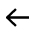  – нажмите на данную иконку для возврата в карточку заявки.
 

### Блок «Общая информация»
содержит информацию об основании для проведения испытаний: здесь указывается номер и дата договора, на основании которого будут проводиться испытания.

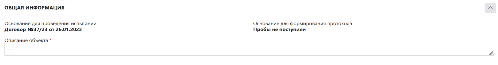

* Поле **Описание объекта** – введите сюда описание объекта испытания. 

### Блок «Дополнительная информация»
Данный блок содержит более подробную информацию о предстоящих испытаниях.

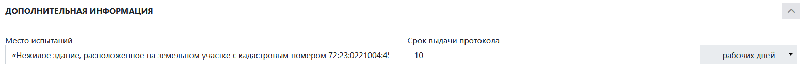

* Поле **«Объект строительства»** – введите сюда наименование объекта строительства.
* Поле **«Комментарий к КП»** – введите сюда комментарии к КП (коммерческом у предложению), если это необходимо.
* Поле **«Срок выдачи протокола»** – установите курсор в данное поле и в выпадающем списке выберите дату, которая будет выставлена в договоре в качестве даты выдачи.
* Поле **«Срок проведения испытаний»** – введите сюда срок проведения испытаний, а в правую часть поля установите курсор и в выпадающем списке выберите единицу измерения срока.
* Поле **«Комментарий к ТЗ»** – введите сюда комментарии к ТЗ, если это необходимо.
* Переключатель **«Заявка учтена»** –	используется в том случае, если стоимость данной заявки уже учтена в другой заявке (данная заявка является подчиненной). Необходимость этого может возникать, например, при работе по госконтрактам, когда все испытания проводятся одной заявкой, которую необходимо разделять на более мелкие.
* Переключатель **«Серт. испытания»** – используется в том случае, если протокол по данной заявке будет проверяться Росаккредитацией. В случае активации переключателя в журнале заявок в строке данной заявки рядом с ее номером появится буква С.

* **Прочая информация** – Информация о месте отбора проб, о том, кем отобраны пробы и о дате отбора заполняется автоматически на основании акта приемки проб, который заполняется менеджером по работе с клиентами.

### Блок «Материалы» 
Данный блок содержит информацию о типе материалов, которые будут подвергаться испытанию, количестве предоставленных образцов, методиках испытаний, технических условиях, ценах, скидке и общей конечной стоимости испытаний.

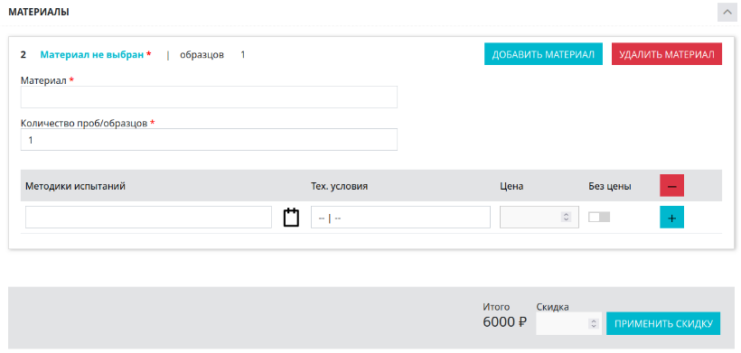

Рисунок 3. Общий вид блока «Материалы»

 

5.	**Блок «Подтверждение ТЗ»** – служит для утверждения или отклонения ТЗ.Содержит информацию о статусе данного ТЗ. 
 
    > Существует всего три статуса:
    > * **«Передать»** –присваивается автоматически после сохранения карточки ТЗ. В данном случае в блоке появляется кнопка «Передать», доступная только сотруднику, ответственному за данное ТЗ, или его руководителю. Передача ТЗ на рассмотрение происходит только по нажатии кнопки «Передать».
    >* **«Заявка передана на рассмотрение»** – присваивается автоматически после нажатия кнопки «Передать». Заявка автоматически передается на рассмотрение руководителям лабораторий, чьи методики указаны в исследовании.
    >* **«Техническое задание утверждено»** – присваивается автоматически после того, как заявку утвердили все руководители лабораторий, чьи методики указаны в исследовании.
Статус ТЗ изменяется после того, как ответственный проверит его и присвоит ему определенный статус, нажав на кнопку «Принять» или «Отклонить» в этом же блоке данной карточки. Данные кнопки появляются только в том случае, если пользователь обладает правами руководителя лаборатории или начальника испытательного центра.

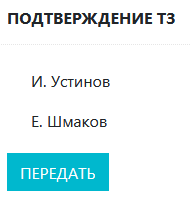

Рисунок 5. Общий вид блока  «Подтверждение ТЗ»

## Заполнение / редактирование ТЗ

### 1. Заполнение блока «Дополнительная информация»

#### 1.1.	Поле «Место испытаний»

Данное поле заполняется автоматически на основании информации, внесенной в соответствующее поле в интерфейсе создания заявки на испытания. Если поле пустое, введите в него название / описание места испытаний.

#### 1.2.	Поле «Срок выдачи протокола»

В данном поле должен содержаться срок выдачи протокола испытаний. Его значение должно устанавливаться по требованию заказчика или (по умолчанию) соответствовать сроку проведения испытаний в указанных в правой части поля единицах. Правая часть поля представляет собой выпадающий список. Установите в него курсор и выберите единицы измерения срока выдачи протокола.

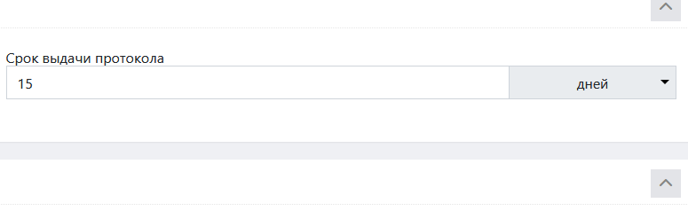

### 2. Заполнение блока «Материалы»

#### 2.1 Добавление материала
1. Чтобы добавить материал для исследования, нажмите на кнопку «Добавить материал» в правом верхнем углу блока 

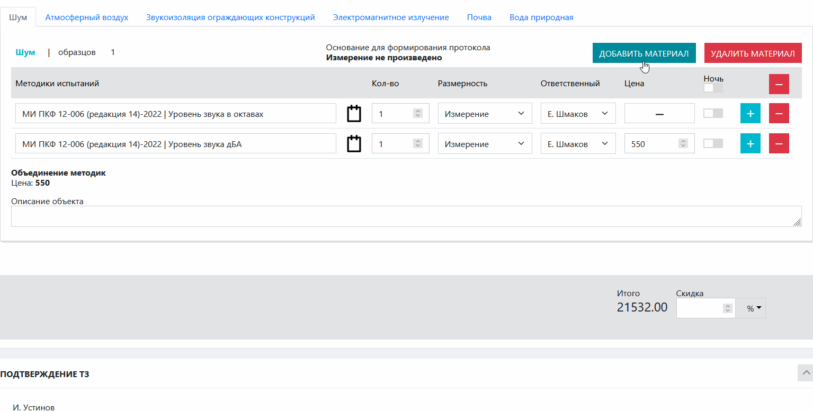

2. Нажмите на появившуюся синюю надпись «Материал не выбран» в левом верхнем углу блока (см. рисунок 4).

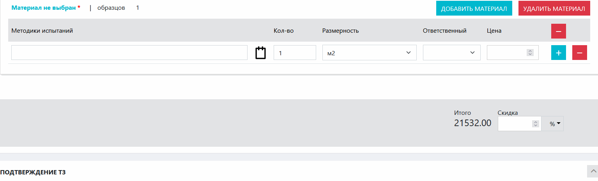

3. Установите курсор в поле «Материал» и начните ввод названия материала. В появившемся списке выберите нужный материал. 
 
    > :warning: Если нужный материал отсутствует, нужно вписать его вручную. При сохранении карточки ТЗ материал автоматически сохранится в системе.

 

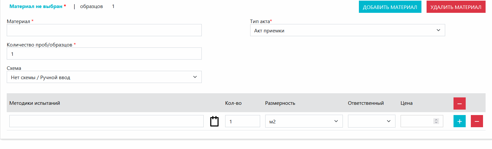

4. В поле «Количество образцов» введите количество предоставленных образцов данного материала.
 

5. В поле «Тип акта» выберите тип акта.

   

6. В поле «Схема» в выпадающем списке выберите схему, согласно которой будут проводиться испытания. После этого система автоматически выставит все методики испытаний, относящиеся к данной схеме. Если в поле написано «Нет схемы / Ручной ввод», а в выпадающем списке нет иных вариантов, то схему выбирать не следует.

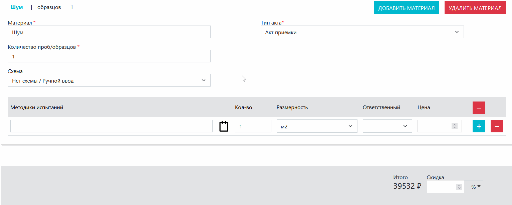

7. Шаги 7-10 необходимы в том случае, если схема не выбрана. Установите курсор в поле «Методики испытаний» и начните ввод названия ГОСТа. В раскрывшемся списке выберите нужный ГОСТ. 
 
    > :warning: Если нужного ГОСТа нет, введите название ГОСТа вручную, и при сохранении карточки ТЗ оно автоматически сохранится в системе.

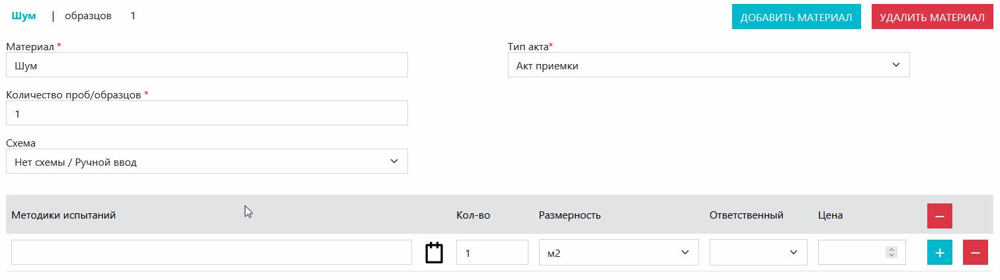

8. Поля «Количество», «Размерность» и «Цена» заполняются автоматически на основании выбранной методики, объекта испытаний и схемы испытаний. В случае необходимости возможно внести в данные поля изменения (они открыты для редактирования). 

    >:warning: Чтобы попасть в карточку методики, нажмите на иконку .

   
9. В поле «Ответственный» выберите ФИО сотрудника, ответственного за проведение испытаний в рамках данной методики в выпадающем списке.
 

10. Если необходимо добавить или удалить строку в списке методик испытаний, сделайте это при помощи кнопок «+» и «-» (см. рисунок 9).
 

11. В правой нижней части блока находится информация об итоговой стоимости испытаний и поле «Скидка». При необходимости установите размер скидки и выберите ее единицу измерения. Подсчет итоговой стоимости после применения скидки произойдет немедленно. 

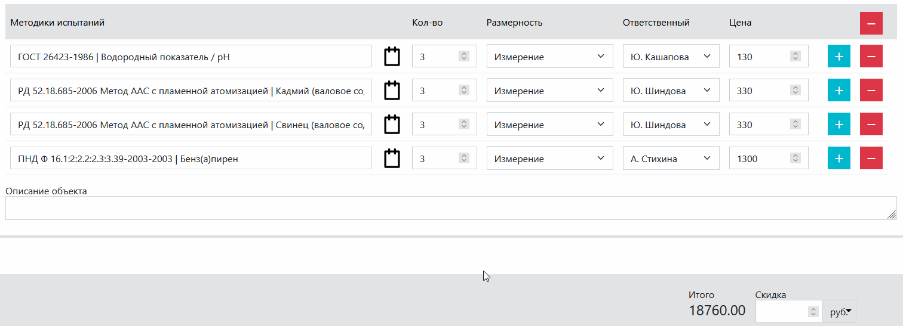

#### 2.2 Удаление материала
Для того чтобы удалить материал, нажмите на красную кнопку «Удалить материал» в правом верхнем углу блока.

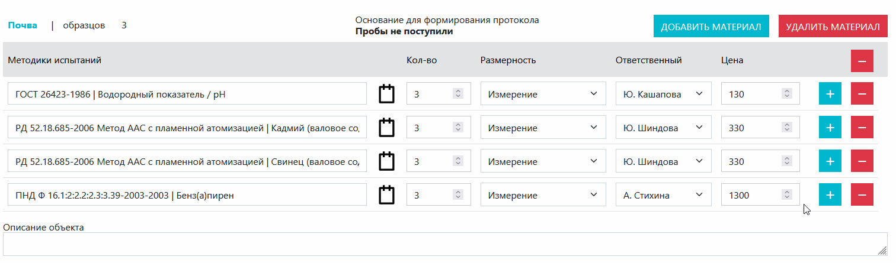

### 3.	Отправка ТЗ на утверждение
Для того чтобы отправить ТЗ на подтверждение, нажмите кнопку «Передать» в блоке «Подтверждение ТЗ»

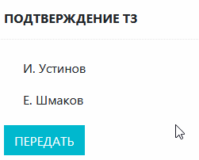

### 4. Сохранение ТЗ
После того как вся необходимая информация внесена в карточку ТЗ, и сделаны все необходимые действия, нажмите кнопку , которая находится после блока «Подтверждение ТЗ». После сохранения система выведет сообщение об успешном сохранении.
 
>:warning: Если в ТЗ необходимо внести изменения, то это нужно сделать до того, как ТЗ будет утверждено руководителем.
>
> Для внесения изменений: 
>1. [перейдите в интерфейс ТЗ](#как-перейти-в-интерфейс);
>2. внесите необходимые изменения;
>3. [сохраните изменения](#сохранение-тз).
